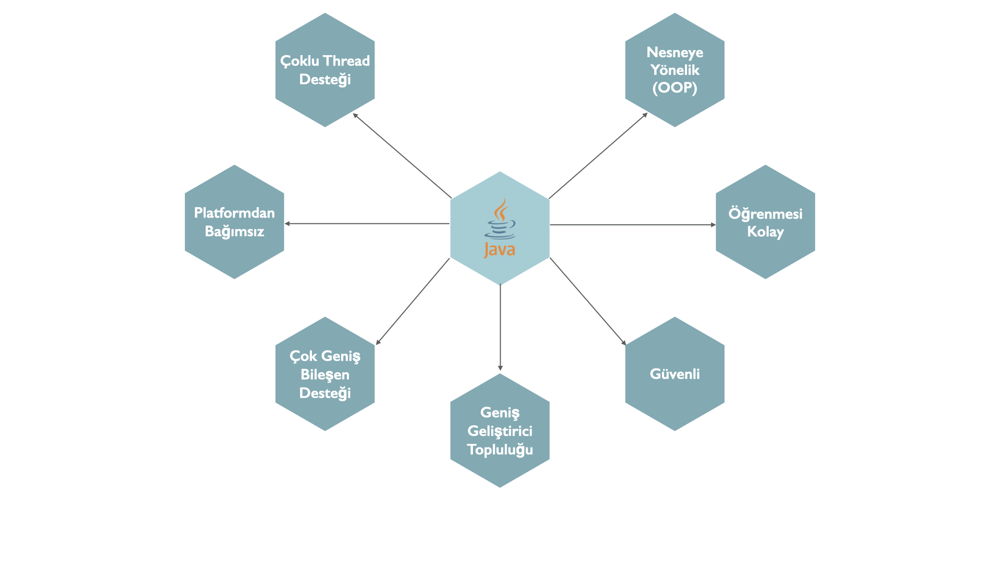
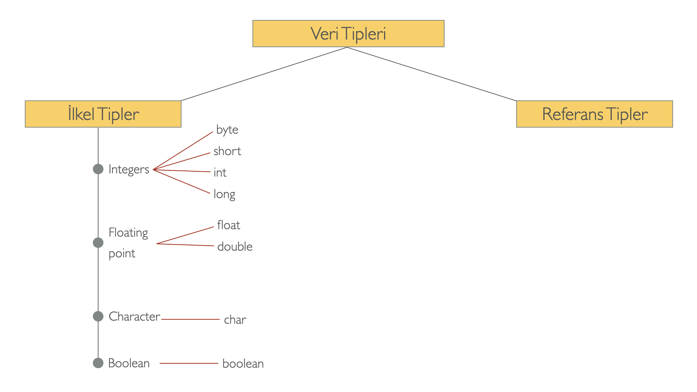
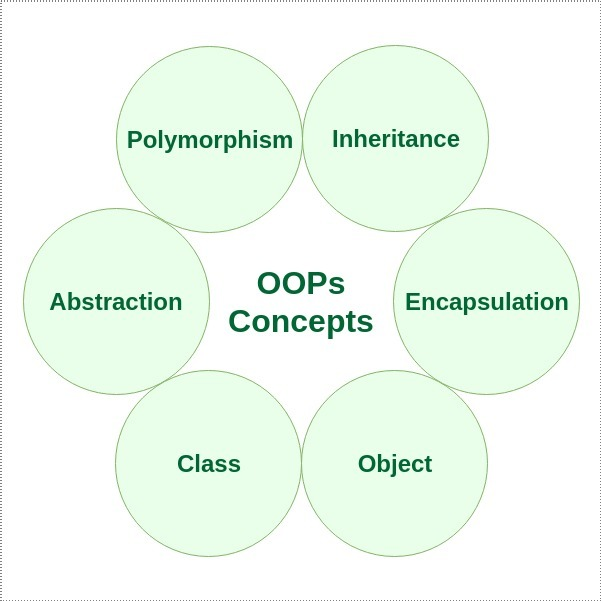
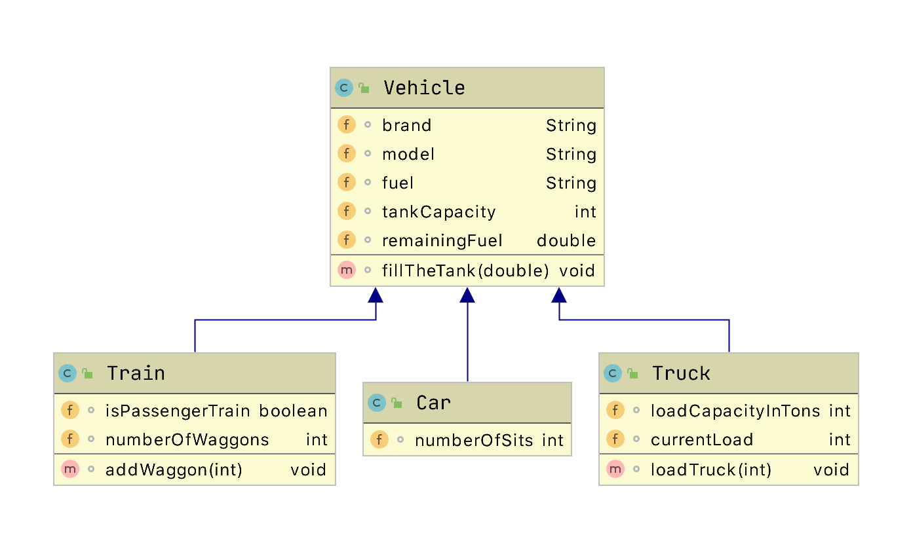
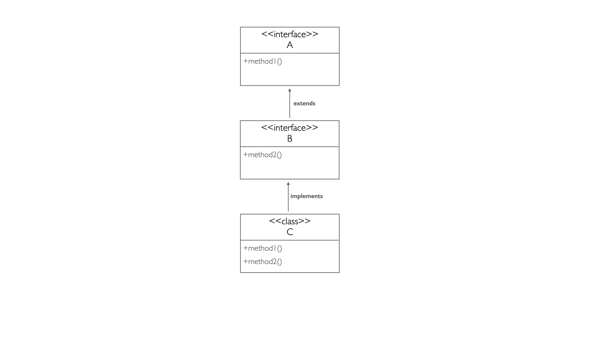
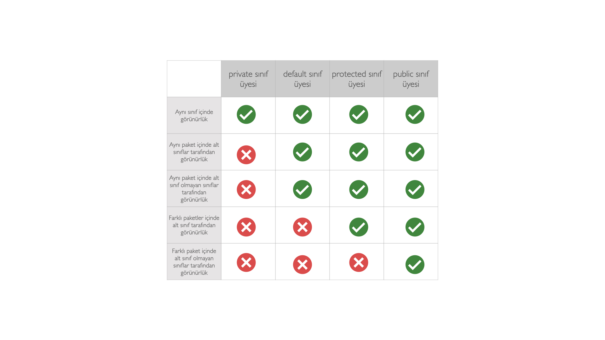
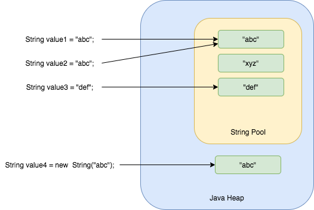

# Java Bootcamp by Hüseyin Karabakla

### Java nedir ve neden önemlidir ?



James Gosling ve ekibi tarafından 1991 yılında OAK ismiyle ortaya çıktı ve 1995 yılında JAVA ismini aldı.
İlk günden itibaren platform bağımsız olarak tasarlandı ve en başta tost makinası, elektikli süpürge gibi son kullanıcı 
elektronik ürünleri için kullanılmış olsa da daha sonra internetin programlama dili oldu ve internetin bu denli 
gelişmesinde kilit rol oynadı. Güçlü yapısı, sunduğu güvenlik, taşınabilirlik ve genel bir programlama dili olması 
popülerliğini biranda artırdı.

Javanın başarısının arkasında yatan sihir **Bytecode**. Java kaynak kodları doğrudan CPU üzerinde çalıştırılmaz. Kaynak 
Kodlar önce bytecode'a çevrilir daha sonra bu bytecode Java Virtual Machine(JVM) dediğimiz sistem tarafından yorumlanır. 
Bu bytecode dönüşümü ve JVM mantığı Javaya platform bağımsızlık ve güvenlik özelliklerini kazandırmıştır.

Diğer bir güçlü özelliği de nesne tabanlı olmasıdır. Bu özellik sayesinde gerçek dünyayı sanal ortamda modellemek son 
derece kolay bir hal almıştır.

Gerçek dünyaya yakın olması sayesinde Java programlama dili en kolay öğrenilebilen dillerden birisi olmuştur.

Saydığımız bütün bu özellikler ve daha fazlası Javayı yıllardır programcıların gözünde hep zirvede tutmuş ve şuan dünyada
10 milyonun üzerinde Java geliştirici olduğu bilinmektedir.

### Java ile geliştirme yapmak için nelere ihtiyacım var ?
- Algoritmik düşünme yeteneği
- JDK (Java Development Kit)
- IDE (Integrated Development Environment)*

#### JDK ya yakından bakış
JDK, Java dilinde yazdığımız uygulamaları compile etmek ve çalıştırmak için gerekli olan altyapıyı sunar. Şuanda güncel
olarak 15. versiyonu yayınlanan JDK, Oracle firmasının [adresinden](https://www.oracle.com/java/technologies/javase-downloads.html)
ve open source olarak piyasaya sunulan [adresten](http://jdk.java.net/) indirilip kurulabilir. Bu eğitim serisinde biz 
en son devrim niteliği taşıyan JDK'nın 8 numaralı versiyonunu kullanacağız.

JDK bize iki temel program sunar; birincisi kodları compile etmek için kullanılan **javac**, ikincisi ise compile edilmiş 
kodları yorumlayan ve uygulamayı çalıştıran **java**. Bu anlamda JDK ekranları olan bir uygulama değildir, sadece komut 
satırı uygulamalrı sunan bir platformdur. Bir IDE de değildir, IDE'ler de kodları derlemek ve çalıştırmak için JDK'yı 
kullanır.

#### IDE
Java dilinde uygulama yazmayı kolaylaştıran bunun yanında da yazılımcının üretkenliğini destekleyen pek çok IDE mevcuttur 
piyasada. Bunlardan en popüler olanları Eclipse, IntelliJ IDE denilebilir. IDE sadece kodlamayı kolaylaştırmak ve daha verimli 
hale getirmek için vardır, IDE olmadan da sadece JDK kullanarak geliştirme yapılabilir.

### Java ile ilk program
```java
package com.hkarabakla;
 
 public class com.hkarabakla.Main {
 
     public static void main(String[] args) {
        // Bu tek satırlık bir yorum
        
        /*
            Bu çok satırlık
            bir yorum
         */
 	    System.out.println("Merhaba Java Bootcamp !");
     }
 }
```
- package : Uygulamanın kaynak kodlarını organize etmemize ve sınıflara kimlik kazandırmamıza yarayan dizinler olarak 
  düşünebiliriz 
- class   : Nesne tabanlı bir programlama dili olan Java’da herşey bir class ile ilişkilendirilmek zorundadır. 
  Class gerçek dünyayı yazılımda modellememize yarayan en önemli bileşendir
- method  : Bir sınıf içerisinde yer almak zorunda olan metodlar yazılıma davranış kazandırırlar.

## Veri tipleri ve operatörler
Java **strongly typed** bir dildir. Yani bütün işlemler compile zamanında type checking dediğimiz veri tipi kontrolü 
işleminden geçirilir. Bu işlem yazılımcının veri tipi uyuşmazlığından kaynaklanan hatalar yapmasına engel olur.



### Primitive (ilkel) veri tipleri
Primitive tipler belli bir boyuta sahiptir ve ekstra fonksiyon sunmazlar.

| Veri tipi | Boyut | Açıklama |
| ----------- | ----------- | ---------- |
|byte	| 1 byte	| -128 den 127 e kadar tüm sayıları tutar |
|short	| 2 bytes	| -32,768 den 32,767 e kadar tüm sayıları tutar |
|int	| 4 bytes	| -2,147,483,648 den 2,147,483,647 e kadar tüm sayıları tutar |
|long	| 8 bytes	| -9,223,372,036,854,775,808 den 9,223,372,036,854,775,807 e kadar tüm sayıları tutar |
|float	| 4 bytes	| Ondalıklı sayıları tutar. Ondalık kısımda 6 ila 7 adet rakam içeren sayılar için uygundur |
|double	| 8 bytes	| Ondalıklı sayıları tutar. Ondalık kısımda 15 aded rakam içeren sayılar için uygundur |
|boolean	| 1 bit	| true yada false değerlerini tutar |
|char	| 2 bytes	| Tek bir karakter(harf, rakam, noktalama işareti gibi) tutar |

### Non-primitive (referans) veri tipleri
Sınıf türünden bütün veri tipleri non-primitive (referans tipler) olarak adlandırılır. Sınıf kavramı ve detaylarını 
daha sonraki bölümlerde daha detaylı göreceğiz.

```java
String name = "Huseyin";
Car myNewCar = new Car("Toyota", "Corolla", 2021);
```

#### Primitive tipler ve non-primitive tipler arasındaki farklar
- Primitive tipler her zaman bir değere sahip olmak zorundadır bu nedenle default değerleri vardır, non-primitive tipler 
  ise null değer alabilir
- Non-primitive tipler tuttukları değer üzerinde işlem yapmaya yarayan metodlar sunabilirler
- Non-primitive tipler primitive tipler kullanılarak elde edilir  
- Primitive tipler hafızada stack denilen bir bölgede saklanırken, referans tiplerin referans kısımları stack'de 
  referansların işaret ettiği gerçek objeler heap denilen özel alanda saklanır


### Değişkenler
- Değişkenler verileri uygulamanın çalışma anında uygulama içerisinde depolamaya yarar.
- Her değişkenin bir veri tipi ve ismi olmak zorundadır
- Değişkenler java programlama dilinde sınıf seviyesinde ve metod seviyesinde tanımlanabilir

```java
// Genel değişken tanımlama
// veri_tipi değişken_ismi = değişkenin_ilk_değeri*;

int age = 10;
String event = "Java Bootcamp";
boolean isCool = true;
```
#### Değişken isimlerini belirlerken uyulması gereken kurallar:
- **Değişken isimleri anlamlı ve değişkenin görevini açıklar nitelikte olmalıdır**
- Sadece harf ile başlayabilir, geri kalan kısmında harf, rakam, alt çizgi(_) ve dolar işareti($) bulundurabilir
- Küçük harfle başlamalıdır ve birden fazla kelimeden oluşuyor ise kelimeler arasında boşluk içeremez
- $ ve _ ile de başlayabilir fakat yaygın olarak tercih edilmez
- Değişken isimleri büyük küçük harfe duyarlıdır
- int, boolean… gibi Java için rezerve edilmiş anahtar kelimeler değişken ismi olamaz

```java
// İyi
int minutesPerHour = 60;

// Geçerli fakat kötü bir tercih
int m = 60;
```
#### Değişkenlere değer atama

##### Tanımlama sırasında değer atama
Değişkenin tanımlandığı yerde değer almasıdır.

```java
int age = 10;
String event = "Bootcamp";
boolean isCool = true;
```
##### Dinamik değer atama
Değişkenin tanımlandığı yerde değer almayıp sadece tanımlanması ile elde edilir. Değişkene değer ataması yapılıncaya kadar
işlemlerde kullanılamaz, compiler hata verir.

```java
int x = 2, y = 3, z = 5, w;
w = x * y * z;
```

#### Degişkenlerde scope (faaliyet alanı) kavramı
Java programla dilinde açılan her bir kıvırcık parantez ({) bir scope açar ve değişkenler bu parantezler içinde tanımlanır.   
Her bir değişken içinde tanımlandığı scope içerisinde ve tanımlandığı noktadan sonraki alt scope'larda geçerlidir. Bir 
değişken geçerli olduğu scope dışında kullanılamaz.

```java
package com.javatraining;

public class VariableScope {

    public static void main(String[] args) { // 1
        int x = 10;

        if (x == 10) { // 2
            int y = 20;

            // double x = 25; error, variable x already defined  

            System.out.println("x and y : " + x + " " + y);
            x = y * 2;
        }

        // y = 100; error y not known here
        
        System.out.println("x is " + x);
    }
}
```

#### Tip dönüştürme (Type casting)
Herhangi bir tipte tanımlanmış bir değişkene kendi tipinde olmayan başka bir değerin atanması durumudur. Bu işlem 
yapılırken dikkatli olunmalıdır. Sadece birbiri ile ilişkili tipler arası dönüşüm yapılabilir.
İki şekilde gerçekleşir :

**Otomatik tip dönüşümü**

Küçük boyutlu bir değerin daha büyük boyutlu bir tipte tanımlanmış değişkene atanmasıdır.

_byte -> short -> char -> int -> long -> float -> double_

```java
public class MyClass {
  public static void main(String[] args) {
    int myInt = 9;
    double myDouble = myInt;

    System.out.println(myInt);      // Çıktı 9
    System.out.println(myDouble);   // Çıktı 9.0
  }
}
```

**Manuel tip dönüşümü**

Büyük boyutlu bir değerin daha küçük boyutlu bir tipte değişkene atanmasıdır, dikkatli olunmalıdır işlem yapılan veride 
değer kaybı yaşanabilir.

_double -> float -> long -> int -> char -> short -> byte_ 

```java
public class MyClass {
  public static void main(String[] args) {
    double myDouble = 9.78;
    int myInt = (int) myDouble;

    System.out.println(myDouble);   // Çıktı 9.78
    System.out.println(myInt);      // Çıktı 9
  }
}
```

### Operatörler
Operatörler; değişkenler ve değerler üzerinde işlem yapmaya yarar.

#### Aritmetik operatörler
|Operator	|İsim	|Açıklama	|Örnek|
| ----------- | ----------- | ---------- | ---------- |
|+	|Toplama	|İki değeri toplar	|x + y	|
|-	|Çıkarma	|İki değeri birbirinden çıkarır	|x - y|	
|*	|Çarpma	|İki değeri çarpar	|x * y	|
|/	|Bölme	|İki değeri böler ve tam sonucu döner	|x / y	|
|%	|Mod alma	|İki değerin birbirine bölümünden sonra kalanı verir	|x % y	|
|++	|Artırma	|Bir değişkenin değerini 1 artırır	|++x|	
|--	|Azaltma	|Bir değişkenin değerini 1 azaltır	|--x|

#### Atama operatörleri
|Operator	|Örnek	|Eşleniği|
| ----------- | ----------- | ---------- |
|=	|x = 5|	x = 5|	
|+=	|x += 3|	x = x + 3|	
|-=	|x -= 3|	x = x - 3|	
|*=	|x *= 3|	x = x * 3|	
|/=	|x /= 3|	x = x / 3|	
|%=	|x %= 3|	x = x % 3|	
|&=	|x &= 3|	x = x & 3|	
||=	|x |= 3|	x = x | 3|	
|^=	|x ^= 3|	x = x ^ 3|	
|>>=	|x >>= 3|	x = x >> 3|	
|<<=	|x <<= 3|	x = x << 3|

#### Karşılaştırma operatörleri
|Operator	|İsim	|Örnek|
| ----------- | ----------- | ---------- |
|==|	Eşitlik|	x == y|	
|!=|	Eşit olmama|	x != y|	
|\>	|Büyüktür|	x > y|	
|<|	Küçüktür|	x < y|	
|>=|	Büyüktür yada eşittir|	x >= y|	
|<=|	Küçüktür yada eşittir|	x <= y|

#### Mantıksal operatörler
|Operator	|İsim	|Açıklama	|Örnek|
| ----------- | ----------- | ---------- | ---------- |
|&& 	|Mantıksal ve	|True döner eğer iki ifade de true ise	|x < 5 &&  x < 10|	
| &#124;&#124; 	|Mantıksal veya	|True döner eğer iki ifadeden en az birisi true ise	|x < 5 &#124;&#124; x < 4|	
|!	|Mantıksal değil	|Değeri tersine çevirir, ifade true ise false false ise true yapar	|!(x < 5 && x < 10)|

## Karar mekanizmaları ve döngüler


Karar mekanizmaları ve döngüler uygulama içindeki akışı kontrol etmek için kullanılır. Kimi zaman bazı koşullar altında
bir kod parçasının çalıştırılmasını isterken kimi zaman da o koşulun gerçek olmaması durumunda başka kod parçalarının 
çalıştırılmasını isteriz, işte bu durumda yardımımıza **if**, **if-else** ve **switch** ifadeleri yetişir. Bazen ise bir 
kod parçasının defalarca çalıştırılması gerekir, bu durumda ise **for** ve **while** döngü ifadeleri istediğimiz kadar 
tekrarlı kod çalıştırmamızı sağlar. Şimdi bu ifadelerin detaylarına ve örneklerine bakalım.

### Konsoldan Scanner yardımıyla input alma
Karar mekanizmaları ve döngü ifadeleri örneklerini zenginleştirmek için konsoldan değer okuma işleminin Scanner sınıfı
ile nasıl yapıldığına bakalım.

```java
import java.util.Scanner;

public class FundamentalsDemo2 {

    public static void main(String[] args) {

        System.out.println("Welcome " + getUserDeatils());
    }

    private static String getUserDeatils() {
        Scanner scanner = new Scanner(System.in);
        System.out.print("Enter your name : ");
        String name = scanner.next();
        System.out.println();
        System.out.print("Enter your age : ");
        int age = scanner.nextInt();

        return name + " " + age;
    }
}
```
Output :
```
Enter your name : Huseyin

Enter your age : 33
Welcome Huseyin 33
```
Örnekte Scanner sınıfından bir obje yarattık (Obje ve sınıf kavramlarına daha sonra değineceğiz), Scanner sınıfına klavyeden 
girilen değerleri okuması için System.in input stream objesini verdik. scanner objesinin next() metodu consoldan girilen 
kelimeyi okur ve String tipinde geri döner, nextInt() metodu ise ilk kelimeyi okur ve int tipinde geri döner. Böylece 
kullanıcı ile etkileşim kurmuş oluruz. Bundan sonraki örnekleri anlayabilmek için bu kadar bilgi yeterli.

### if-else ifadesi
if ifadesi belirli bir koşul altında program akışının hangi yöne devam edeceğini belirler. if ifadesi içinde yer alan
koşul true dönmesi durumunda if bloğu işletilir.

```java
import java.util.Scanner;

public class FundamentalsDemo3 {

    public static void main(String[] args) {

        Scanner scanner = new Scanner(System.in);
        System.out.print("Enter your age : ");
        int age = scanner.nextInt();
        System.out.println("Your availability for driving licence : " + isEligibleToHaveADrivingLicence(age));
    }

    public static boolean isEligibleToHaveADrivingLicence(int age) {

        if(age < 18) {
            System.out.println("It's too early to drive !!!");
            return false;
        }

        return true;
    }
}
```
Output :
```
Enter your age : 11
It's too early to drive !!!
Your availability for driving licence : false
```

else ifadesi ise if koşulu gerçekleşmemesi durumda, yani if ifadesi içinde yer alan koşul false dönmesi durumunda, 
program akışının gideceği yönü belirlemeye yarar.

```java
import java.util.Scanner;

public class FundamentalsDemo4 {

    public static void main(String[] args) {

        Scanner scanner = new Scanner(System.in);
        System.out.print("What is the time : ");
        int time = scanner.nextInt();

        if (time < 18) {
            System.out.println("Good day.");
        } else {
            System.out.println("Good evening.");
        }
    }
}
```
```
What is the time : 19
Good evening.
```

if-else-if ifadesi ise if koşulu gerçekleşmediği taktirde ikinci bir koşulu test etmeye yarar. [Örneğin](../../examples/src/com/hkarabakla/fundamentals/FundamentalsDemo5.java);

```java
import java.util.Scanner;

public class FundamentalsDemo5 {

    public static void main(String[] args) {

        Scanner scanner = new Scanner(System.in);
        System.out.print("What is the temperature today : ");

        int temperature = scanner.nextInt();

        if (temperature < 20) {
            System.out.println("A little bit cold.");
        } else if (temperature < 25) {
            System.out.println("It's cool.");
        } else {
            System.out.println("It's warm, drink water.");
        }
    }
}
```
Output :
```
What is the temperature today : 23
It's cool.
```

İstediğimiz kadar if-else-if ifadesini zincirleme kullanabiliriz, if-else-if ifadeleri yukarıdan aşağıya doğru teker teker
çalıştırılır ve bize istediğimiz kadar farklı koşulu test etme imkanı sunar. Fakat if-else-if ifadesi nekadar çok kullanılırsa 
kodun okunabilirliği okadar azalır.

### switch ifadesi
Bir değere bağlı olarak birden fazla koşul ve kod akışı olasılığı söz konusu olduğu durumlarda switch ifadesi kullanılabilir.
Bu değer **byte, short, int, char yada String** tipinde olabilir. [Örneğin](../../examples/src/com/hkarabakla/fundamentals/FundamentalsDemo6.java);

```java
import java.util.Scanner;

public class FundamentalsDemo6 {

    public static void main(String[] args) {

        Scanner scanner = new Scanner(System.in);
        System.out.print("Enter the number of the day : ");

        int numberOfTheDay = scanner.nextInt();

        System.out.println("Today is " + getDayNameOfWeek(numberOfTheDay));
    }

    public static String getDayNameOfWeek(int dayOfTheWeek) {

        String nameOfTheDay;

        switch (dayOfTheWeek) {
            case 1:
                nameOfTheDay = "Monday";
                break;
            case 2:
                nameOfTheDay = "Tuesday";
                break;
            case 3:
                nameOfTheDay = "Wednesday";
                break;
            case 4:
                nameOfTheDay = "Thursday";
                break;
            case 5:
                nameOfTheDay = "Friday";
                break;
            case 6:
                nameOfTheDay = "Saturday";
                break;
            case 7:
                nameOfTheDay = "Sunday";
                break;
            default:
                nameOfTheDay = "Unknown";
        }

        return nameOfTheDay;
    }
}
``` 
Output :
```
Enter the number of the day : 3
Today is Wednesday
```
switch ile test ettiğimiz değer hiçbir case ifadesi ile eşleşmezse default ifadesi altında yeralan kod çalıştırılır. Burada
default ifadesi opsiyoneldir, eğer default olarak çalıştırmak istediğimiz bir kod yoksa switch ifadesine eklenmeyebilir.

break ifadesi eşleşen case ifadesinin işletilmesinden sonra switch ifadesinden kod akışının çıkmasını sağlar. switch ifadesi 
bizim için birden fazla koşuldan herhangi birinin gerçekleşmesi durumunda aynı kod akışının işletilmesine olanak sağlar.

```java
import java.util.Scanner;

public class FundamentalsDemo7 {

    public static void main(String[] args) {

        Scanner scanner = new Scanner(System.in);
        System.out.print("Year : ");

        int year = scanner.nextInt();
        System.out.print("Month : ");

        int month = scanner.nextInt();

        System.out.println("Number of Days = " + getNumberOfDays(year, month));
    }

    public static int getNumberOfDays(int year, int month) {
        int numDays = 0;

        switch (month) {
            case 1: case 3: case 5:
            case 7: case 8: case 10:
            case 12:
                numDays = 31;
                break;
            case 4: case 6:
            case 9: case 11:
                numDays = 30;
                break;
            case 2:
                if (((year % 4 == 0) &&
                        !(year % 100 == 0))
                        || (year % 400 == 0))
                    numDays = 29;
                else
                    numDays = 28;
                break;
            default:
                System.out.println("Invalid month.");
                break;
        }

        return numDays;
    }
}
``` 
Output :
```
Year : 2000
Month : 2
Number of Days = 29
``` 

Bu örnekte switch ifadesinde test edilen değişkenin hangi case durumu ile eşleştiyse o case'den itibaren altındaki tüm 
caselerin break ifadesi ile karşılaşıncaya kadar işletildiğine dikkat edelim.

### Döngüler
Java'da döngüler tekrarlı işleri gerçekleştirmek için kullanılır. Java programlama dilinde belli bir sayıda işlemi 
gerçekleştirmek için yada belli bir koşul gerçekleştiği sürece çalıştırabileceğimiz döngüler yaratılabilir.

#### for döngüsü
Bu döngü tipi bir kod bloğunun belli bir sayıda çalıştırılması gerektiği bilindiği durumlarda kullanılır. Genel yapısı 
aşağıdaki gibidir;

```java
    for(initialization; condition; iteration) {
        statement sequence;
    }
```
Initialization ifadesi döngü kontrol değişkeninin tanımlandığı ve ilk değerini aldığı kısımdır.
Condition ifadesi döngünün hangi şartlar altında devam edeceğinin belirlendiği kısımdır.
Iteration ifadesi ise döngü kontrol ifadesinin her bir döngü adımında nasıl değişeceğinin belirlendiği kısımdır.

```java
    for (int i = 0; i < 5; i++) {
      System.out.println(i);
    }
```
Output :
```
    0
    1
    2
    3
    4
```
Yukarıdaki örnekte int tipinde i değeri 0 olarak tanımlanmış ve döngünün i 5den küçük olduğu sürece tekrarlanması istenmiş.
Döngünün her adımı tamamlanınca yani if bloğunun içi çalıştırılıp bitince i değeri 1 artırılmış.

```java
    for(int i = 0, j = 10; i < j; i++, j--) {
        System.out.println("i and j :" + i + " " + j);
    }
```
Output :
```
    i and j :0 10
    i and j :1 9
    i and j :2 8
    i and j :3 7
    i and j :4 6
```
Bu örnekte ise i ve j olmak üzere iki farklı değer kullanılmış döngüyü kontrol etmek için. Her döngü adımında i değeri 
1 artırılırken j değeri ise 1 azaltılmış ve i j'den küçük olduğu sürece döngünün tekrarlanması sağlanmış.

```java
    int i = 0;
    for(; i < 5;) {
        System.out.println("i :" + i++);
    }
```
Output :
```
    i :0
    i :1
    i :2
    i :3
    i :4
```
Bu örnekte ise i değeri döngü dışında tanımlanmış ve döngünün i değeri 5ten küçük olduğu sürece çalışması istenmiş. 
i değerinin değiştirilmesi işi ise döngü bloğunun içinde yapılmış.

> Not : for döngüsünün farklı bir versiyonu olan foreach döngüsüne daha sonra array konusunu işlediğimiz zaman değineceğiz.

#### while döngüsü
while döngüsü ise döngünün kaç defa işletileceğinin bilinmediği ama hangi koşul devam ettiği sürece tekrar edeceği bilindiği
durumlarda kullanılır. Genel yapısı aşağıdaki gibidir;

```java
    while(condition) {
        statement sequence;
    }
```

Condition ifadesi döngünün hangi şartlar altında devam edeceğine karar verilen kısımdır, condition true olduğu sürece döngü
tekrar eder.

```java
    int i = 0;
    while (i < 5) {
      System.out.println(i);
      i++;
    }
```

while döngüsü çalışmaya condition ifadesinin sonucunu kontrol ederek başlar ve her adımda değer kontrol edilir, condition 
ifadesi true döner ise döngü içindeki kod çalıştırılır. false döndüğü durumda döngü son bulur.

while döngüsünün özel bir şekli olan do-while döngüsünde ise önce do ifadesinin içinde bulunan kod çalıştırılır daha 
sonra while ifadesinin içinde yeralan condition ifadesinin döndüğü değere bakılır. do-while döngüsünde döngünün en az 
bir kere çalışması garantidir.

```java
    int i = 5;
    do {
        System.out.println("Iteration: "+ ++i);
    } while(i < 5);
```
Output :
```
Iteration: 6
```

#### break ve continue ifadeleri
Bazı durumlarda döngünün ne zaman sonlanacağına döngü içerisinde karar vermek gerekebilir. Bu durumda break ifadesi 
döngüyü sonlandırmaya yarar.

```java
    for (int i = 0; i < 10; i++) {
      if (i == 4) {
        break;
      }
      System.out.println(i);
    }
```
Output :
```
0
1
2
3
```
Bu örnekte döngünün normalde 10 adımda sonlanması gerektiği döngü tanımında belirlenmiştir, fakat döngü içerisinde i 
değerinin 4 e eşit olduğu durumda break ile döngüden çıkılmıştır. break ifadesi tüm döngü yapılarında (for, while ve do-while)
kullanılabilir.

```java
    while (true) {
        char ch = (char) System.in.read();
        if (ch == 'q') {
            break;
        }
    
        System.out.println(ch);
    }
```

Bazı durumlarda ise döngü içerisinde işletilen adımın pas geçilmesi istenilebilir. Bu durumda continue ifadesi, döngü 
içerisinde continue'dan sonra gelen kodun çalıştırılmadan bir sonraki döngü adımına geçilmesini sağlar.

```java
    for (int i = 0; i < 100; i++) {
        if (i % 10 != 0) {
            continue;
        }
        System.out.println("I : " + i);
    }
```

Output :
```
    I : 0
    I : 10
    I : 20
    I : 30
    I : 40
    I : 50
    I : 60
    I : 70
    I : 80
    I : 90
```
Yukardaki örnekte 0dan 99a kadar sayılmış ve sadece onun katlarında konsola değer yazılması sağlanmıştır, diğer durumlarda
döngü adımı pas geçilmiş.

#### İç içe döngüler
Bu bölümde kullanıcıdan alınan yükseklik bilgisine göre ekrana bir piramid çizdirmemiz bekleniyor. Örnek aşağıdaki 
gibidir:
```java
Enter the height of pyramid : 
4
   *
  ***
 *****
*******
 *****
  ***
   *
```

```java
import java.util.Scanner;

public class NestedLoops {

    public static void main(String[] args) {

        Scanner sc = new Scanner(System.in);

        System.out.println("Enter the height of pyramid : ");
        int height = sc.nextInt();

        int stars = 1;

        for (int i = 0; i < height; i++) {
            for (int j = 0; j <  (height * 2 - stars) / 2; j++) {
                System.out.print(" ");
            }

            for (int j = 0; j < stars ; j++) {
                System.out.print("*");
            }

            stars += 2;
            System.out.println();
        }

        stars -= 4;
        for (int i = height - 1; i > 0 ; i--) {

            for (int j = 0; j < (height * 2 - stars) / 2; j++) {
                System.out.print(" ");
            }

            for (int j = 0; j < stars; j++) {
                System.out.print("*");
            }

            stars -= 2;
            System.out.println();
        }
    }
}
```

## Nesneye Yönelik Programlama (OOP)



Nesne (object) Java dilinin özüdür temelde. Nesneler sınıflardan (class) üretilir ve sınıf kavramı Java dilinin temel 
yapı taşıdır. Bu nedenle Java dilini anlamak için sınıf, nesne ve referans kavramlarını çok iyi anlamak gerekir.

Etrafımızda gördüğümüz herşey bir nesne olarak modellenebilir. Nesneye dayalı programlamanın gücü de burdan gelir. 
Gerçek hayatı modellemek için iyi bir araçtır.

### Class ve Object kavramları


Javada bütün olay sınıfların içinde döner, aslında eğitimin başından beri sınıfları çokca kullandık fakat oldukça basit 
sınıflardı bunlar ve Java tarafından bize sağlanan sınıflardı.

Bir sınıf çeşitli türden veriler ve bu veriler üzerinde işlem yapmaya yarayan metodlar içerir. Bu haliyle sınıf nesneler 
için bir şablon görevi görür, yani tek başına sınıf bir işe yaramaz. Onun hafızada bir yer kaplaması ve programın 
döngüsüne katılabilmesi için kendisinden nesneler yaratılmalıdır.

Sınıfın içinde bulunan verilere ve metodlara sınıfın üyeleri adı verilir. Sınıfın içinde bulunan verilere tek başına 
instance variable da denir.


Bir sınıf hem veri hem metod barındırabileceği gibi bunlardan sadece birini de barındırabilir. Bir sınıfın genel tanımı 
aşağıdaki gibidir;

```java
class ClassName {
    // declare instance variables
    type var1;
    type var2;
    // ...
    type varN;

    // declare methods
    type method1(parameters) {
     // body of method
    }
    type method2(parameters) {
     // body of method
    }
    // ...
    type methodN(parameters) {
     // body of method
    }
}
```

Bir sınıfı tanımlarken burada önemli olan sınıfın birbiri ile alakalı bilgiler içeriyor olmasıdır. Örneğin bir stok 
yönetimi uygulamasında bir kullanıcı sınıfı tanımlıyorsak içine kullanıcı adı, email adresi gibi bilgiler koyarken 
stok bilgisi ile alakalı detayları doğrudan koymaktan kaçınmalıyız.

```java
public class Vehicle {

    int passengers;
    double fuelCapacity;
    int fuelConsumptionPerKm;
}

public class OopDemo1 {

    public static void main(String[] args) {

        Vehicle minivan = new Vehicle();
        minivan.passengers = 7;
        minivan.fuelCapacity = 70;
        minivan.fuelConsumptionPerKm = 6;

        double range = minivan.fuelCapacity / minivan.fuelConsumptionPerKm;
        System.out.println("Minivan can carry " + minivan.passengers + " people for " + range + " km");
    }
}
```
Output :
```
Minivan can carry 7 people for 11.666666666666666 km
```

#### Instance variables
Daha önce sınıf değişkenlerine instance variables denildiğini öğrenmiştik. Şimdi bu değikenlere biraz daha yakından 
bakalım. Bu değişkenlerin default değerleri vardır, yani bir sınıftan bir instance yarattığımızda eğer değişkenlerine 
biz değer atamaz isek Java arka planda bu değişkenlere bir default değer ataması yapar.

```java
public class Vehicle {
    int passengers;
    double fuelCapacity;
    int fuelConsumptionPerKm;
    boolean isSport;
    String brand;
}

public class OopDemo2 {

    public static void main(String[] args) {

        Vehicle minivan = new Vehicle();
        System.out.println(
                "Brand " + minivan.brand +
                " passengers : " + minivan.passengers +
                " fuel capacity : " + minivan.fuelCapacity +
                " consumption per km : " + minivan.fuelConsumptionPerKm +
                " is sport car : " + minivan.isSport
        );
    }
}
```
Output :
```
Brand null passengers : 0 fuel capacity : 0.0 consumption per km : 0 is sport car : false
```
Instance değişkenlere değer atanmadığı halde çıktıda jvm tarafından atanan default değerleri görebiliyoruz.

#### Constuctor
```java
Vehicle minivan = new Vehicle();
minivan.passengers = 7;
minivan.fuelCapacity = 70;
minivan.fuelConsumptionPerKm = 6;
```
Daha önceki örneklerimizde yukarıdakine benzer objenin değişkenlerine değer atama işlemleri görmüştük.
Profesyonel bir uygulamada buna benzer değer atama işlemlerini göremeyiz, bunun yerine değişkenlerin ilk değerlerini 
atamak için constructor dediğimiz yapıları kullanırız.

Constructorlar ait oldukları class ile aynı ismi taşırlar ve bir dönüş değerleri yoktur. Bir constructorun içinde
instance variablelara ilk değer atama işlemi yapılırken ayrıca objenin tam olarak işlevini yerine getirmesini sağlayacak
diğer konfigürasyon işlemleri de yer alabilir.

```java
public class Vehicle {
    int passengers;
    double fuelCapacity;
    int fuelConsumptionPerKm;
    boolean isSport;
    String brand;

    public Vehicle() {
        passengers = 4;
        fuelCapacity = 60;
        fuelConsumptionPerKm = 6;
        isSport = false;
        brand = "BMW";
    }
}
```

Burada görülen constructor hiç bir parametre almazken içinde bütün instance değişkenlerine default değerler hard-coded
olarak atanmıştır.

```java
public class com.hkarabakla.Main {

    public static void main(String[] args) {

        Vehicle bmw = new Vehicle();
        System.out.println(
                "Brand " + bmw.brand +
                        " passengers : " + bmw.passengers +
                        " fuel capacity : " + bmw.fuelCapacity +
                        " consumption per km : " + bmw.fuelConsumptionPerKm +
                        " is sport car : " + bmw.isSport
        );
    }
}
```
Output :
```
Brand BMW passengers : 4 fuel capacity : 60.0 consumption per km : 6 is sport car : false
```

Constructorlar aynı zamanda bütün bu değerleri dışarıdan argüman olarak da alabilir, bu durumda ilk değerleri set etme 
görevi objeyi yaratan kod parçasına düşer.

```java
public Vehicle(int passengers, double fuelCapacity, int fuelConsumptionPerKm, boolean isSport, String brand) {
    this.passengers = passengers;
    this.fuelCapacity = fuelCapacity;
    this.fuelConsumptionPerKm = fuelConsumptionPerKm;
    this.isSport = isSport;
    this.brand = brand;
}
```

```java
Vehicle bmw = new Vehicle(4, 75, 7, false, "Volkswagen");
```

Eğer hiç bir constructor eklemezsek bir sınıfa, bu durumda jvm otomatik olarak default constructoru ekler
(hiçbir parametre almayan constructor) ve değişkenler ait oldukları tipe göre default değerlerini alır.

#### Metodlar
Daha önce instance değişkenlerini ve bu değişkenlere ilk değerlerini vermek için kullanılan constructor kavramını 
görmüştük şimdi ise bu değişkenler üzerinde işlem yapmak için kullanılan metod kavramına bakacağız. Metodların genel 
yapısı aşağıdaki gibidir;

```java
return-type methodName( parameter-list ) {
    // body of method
}
```

Burada methodName metodun ismini temsil etmektedir ve daha sonra bu metoda erişmek için bu metod ismi kullanılır.
parameter-list ise metodun kabul ettiği argüman listesini temsil etmektedir. Son olarak return-type metod işletildiği
zaman metodun çağırıldığı yere hangi tipte bir veri döneceğini belirtir. Return tipi bir primitive tip olabileceği gibi
bir class da olabilir(yani metod bu class'dan üretilmiş bir obje de dönebilir). Bazı durumlarda bir metod hiçbir değer 
de dönmeyebilir, yine de bu durumda metodun dönüş tipini özel bir kelime ile belirtmek gerekir; **void**

Şimdi daha önce yarattığımız Vehicle sınıfına bir metod ekleyelim.

```java
public class Vehicle {
    int passengers;
    double fuelCapacity;
    int fuelConsumptionPerKm;
    boolean isSport;
    String brand;

    double range () {
        return fuelCapacity / fuelConsumptionPerKm;
    }
}

public class OopDemo3 {

    public static void main(String[] args) {

        Vehicle minivan = new Vehicle();
        minivan.passengers = 7;
        minivan.fuelCapacity = 70;
        minivan.fuelConsumptionPerKm = 6;

        double range = minivan.range();
        System.out.println("Minivan can carry " + minivan.passengers + " people for " + range + " km");
    }
}
```
Output :
```
Minivan can carry 7 people for 11.666666666666666 km
```
Burada range() metodunun fuelCapacity ve fuelConsumptionPerKm değerlerine obje ismi kullanmadan eriştiğine dikkat edelim.
Ayrıca metoddan çıkmak ve değer dönmek için **return** ifadesinin kullanıldığını da gözden kaçırmayalım.

Aşağıdaki örnekte return ifadesi ve farklı tipte değer return etme örnekleri verilmiştir;

```java
public class SimpleMath {

    int add(int a, int b) {
        return a + b;
    }

    int subtract(int a, int b) {
        return a - b;
    }

    double divide(int a, int b) {
        return (double) a / b;
    }

    int multiply(int a, int b) {
        return a * b;
    }

    boolean isOddNumber(int a) {
        return a % 2 != 0;
    }

    boolean isFactor(int a, int b) {
        return a % b == 0;
    }
}

public class OopDemo4 {

    public static void main(String[] args) {

        SimpleMath simpleMath = new SimpleMath();
        int addThreeAndFive = simpleMath.add(3, 5);
        boolean factorElevenAndThree = simpleMath.isFactor(11, 3);
       
    }
}
```

 #### Bir obje yaratıldığında arka planda neler olur ? 
 


Jvm (Java virtual machine)'de memory yönetimi şu şekilde yapılır :
Memory ikiye ayrılmıştır, Stack ve Heap. Yaratılan her bir obje memoryde Heap adı verilen özel alanda saklanır. 
Bunun yanında uygulama sırasında yaratılan her bir thread için bir Stack alanı açılır ve bu alan threadin çaşıltırdığı 
metodları sırası ile tutar. Çalıştırılan metodların yanında local değişkenler de stackde saklanır. 

Burada önemli bir kaç nokta vardır. Memorydeki stack alanları threadlere özeldir, yani bir threadin stack alanına sadece 
o thread erişebilir. Fakat heap memorydeki paylaşılan alandır, yani bir thread bir obje yaratırsa heap alanında bu obje 
diğer threadler için de erişilebilirdir. Bu multithread uygulamalarda herzaman istenmeyen bir olaydır, concurrency ve 
multithreading konuları gelince bu konuya tekrar detaylıca değineceğiz. Bunun yanında bir method içinde bir lokal 
değişken bir objeye referans ediyor diyelim, referans stack kısmında saklanırken objenin kendisi heap alanında saklanır. 

Peki heap ve stack alanlarında ne kadar veri saklayabiliriz ? Memory dediğmiz kısım fiziksel bir cihazdan ibaret olduğu için
tabiki maksimum kullanabileceğimiz bir limit var. Fakat basit bir uygulamada bu limiti doldurmak okadar kolay değil
bunun yanında döngüler içinde obje yaratırken dikkatli olmak gerekir. Yinede jvm parametreleri ile stack ve heap için nekadar 
yer ayırmak istediğimizi kontrol edebiliyoruz. Olurda yinede ayırdığımız stack alanı yeterli gelmezse java.lang.StackOverFlowError 
exceptionı fırlatılır. Eğer heap alanı yeterli gelmez ise java.lang.OutOfMemoryError hatası fırlatılır. Exception ve Error
konusuna ilerleyen derslerde daha detaylı değineceğiz.

#### new ve this anahtar kelimeleri
new operatörünün yeni nesne yaratmak için kullanıldığını daha önce görmüştük. new operatörü ile yarattığımız nesneyi bir
referans değişkenine atayarak bu referans değişkenin ismiyle objenin fieldlarına ve metodlarına erişebildiğimizi de görmüştük.

Şimdi de this anahtar kelimesine yakından bakalım ;
```java
public class Power {
    int base;
    int power;
    int value;

    public Power(int base, int power) {
        this.base = base;
        this.power = power;

        if (power == 0) return;
        
        this.value = 1;
        for (int value = 0; value < power; value++) {
            this.value = this.value * base;
        }
    }
}
```
Burada value ifadesine dikkat edelim. Hem instance variable olarak tanımlanmış, hem de for döngüsü içinde local değişken 
olarak tanımlanmış. Javada bu tarz durumlarda eğer this anahtar kelimesini kullanmazsak jvm instance değişkenini görünmez 
kılar, yani onu maskeler. Bu olaya **variable shadowing** denir; constructor/metod seviyesinde tanımlanan bir lokal 
değişken aynı isme sahip instance değişkenini gölgeler. Bu durumda yukarıdaki gibi constructor içinde instance 
değişkenine erişmek istersek this anahtar kelimesini kullanmamız gerekir.

### Pass by value / pass by reference
Mülakatlarda en çok karşımıza çıkan sorulardan birisi budur; Java pass by value mudur yoksa pass by reference mıdır ? 
Daha önce metodlara argüman verilebildiğini görmüştük. Peki bir metoda bir değişkeni gönderdiğimizi düşünelim, ve bu 
metodun da gönderdiğimiz değişkenin değerinde değişiklik yaptığını varsayalım. Bu durumda metodu çağırdığımız yerde 
tekrar parametre olarak gönderdiğimiz değişkenlere erişmek istersek hangi değeri elde ederiz ?

```java
public static void main(String[] args) {

    int value = 5;
    Vehicle vehicle = new Vehicle(4, 60, 6, false, "BMW");

    System.out.println("Value : " + value);
    System.out.println("Brand of vehicle : " + vehicle.brand);

    doSomeOperation(value, vehicle);
    System.out.println("After the operation -------");
    System.out.println("Value : " + value);
    System.out.println("Brand of vehicle : " + vehicle.brand);
}

public static void doSomeOperation(int value, Vehicle vehicle) {
    value = 10;
    vehicle.brand = "Mercedes";
}
```
Output :
```
Value : 5
Brand of vehicle : BMW
After the operation -------
Value : 5
Brand of vehicle : Mercedes
```

Burada görüldüğü gibi metoda bir primitive tipte değişken gönderirsek o değişkenin değerinin bir kopyası metoda ulaşmış 
olur ve orijinal değer üzerinde yapacağımız değişikliklerden etkilenmez. Buna pass by value denir.

Fakat bir metoda bir objenin referansını parametre olarak gönderirsek aslında metoda o objenin sadece referansı yani 
memorydeki adresi ulaşmış olur, biz de metodun içinde o referansı kullanarak referans ettiği objeye erişir ve değerleri 
değiştirirsek orijinal objede değişiklik yapmış oluruz. Buna pass by reference denir.

Yani Java dilinde metodlar hem pass by value hem de pass by referance olarak çalışır, metoda parametre olarak ne 
gönderdiğinize bağlı olarak. 

### Garbage Collector
Daha önce objelerin memorynin heap adı verilen özel alanlarında tutulduğundan bahsetmiştik. Bu alan memory üzerinde 
fiziksel bir alana denk geldiğinden bir limitinin olduğunu unutmamak gerekir. Bu nedenle uygulamada yarattığımız objelerin 
kendilerine ihtiyaç kalmadığında memoryden temizlenmesi gerekir. C gibi bazı dillerde bu işlemin manuel olarak uygulamanın 
içinden yapılması gerektiği gibi Javada bu işlem tamamen JVM tarafından Garbage Collector dediğimiz bileşen tarafından 
otomatik olarak yürütülür. Yani developer olarak bizim memory dolu mu diye, bir obje daha yaratırsam bir sorun olur mu 
diye ince hesaplar yapmamıza gerek yoktur. 

Garbage collector bir objeye ait referans kalmadığında, bu objeyi silerek objenin memoryde tuttuğu alanı temizler ve 
tekrar kullanıma açar. Bu işlemi kod içinde tetiklemenin garanti bir yolu yoktur, garbage collectora işleme başlamasını 
tavsiye edebiliriz. Fakat garbage collection dediğimiz bu işlem masraflı bir işlem olduğundan işlemin zamanına yine 
Garbage Collector kendisi karar verir. Uygun görmediği durumda bu tavsiyeyi gözardı eder ve silme işlemini daha sonraya 
bırakır.

```java
public class Bicycle {

    String brand;
    int gear;
    int numberOfSits;

    public Bicycle(String brand, int gear, int numberOfSits) {
        this.brand = brand;
        this.gear = gear;
        this.numberOfSits = numberOfSits;
    }

    @Override
    protected void finalize() throws Throwable {
        System.out.println("Finalize is called.");
    }
}

public class Main {
    
    public static void main(String[] args) {
        Bicycle bianchi = new Bicycle("Bianchi", 21, 1);

        System.gc();

        System.out.println(bianchi.brand + " " + bianchi.numberOfSits + " " + bianchi.gear);
    }

}
```
Yukarıdaki örnekte garbadge collectorun System.gc() metodu yardımı ile nasıl çalışmaya davet edildiğini gördük. Burada
dikkat edilmesi gereken Bicycle sınıfı içindeki finalize() metodudur. Bu metod teoride objenin GC tarafından memoryden
temizlenmesinden hemen önce çağrılması gerekir. Fakat JVM bunu da garanti etmemektedir. Çünkü GC ve finalizer başka 
threadler üzerinde çalışabilir. Bu durumda JVM GC çalışmadan son bulursa finalizer hiç çağırılmaz. Bu nedenle de Java 9
versiyonu ile birlikte deprecate olmuştur.

### static anahtar kelimesi

Daha önce instance değişkenleri ve bu değişkenlere objeler aracılığı ile nasıl erişebileceğimizi görmüştük. Instance 
değişkenler objelere özel yapılardır, yani bir sınıf içerisinde bir instance değişken tanımlanmışsa bu değişken o 
sınıftan türeyen her bir obje için farklı değer tutabilir. Her obje instance değişkenlerini dış dünyadan izole eder.

Fakat bazen bu durum beklentilerimizi karşılamaz ve o sınıfın tüm objeleri tarafından paylaşılabilecek değişkenler 
yaratmak isteriz. İşte static anahtar kelimesi tam da bu noktada devereye giriyor. Bir instance değişkenin başına 
static anahtar kelimesini koyduğumuz zaman o değişken artık obje seviyesinde değil sınıf seviyesinde bir değişken 
kimliği kazanıyor. Ve bu noktadan itibaren artık bir objeye ihtiyaç duymadan doğrudan sınıf ismi ile o değişkene 
erişebiliyoruz, aynı zamanda ait oldukları sınıfların objeleri aracılığı ile de erişim mümkün. Bu nedenle sstatic 
değişkenlere global değişken adını veriyoruz ve global değişkenler üzerinde yapılan değişiklikler uygulamanın heryerinde 
direk görülebilir hale geliyor.

```java
public class StaticDemo {

    int x;          // instance degiskeni
    static int y;   // static global degisken

    int sum() {
        return x + y;
    }
}

public class Main {

    public static void main(String[] args) {

        StaticDemo ob1 = new StaticDemo();
        StaticDemo ob2 = new StaticDemo();

        ob1.x = 10;
        ob2.x = 20;

        System.out.println("X of ob1 : " + ob1.x);
        System.out.println("Y of ob1 : " + ob1.y);
        System.out.println("X of ob2 : " + ob2.x);
        System.out.println("Y of ob2 : " + ob2.y);

        StaticDemo.y = 3;

        System.out.println("Sum of X and Y on ob1 : " + ob1.sum());
        System.out.println("Sum of X and Y on ob2 : " + ob2.sum());

        ob1.y = 10;

        System.out.println("Sum of X and Y on ob1 : " + ob1.sum());
        System.out.println("Sum of X and Y on ob2 : " + ob2.sum());
    }
}
```
Çıktı :
```java
X of ob1 : 10
Y of ob1 : 0
X of ob2 : 20
Y of ob2 : 0
Sum of X and Y on ob1 : 13
Sum of X and Y on ob2 : 23
Sum of X and Y on ob1 : 20
Sum of X and Y on ob2 : 30
```

Örnekte de görüldüğü gibi, y değişkeni global değişken olduğu için doğrudan sınıf aracılığıyla yada o sınıftan yaratılan 
bir obje aracılığıyla değeri değiştiği zaman, yeni değer bu değişkene erişilen her noktadan görülebiliyor.

static anahtar kelimesi aynı zamanda metodlar ile de kullanılabilir. Static metodlar da static değişkenler gibi sınıf
seviyesinden erişilebilir. 

```java
public class StaticDemo {

    int x;          // instance degiskeni
    static int y;   // static global degisken

    int sum() {
        return x + y;
    }

    static int multiplyYwith(int multiplier) {
        return multiplier * y;
    }
}

public class Main {

    public static void main(String[] args) {

        StaticDemo.y = 3;

        System.out.println("Multiply of Y and 4 : " + StaticDemo.multiplyYwith(4));
    }
}
```
Static metodların normal metodlara göre bir takım kısıtlamaları vardır, bunlar:
- Static metodlar kendi sınıflarındaki sadece static metodları **doğrudan** çağırabilirler.
- Static metodlar kendi sınıfları içindeki sadece static değişkenlere **doğrudan** erişebilirler.
- this referansına erişimleri yoktur, yani static metod içinde this kullanılamaz.

```java
public class StaticDemo {

    int x;          // instance degiskeni
    static int y;   // static global degisken

    int sum() {
        return x + y;
    }

    static int multiplyYwith(int multiplier) {
        return multiplier * y * x; // Hata
    }
}
```
Yukarıdaki örnekte görüldüğü gibi static metod x instance değişkenine erişmeye çalışırssa compiler hata verir.

#### static blok
Bazı durumlarda bir sınıf kendisinden objeler yaratılmadan önce bir takım ön konfigürasyona ihtiyaç duyar. Ya da bazen
static değişkenlerin sınıf içerisindeki static metodlara sınıf üzerinden erişilmeden ilk değerleri atanması gerekebilir.
İşte bu gibi durumlarda static blok kullanılabilir. static blok sınıf ilk defa yüklendiği zaman çalıştırılır ve herhangi
bir nedenle sınıf kullanılmadan önce static blok çalıştırılır.

```java
public class StaticDemo {

    int x;          // instance degiskeni
    static int y;   // static global degisken

    static {
        System.out.println("static block is executing");
        y = 10;
    }

    public StaticDemo(int x) {
        System.out.println("Constructor is eexecuting");
        this.x = x;
    }

    int sum() {
        return x + y;
    }

    static int multiplyYwith(int multiplier) {
        System.out.println("multiplyYwith is executing");
        return multiplier * y;
    }
}

public class Main {

    public static void main(String[] args) {

        StaticDemo.y = 7;
        StaticDemo ob = new StaticDemo(5);

        System.out.println("Multiply of Y and 4 : " + StaticDemo.multiplyYwith(4));
    }
}
```

## OOP Konseptleri: Inheritance, Polymorphism, Encapsulation

### Inheritance
Inheritance (kalıtım) nesne yönelimli programlamanın üç ana bileşeninden birisidir. Inheritance yardımıyla sınıflar arası 
hierarşi oluşturmak ve ortak özellikleri başka sınıflara aktarmak mümkündür.

Kalıtımda iki ana unsur vardır, ortak özellikleri taşıyan ve diğer sınıflara aktaran superclass ve superclass dan kalıtımla 
ortak özellikleri alıp üzerine kendine has özellikleri ekleyen subclass.

Kalıtımı sağlamak için Javada **extends** ifadesini kullanırız. Genel tanım şu şekildedir.

```java
class com.hkarabakla.SuperClass {
}

class com.hkarabakla.SubClass extends com.hkarabakla.SuperClass {
}

class SubToSubClass extends com.hkarabakla.SubClass {
}
```

> Java dilinde bir subclass sadece bir superclass ı extend edebilir. Mülakatlarda bu konu çok sıklıkla sorulmaktadır.
> Javada bu şekilde multiple inheritance mümkün değildir. Bunun sebebini ilerleyen konularda göreceğiz.



Şimdi bu yukarda gördüğümüz örnek dizaynı nasıl implemente edebiliriz bakalım, 

```java
public class Vehicle {
    String brand;
    String model;
    String fuel;
    int tankCapacity;
    double remainingFuel;

    void fillTheTank(double amount) {
        if (amount + remainingFuel < tankCapacity) {
            tankCapacity += amount;
        }
    }
}

public class Car extends Vehicle {
    int numberOfSits;
}

public class Train extends Vehicle {
    boolean isPassengerTrain;
    int numberOfWaggons;

    void addWaggon(int waggons) {
        numberOfWaggons += waggons;
    }
}

public class Truck extends Vehicle {
    int loadCapacityInTons;
    int currentLoad;

    void loadTruck(int load) {
        if (load + currentLoad <= loadCapacityInTons) {
            currentLoad += load;
        }
    }
}
```

#### super anahtar ifadesi
Yukarıdaki örnekte de görüldüğü gibi Car, Train ve Truck sınıfları Vehicle sınıfını extend ediyor ve kalıtım yolu ile 
Vehicle sınıfının değişkenlerine ve metoduna sahip oluyorlar. Subclass lar superclass tarafından sunulan değişken ve metodlara 
super ifadesi aracılığıyla erişebilirler. Bu erişim tek yönlüdür, yani superclass subclass ın bileşenlerine erişemez.

```java
public class Car extends Vehicle {
    int numberOfSits;

    void printCarNameAndBrand() {
        System.out.println("Brand : " + super.brand + " Model : " + super.model);
    }   
}
``` 

#### Inheritance ve constructor işlemleri
Üst sınıflar alt sınıflardan bağımsızdır fakat alt sınıflar üst sınıflara bağımlıdır. Örneğin üst sınıfların objeleri
bağımsız olarak yaratılabilir.

```java
public class Vehicle {
    String brand;
    String model;
    String fuel;
    int tankCapacity;
    double remainingFuel;

    public Vehicle(String brand, String model, String fuel, int tankCapacity, double remainingFuel) {
        this.brand = brand;
        this.model = model;
        this.fuel = fuel;
        this.tankCapacity = tankCapacity;
        this.remainingFuel = remainingFuel;
    }

    void fillTheTank(double amount) {
        if (amount + remainingFuel < tankCapacity) {
            tankCapacity += amount;
        }
    }
}

public class Truck extends Vehicle {
    int loadCapacityInTons;
    int currentLoad;

    public Truck(String brand, String model, String fuel, int tankCapacity, double remainingFuel, int loadCapacityInTons, int currentLoad) {
        super(brand, model, fuel, tankCapacity, remainingFuel);
        this.loadCapacityInTons = loadCapacityInTons;
        this.currentLoad = currentLoad;
    }
    
    void loadTruck(int load) {
        if (load + currentLoad <= loadCapacityInTons) {
            currentLoad += load;
        }
    }
}
```

Üst sınıfa bir constructor eklersek bu constructor ı alt sınıflara da constructor ekleyerek üst sınıfın constructorunu 
uygun şekilde çağırmamız gerekir. Aksi durumda compiler hata verir. Onun dışında alt sınıfın ihtiyacı olan bilgileri de 
constructora ekleyip alt sınıfın değişkenlerine atayabiliriz. Burada this ifadesini kullanarak içinde bulunduğumuz objeye
değerleri atarız.

Burada önemli olan herzaman üst sınıfın constructorunun alt sınıf constructorunda ilk olarak çağrılması gerektiğidir.
Çünkü herzaman sınıf hieraşisinde ilk olarak üst sınıfın constructoru çalıştırılır ve biter.

```java
public class A {
    public A() {
        System.out.println("Constructing class A");
    }
}

public class B extends A {
    public B() {
        System.out.println("Constructing class B");
    }
}

public class C extends B {
    public C() {
        System.out.println("Constructing class C");
    }
}

public class com.hkarabakla.Main {
    public static void main(String[] args) {
        C c = new C();
    }
}
```

Output :
```
Constructing class A
Constructing class B
Constructing class C
```

Bu örneklerde constructor lar herhangi bir parametre almadığı için alt sınıfın constructoru üst sınıfın constructorunu 
çağırmasa da olur. Compiler bizim yerimize çağırma işlemini yapar. Fakat üst sınıfın constructoru parametre alıyor ise
alt sınıf kendi constructorunun ilk satırında üst sınıfın constructorunu uygun parametreler ile çağırmalıdır.

#### Alt sınıfdan yaratılan objeleri üst sınıfdan tanımlanan referanslara atama
Java programlama dili tip ve değer uyumu konusunda son derece katıdır. Bu ne demek ? 
X sınıfı ve Y sınıfı diye iki tane sınıfınız var diyelim. Bu sınıflar arasında üst sınıf alt sınıf ilişkisi de yok. Bu 
durumda X tipinde bir değişkene Y tipinde bir objeyi değer olarak atayamayız. Java buna compile sırasında hata vererek 
engel olur. 

```java
public class X {
    
}

public class Y {
   
}

public class com.hkarabakla.Main {
    public static void main(String[] args) {
        X x = new Y(); // Hata
    }
}
```

Fakat X ve Y sınıfları arasında üst-alt sınıf ilişkisi varsa bu drumda X tipinde bir değişken Y tipinde bir objeye 
referans edebilir. Bunun tam tersi mümkün değildir, yani alt sınıf tipinde bir değişken üst sınıf tipinde bir objeye 
referans gösteremez.

```java
public class X {
    int valueByX;
}

public class Y extends X {
   int valueByY;
}

public class com.hkarabakla.Main {
    public static void main(String[] args) {
        X x = new Y();
        x.valueByX = 10;
        x.valueByY = 10; // Hata
        
        Y y = new X(); // Hata
 
    }
}
```
#### Method overriding ve method overloading
En çok karıştırılan ve bu nedenle de mülakatlarda en çok sorulan konulardan biri method overriding/overloading konusudur.  
Her ne kadar fonotik olarak birbirine benzeselerde birbirinden tamamen farklıdır bu iki kavram. Öncelikle doğrudan kalıtım
konusuyla da ilgili olan overriding kavramına bakalım.

Üst sınıf tarafından alt sınıfa miras bırakılan metodların alt sınıftan bir obje yaratılarak erişilebildiğini daha önce 
öğrenmiştik. Bazı durumlarda üst sınıf tarafında kalıtımla alt sınıflara miras bırakılan metodlar alt sınıfın ihitiyacını 
tam olarak karşılayamazlar. Bu durumda bu metodun alt sınıfta onun kendi ihtiyacına uygun olarak tekrardan yazılması 
gerekir. Burada önemli olan metod imazsının aynen korunmasıdır. Bu noktada alt sınıftan yaratılan obje artık üst sınıfın 
metodunu değil kendi metodunu kullanabilecektir. İşte bu olaya üst sınıfın metodunu ezme yani method overriding denir.
 
```java
public class Animal {

    void speak() {
        System.out.println("All animals speak.");
    }
}

public class Dog extends Animal {

    void speak() {
        System.out.println("Dogs bark");
    }
}

public class Ant extends Animal {

    void speak() {
        System.out.println("Ants don't speak much");
    }
}

public class com.hkarabakla.Main {

    public static void main(String[] args) {
        Animal animal = new Animal();
        animal.speak();

        Dog dog = new Dog();
        dog.speak();

        Ant ant = new Ant();
        ant.speak();
    }
}
```

Output :
```
All animals speak.
Dogs bark
Ants don't speak much
```

Method overloading ise aynı sınıf yada üst sınıfta yer alan bir metodun ismini korumak şartıyla imzasının değiştirilerek
farklı şekilde implemente edilmesidir. Bir metodun imzası metodun ismi ve parametrelerinin sayısı, tipi ve sırasından
ibarettir. Metodun dönüş tipi ve parametrelerin ismi metod imzasına dahil değildir.

```java
public class Animal {

    void speak() {
        System.out.println("All animals speak.");
    }
}

public class Ant extends Animal {

    void speak() {
        System.out.println("Ants don't speak much");
    }

    void speak(String word) {
        System.out.println(word);
    }
}

public class com.hkarabakla.Main {

    public static void main(String[] args) {

        Ant ant = new Ant();
        ant.speak();
        ant.speak("Overloaded method");
    }
}
```

Output :
```
Ants don't speak much
Overloaded method
```

> Method overriding olabilmesi için kalıtımın olması ve override edilen metodun imzası değiştirilmeden sadece implementasyon 
 kısmının değişmesi şarttır.Fakat overloading olması için kalıtım olması şart değildir, metodun imzasının değişmesi 
 yeterlidir (metod ismi aynı kalmak koşuluyla). 

> Burada metod imzasıyla ilgili dikkat edilmesi gereken bir nokta da metodların dönüş tipidir. Bir sınıf içinde bir metodun 
  imzasını korumak şartıyla farklıı dönüş tipine sahip metodlar tanımlanamaz. Çünkü metod imzası compiler tarafından metodların
  unique bir şekilde tanımlanması için kullanılır, yani dönüş tipi metodların ayırt edilmesi için kullanılmaz bu nedenle
  farklı dönüş tipine ve aynı metod imzasına sahip iki metod aynı sınıf yada alt sınıflar içinde yer alamaz.

#### Variable hiding nedir ve method overriding den farkı

### Polymorphism (Çok biçimlilik)
Java dilinde iki tip polymorphism vardır; ilki compile time polymorphism, ikincisi ise runtime polymorphism.

#### Compile time polymorphism
Java dilinde method overloadingin ne demek olduğunu ve nasıl yapıldığını daha önceki konularımızda öğrenmiştik. Şimdi 
bunun compiler açısından ne demek olduğuna bakalım. Diyelimki bir Math sınıfımız var ve bu sınıfın içine basit toplama 
işlemi için metodlar eklemek istiyoruz. Bu metodlar iki tane sayısal parametre alsın ve bunları toplayıp sonucunu dönsün.

Burada Math sınıfını kullanacak diğer sınıfları toplama işleminin karmaşasından uzaklaştırmak ve toplama işlemini 
parametrelerin tipinden bağımsız hale getirmek için method overloading yöntemini kullanırız. Yani aynı isimli toplama 
metodları farklı türle parametreler alır ve aldığı parametre tipinde sonuç döner.

```java
public class Math {

    int add (int a, int b) {
        return a + b;
    }

    double add (double a, double b) {
        return a + b;
    }
}

public class com.hkarabakla.Main {

    public static void main(String[] args) {

        Math math = new Math();
        int addInt = math.add(5, 4);
        double addDouble = math.add(1.2, 5.7);
    }
}
```   

Örnekte görüldüğü gibi com.hkarabakla.Main sınıfının main metodu Math sınıfından bir obje yaratıyor sonra int ve double 
değerleri topluyor. Bu iki işlem için aynı metod ismini kullanıyor. Bu uygulamayı compile ettiğimiz zaman arka planda 
compiler hangi metodun çağrılacağına compile time da karar veriyor. Buna compile time polymorphism denir.

#### Runtime polymorphism
Daha önce super class, sub class ve mothod overriding kavramlarından bahsetmiştik. Hatta super class tipinde bir değişkenin 
sub class tipinde bir objeye referans gösterebileceğini de söylemiştik.

Böyle bir durumda sub classın bir metodu override ettiğini ve referans değişken ile override edilen metodun çağırıldığını 
düşünelim Bu durumda JVM hangi metodu kullanacak ? JVM in hangi metodu çağıracağını compile time da bilme şansı yoktur. 
Çünkü referans değişkenine obje atama işlemi run time da gerçekleşir. JVM de runtime da referans edilen objenin ilgili 
metodunu çağırır. Burda yazılımcı olarak önemli olan metodun nasıl çağrılacağını bilmektir. Geri kalan iş JVM tarafından 
runtime da halledilir.

```java
public class Animal {

    void speak() {
        System.out.println("All animals speak.");
    }
}

public class Dog extends Animal {

    void speak() {
        System.out.println("Dogs bark");
    }
}

public class Ant extends Animal {

    void speak() {
        System.out.println("Ants don't speak much");
    }
}

public class com.hkarabakla.Main {

    public static void main(String[] args) {

        letTheAnimalSpeak(new Dog());
        letTheAnimalSpeak(new Ant());
        letTheAnimalSpeak(new Animal());
    }
    
    static void letTheAnimalSpeak(Animal animal) {
        animal.speak();
    }
}
```    
Burada letTheAnimalSpeak metodu bir Animal objesi kabul ediyor ve objenin speak metodunu çağırıyor. Burada hangi metodun 
çalıştırılacağına runtime da JVM gelen parametreye göre karar veriyor. İşte buna runtime polymorphism denir. 

### Abstract method ve abstract class
Daha önce kalıtım yardımıyla bir alt sınıfın üst sınıfdan kalıtımla aldığı metodları nasıl yeniden implemente ettiğini 
ve buna method overriding denildiğini görmüştük. Burada overriding işlemine alt sınıf kendisi karar veriyordu.

Bazı durumlarda ise üst sınıf bu metod implementasyonunu kendisi yapmak yerine bunu tamamıyla alt sınıflara bırakmak ister. 
Kendisi sadece metod imzasını verir ve metod implementasyonu için alt sınıfları zorlar. Bu tarz metodlara abstract metod
adı verilir ve abstract metod barındırmak isteyen sınıflar da abstract olmak zorundadır. Bunu yapmak istemesindeki temel
neden abstract bir sınıfı extend eden diğer sınıflar ile olan iletişiminizin belli bir şekilde gerçekleşmesini garanti 
altına almaktır. Bu önemli bir noktadır ve bunun detaylarına interface konusunda daha detaylı değineceğiz.

Abstract metod tanımlaması aşağıdaki gibi yapılır.
```java
abstract class AbstractClassName {
    abstract returnType methodName();
}
``` 
Burada önemli olan abstract metodların alt sınıflar tarafından implemente edilmesi gerektiğidir. Eğer alt sınıf da 
implementasyonu yapmak istemez ise bu durumda kendisi de abstract class olmak zorunda ve implementasyonu kendi alt 
sınıflarına bırakmak zorundalardır. Ayrıca abstract metodların yalnızca abstract sınıf içinde yer alabileceğini unutmayalım. 
Abstract sınıflar abstract metodların yanında başka metod implementasyonları da içerebilir ve bu metodlarıı alt sınıflarına
kalıtım yoluyla aktarabilir.

```java
public abstract class Animal {

    void doSomething() {
        System.out.println("I'm doing something else");
    }

    abstract void doSomethingElse();

    abstract void speak();
}

public class Dog extends Animal {

    void speak() {
        System.out.println("Dogs bark");
    }
    
    void doSomethingElse() {
        System.out.println("Something something else");
    }
}

public abstract class Ant extends Animal {
    void doSomethingElse() {
        System.out.println("Something something else from Ant");
    }
}
```  
Yukardaki örnekte Dog sınıfının Animal sınıfı tarafından tanımlanan tüm abstract metodları implemente etmek zorunda 
kaldığına, Ant sınıfının ise abstract olduğu için Animal tarafından tanımlanan tüm abstract metodları implemente etmek 
zorunda olmadığına dikkat edelim.

> Abstract sınıflardan new operatörü yardımıyla objeler yaratılamayacağını unutmayalım, abstract sınıflar sadece kalıtım
  için kullanılabilir.

> Peki kalıtımı ve abstractt sınıfları nerelerde kullanmalıyız ? Bu sorunun cevabını ve en doğru kullanım senaryolarını 
  ilerleyen kısımlarda 'Composition over inheritance' konseptini anlatırken vereceğiz.

### Interface
Özel bir sınıf olan interface, abstract sınıflar tarafından sunulan abstraction ın bir adım daha ileri taşınmış halidir.
Abstract class da yer alan abstract metodlar metod imzasını verir metodun implementasyonunu kendisini extend eden 
subclass a bırakır. Yani ne yapılması gerektiğini tarif eder fakat nasıl yapılması gerektiğini söylemez. Bunun yanında 
abstract class ful implemente edilmiş metodlar, private metodlar yada instance değişkenleri de barındırabilir. İşte 
interface tam da bu noktada abstract sınıfdan ayrılıyor. Java 8 öncesi versiyonlarda interfaceler sadece metod imzalarını 
içinde barındırabilirken implementasyon kısmını interface i implemente eden sınıfa bırakıyordu. Java 8 ile birlikte 
interfaceler içinde sabit değişkenler ve default metodlar (ful implemente edilmiş) da bulundurabiliyor.

```java
access interface name {
    returnType methodName1(parameter list);
    returnType methodName2(parameter list);
    
    default returnType defaultMethod1(parameter list) {
        ...
    }

    type var1 = value;
    type var2 = value;
}
```

Burada dikkat edilmesi gereken noktaların başında class yerine kullandığımız interface anahtar kelimesi gelir. 
Bunun yanında bir interface sadece 2 farklı erişim belirleyici alabilir. public yada default (Erişim belirleyicilere 
daha sonra detaylı olarak değineceğiz).
Bir interface hangi erişim belirleyiciyi alırsa içindeki metodlar o erişim belirleyiciye otomatik olarak sahip olur 
yani tekrar erişim belirleyici almalarına gerek olmaz ve interface tanımından gelen bu erişim belirleyici değiştirilemez.
Interface içinde tanımlanan bütün değişkenler otomatik olarak class düzeyinde (public, static, final) değişken olurlar 
ve bir ilk değer almak zorundalar. Buna constant yani sabit değer diyeceğiz.

Default metodlar, default anahtar kelimesini almaları dışında normal metodlar gibi davranır ve interface i implemente eden 
sınıfa davranışları aktarırlar. AYnı zamanda normal metodlar gibi override edilebilirler.

Interfacelerin nasıl implemente edildiğine bakalım :
```java
class ClassName extends SuperClass implements Interface1, Interface2, Interface3 {
}
```

Bir class hem bir super class ı extend edip hemde bir yada birden fazla interface i implemente edebilir. Bir interface i
implemente etmek için yukarda görüldüğü gibi **implements** anahtar kelimesini kullanmak yeterlidir. Eğer birden fazla 
interface i implemente etmek gerekirse bunları virgül ile ayırmak yeterli olur.

Eğer bir sınıf bir yada birkaç interface i implemente ediyor ise bu interfacelerde yer alan tüm metodları implemente 
etmek zorundadır. Eğer tüm metodları implemente etmek istemezsek bu durumda bu sınıfı abstract sınıf yapmak zorundayız 
böylece implemente etmediğimiz metodlar otomatikman abstract metod gibi davranacak ve implemente etmek zorunda 
kalmayacağız. Bu abstract sınıfı extend ettiğimiz sınıf içinde bu metodları implemente etmemiz gerekecek. 

```java
abstract class Animal {
    String name;
    String mainLand;
    int averageLife;
    double averageHeight;
    double averageWeight;

    public Animal(String name, String mainLand, int averageLife, double averageHeight, double averageWeight) {
        this.name = name;
        this.mainLand = mainLand;
        this.averageLife = averageLife;
        this.averageHeight = averageHeight;
        this.averageWeight = averageWeight;
    }
}

public interface Flyer {
    void fly();
}

public interface Runner {
    void run();
}

public interface Swimmer {
    void swim();
}

public class Dog extends Animal implements Runner, Swimmer {

    public Dog(String name, String mainLand, int averageLife, double averageHeight, double averageWeight) {
        super(name, mainLand, averageLife, averageHeight, averageWeight);
    }

    public void run() {
        System.out.println("A dog can run.");
    }

    public void swim() {
        System.out.println("A dog can swim.");
    }
}

public class Eagle extends Animal implements Flyer {


    public Eagle(String name, String mainLand, int averageLife, double averageHeight, double averageWeight) {
        super(name, mainLand, averageLife, averageHeight, averageWeight);
    }

    public void fly() {
        System.out.println("An eagle can fly");
    }
}

public class Puffin extends Animal implements Swimmer, Flyer {

    public Puffin(String name, String mainLand, int averageLife, double averageHeight, double averageWeight) {
        super(name, mainLand, averageLife, averageHeight, averageWeight);
    }

    public void fly() {
        System.out.println("A puffin can fly");
    }
    
    public void swim() {
        System.out.println("A puffin can swim");
    }
}

public class com.hkarabakla.Main {

    public static void main(String[] args) {

        Animal dog = new Dog("Lessi", "Anywhere on the earth", 15, 60, 35);
        Animal eagle = new Eagle("Rocky", "Rocks", 25, 60, 30);
        Animal puffin = new Puffin("Puffin", "North", 8, 40, 25);

        printSkills(dog);
        printSkills(eagle);
        printSkills(puffin);
    }

    static void printSkills(Animal animal) {
        if (animal instanceof Flyer) {
            ((Flyer) animal).fly();
        }

        if (animal instanceof Swimmer) {
            ((Swimmer) animal).swim();
        }

        if (animal instanceof Runner) {
            ((Runner) animal).run();
        }
    }
}

``` 

Output :
```
A dog can swim.
A dog can run.
An eagle can fly
A puffin can fly
A puffin can swim
```

Bir interface başka bir interface i extend edebilir, uygulanış şekli normal sıfınıfların birbirini extend etmesi gibidir.
Eğer bir sınıf başka bir interface i extend eden bir interface i implemente derse bu durumda her iki interface de de bulunan 
tüm metodları implemente etmesi gerekir.



```java
interface A {
    void method1();
} 

interface B extends A {
    int method2();
}

class C implements B {
    void method1() {
    }
    
    int method2() {
    }   
}
``` 
#### Abstraction nedir ?
Daha önce abstract sınıf, abstract metod ve interface kavramlarını gördük. Bu yapılar bize yazılımda abstraction yapma
imkanı sunar. Peki abstraction nedir ? Abstraction bir iş için gerekli olan minimum bilginin gösterilip kalan bütün 
detayların kullanıcıdan saklanmasıdır. Java programlama dilinde abstraction üst sınıf veya interface in metod imzalarını
verip implementasyon detaylarını alt sınıflara bırakması ile gerçekleşir. Böylece üst sınıfa bağımlı olan başka bir sınıf
fonksiyonun nasıl çağırılacağını bilir ve hangi alt sınıf gelirse gelsin runtime'da metodu doğru bir şekilde çağırır ve
beklediği sonucu elde edebilir.


#### Multiple Inheritance
Daha önce bir sınıfın birden fazla sınıfı extend edemeyeceğini söylemiştik. Şimdi bunun nedenine bakalım.

Diyelim ki A sınıfının operation() adında bir metodu var ve B sınıfının da aynı operation() metoduna sahip olduğunu 
düşünelim. Bu durumda C sınıfı hem A sınıfını hem de B sınıfını extend ederse bu durumda JVM hangi operation() metodunun 
inherit edilip kullanılacağını anlayamaz. Başka programlama dillerinde bunu yapmak mümkün fakat JAVA dilinde en başından 
beri buna izin verilmez. Bu sınıflar abstract sınıf bile olsa bir sınıfın birden fazla abstract sınıfı extend 
etmesine izin verilmez.

```java
public abstract class AbstractClass1 {

    abstract void doSomething();
}

public abstract class AbstractClass2 {

    abstract void doSomething();
}

public class com.hkarabakla.SubClass extends AbstractClass1, AbstractClass2 { // Hata

    void doSomething() {

    }
}
```

Fakat bir sınıfın birden fazla interface i implemente edebildiğini ve Java 8 ile birlikte interfacelerin default metodlar 
yardımı aracılığıyla metod implementasyonları içerebildiğini görmüştük. Bu durumda iki interface aynı default metodlara 
sahipse ve bir sınıf bu iki interface i implemente ederse ne olur ?

Bu durumda compiler yine hata verir. Çünkü yine hangi metod implementasyonun kullanılacağını bilemez. Böyle bir durumla 
karşılaşırsak bu durumdan kurtulmanın tek yolu o sınıf içinde bu metodu override etmektir. Override ederek istersek kendi 
implementasyonumuzu yazabilir istersek de implemente ettiğimiz interfacelerden birinin metodunu çağırabiliriz. Şimdi bir
örnekle bunu nasıl yaparız bakalım :

```java
public interface A {

    default void operation() {
        System.out.println("This operation from interface A");
    }
}

public interface B {
    default void operation() {
        System.out.println("This operation from interface B");
    }
}

public class C implements A, B {

    // Option 1
//    public void operation() {
//        A.super.operation();
//    }

    // Option 2
    public void operation() {
        System.out.println("This operation from interface C");
    }
}

public class com.hkarabakla.Main {

    public static void main(String[] args) {

        C c = new C();
        c.operation();
    }
}
```
Output :
```
Option 1
This operation from interface A

Option 2
This operation from interface C
```

Burada interfacelerden birinin metodunu çağırmak için **interfaceName.super.methodName()** kalıbının kullanıldığına 
dikkat edelim.

> Multiple inheritance konusu mülakatlarda sıklıkla sorulmaktadır, o nedenle mantığını anlamak önemli. Multiple inheritance 
> Java dilinde 8 versiyonundan sonra interfaceler ve default metodlar yardımıyla mümkündür. Fakat yukarıda bahsettiğimiz 
> kurala uyma zorunluluğu vardır.

#### final anahtar kelimesi
Daha önce Java dilinde sınıfların nasıl extend edildiğini ve metodların nasıl override edildiğini gördük. Fakat bazı 
durumlarda bir sınıfı oluştururken bu sınıfın hiçbir şekilde extend edilememesini isteriz. Yada bu sınıfta yer alan bir 
metodun sub class lar tarafından override edilememesini. Yada bir değişkenin ilk değerinin değiştirilememesini aldığı 
ilk değer ile kullanılmasını isteriz. Bu durumlar gerçek hayatta yazılımcıların sıklıkla karşılaştıkları durumlardır. 

Bütün bu senaryolarda kullanmamız için Java dilinde **final** anahtar kelimesi bizlere sunulmuştur. Bu senaryolarda 
görüldüğü gibi final anahtar kelimesi hem sınıflara, hem metodlara hem de değişkenlere uygulanabilir. Şimdi bu senaryolara 
birer örnek ile bakalım.

1. Senaryo, final class
```java
public final class FinalClass {

    void operation() {
        for (int i = 0; i < 5; i++) {
            System.out.println("");            
        }
    }
}

public class AnotherClass extends FinalClass {
}
```  
Bu senaryoda AnotherClass sınıfı final olarak tanımlanmış FinalClass sınıfını extend etmek istiyor. Bu durumda compiler
hata vererek final bir sınıfı extend edemeyeceğimizi bize hatırlatır.

> final kelimesi abstract class ve interface ler ile birlikte kullanılamaz.

2. Senaryo, final method
```java
public class A {

    final void nonOverrideableMethod() {
        System.out.println("This method cannot be overridden");
    }
}

public class B extends A {

    void nonOverrideableMethod() {
        System.out.println("Nice try but this method cannot be overridden");
    }
}
``` 
Bu senaryoda B sınıfı A sınıfını extend ederek A sınıfında yeralan final bir metodu override etmeye çalışıyor. Fakat 
compiler hata vererek bizi uyarıyor.

> final ifadesi abstract metodlar ve default metodlar ile birlikte kullanılamaz.

3. Senaryo, final değişken
```java
public class com.hkarabakla.Main {

    static final int value1 = 7;
    
    public static void main(String[] args) {
        final boolean value2 = true;
        
        value2 = false; // Hata
        value1 = 12; // Hata
    }
    
    static void aMethod(final String value3) {
        
        value3 = "new value"; // Hata
    }
}
```
Bu senaryoda final kelimesini üç farklı şekilde değişkenler ile kullandık. Üç durumda da final tanımlanan değişkenlere
tekrar değer atamaya çalışınca compiler ın hata verdiğini görüyoruz.


### Encapsulation
Şuana kadar örneklerimizde sadece 1-2 sınıftan oluşan basit kod parçaları gördük fakat gerçek hayatta yazılımlar çok daha
karmaşık olabilmekte. Bir yazılım içinde onlarca, yüzlerce, binlerce hatta milyonlarca sınıf bulunabiliyor. Bunun üzerine 
yazılımınız tarafından kullanılan kütüphaneleri de eklediğimiz zaman ortaya çok karmaşık bir yapı çıkmakta. Ve uygulamada 
bazı bilgilerin diğer sınıf/objelerin erişiminden saklanması ihtiyacı ortaya çıkıyor. Java dili bize bu gizlenmeyi ve 
beraberinde güvenliği sağlama noktasında bir kaç adımdan oluşan güçlü bir mekanizma sunuyor. Şimdi bu adımlarda 
kullanmamız gereken bileşenlere göz atalım:

#### Package kavramı
Package dediğimiz kavram aslında dosya sisteminde dizin (folder) den ibarettir ve kaynak kodları organize etmeye yarar. 
Mantıksal olarak birlikte bulunması gereken sınıfları package yardımıyla birlikte gruplayabiliriz. Paket kavramının bir 
diğer önemli görevi ise sınıflara unique'lik kazandırmasıdır, compiler her sınıfa paket ismi ve sınıf ismini birlikte 
kullanarak erişir. Bu da aynı isme sahip sınıflar için erişim karmaşasını önler. Son olarak paketler erişim kontrol 
mekanizmasında önemli bir rol oynar. Şimdi paketlerin nasıl tanımlandığına ve kullanıldığına göz atalım.

Javada paketler **src** dizininin altında yer alır. Eğer uygulamada hiçbir paket yaratmazsak ve sınıflarımızı doğrudan 
src dizinine koyarsak java bizim için default paketi kullanır.

Bir paket yaratılırken isimlendirmeye dikkat etmek gerekir. Javada paket isimleri case sensitive dir, yani büyük küçük 
harfe duyarlıdır. Pratikte paket oluştururken vereceğimiz ismin her bir kelimesi için bir dizin oluşturulur ve tamamen 
küçük harfler tercih edilir. Kütüphaneler aracılığıyla uygulamaya eklenen başka sınıflar ile isim karışıklığı olmaması 
için genelde paket ismi olarak uygulamanın sahibi olan kişi yada kurumun web sitesine ait domain ismi kullanılır. 
Örneğin benim http://hkarabakla.com diye bir web ssitem varsa paket ismi olarak com.hkarabakla tercih edebilirim.

```java
src
 |
 |--pckg1
    |
    |--pckg2
        |
        |--pckg3
            |
            |--pckg4
```

Bir sınıfın hangi pakete ait olduğunu öğrenmek için o sınıfın ilk satırına bakarız, paket bilgisi aşağıdaki gibi tanımlanır.

```java
package pckg1.pckg2.pckg3.pckg4;
```

Başka bir pakette tanımlanmış bir sınıfa başka bir pakette tanımlanmış bir sınıftan erişmek istersek o sınıfı paket bilgisi 
ile birlikte import etmemiz gerekir. Aksi durumda paketler içinde barındırdığı sınıfları izole edecek ve paket dışından 
erişimini engelleyecektir.

```java
package com.hkarabakla.example;

import java.util.UUID;

public class UserDetails {
    String username;
    UUID userId;
    String name;
    String surname;

    public UserDetails(String username, UUID userId, String name, String surname) {
        this.username = username;
        this.userId = userId;
        this.name = name;
        this.surname = surname;
    }
}
```

```java
package com.hkarabakla;

import UserDetails;

import java.util.UUID;

public class com.hkarabakla.Main {

    public static void main(String[] args) {

        UserDetails userDetails = new UserDetails("nesUser", UUID.randomUUID(), "name", "surname");
        userDetails.username = "anotherName";
    }
}
```

Yukarıdaki örnekte görüldüğü gibi UserDetails objesini yaratabiliyor ve constructor unu kullanarak instance değişkenlerine
değer atayabiliyoruz. Ayrıca tek tek değişkenlerine obje üzerinden doğrudan erişip değer ataması yapabiliyoruz. Bu ilk 
bakışta çok normal ve sorunsuz görünse de aslında güvenli bir yöntem değildir. Çünkü objenin state i obje dışından 
doğrudan değiştiriliyor ve objenin bunun üzerinde hiçbir kontrolü yok. Bu durumu güvenli bulmadığımız için nasıl 
engelleyebiliriz ? 

#### Access Modifiers (Erişim belirleyiciler)
Önceki bölümde gördüğümüz gibi paketler birtakım kodları ve bilgileri saklamakta bize yardımcı oluyor fakat tek başına 
yeterli değil. Kod erişimini farklı seviyelerde engelleyen bir de erişim belirleyiciler vardır. Java dilinde 4 adet 
erişim belirleyici vardır : public, protected, private ve default. İlk üç erişim belirleyiciyi kullanmazsak otomatikman 
default erişim belirleyici atanır.

Şuana kadar hep default erişim belirleyiciyi ve public ifadesini kullandık. Şimdi bunların detaylarına bakalım :



Bu tablodaki kurallar sadece sınıf içindeki değişken ve metodlar için geçerlidir.

Default erişim belirleyiciye sahip değişken ve metodlar sadece aynı paket içinde bulunan diğer sınıf ve metodlar 
tarafından erişilebilir. Bu nendenle bu erişim belirleyciye 'package access modifier' yani paket seviyesinde erişim 
belirleyici de denir.

Public erişim belirleyici en geniş erişim hakkı sunun ifadedir. Aynı pakette olsun olmasın tüm sınıf ve metodlar 
tarafından erişilebilir.

Private erişim belirleyici sadece sınıf içi erişim hakkı verir, paket ve subclass ilişkilerine bakmaksızın.

Protected ifadesi ise kendisi ile aynı pakette bulunan diğer kodlara ve diğer paketlerde bulunan sadece alt sınıflarına 
erişim hakkı verir.

Söz konusu class olduğunda ise kullanabileceğimiz sadece 2 tane erişim belirleyici vardır; default ve public.
Bir class public olarak tanımlanırsa bu durumda tüm uygulama tarafından erişilebilir aynı sınıf bileşenlerinde olduğu gibi.
Default olarak tanımlanır ise bu durumda sadece tanımlandığı paketteki sınıflar tarafından erişilebilir.

#### getter ve setter metodlar
Her ne kadar encapsulation yardımı ile bazı sınıfları ve sınıf bileşenlerini saklasak da bazı pek çok durumda yarattığımız 
sınıfa ve o sınıfın bileşenlerine bir noktada erişim yetkisi vermek zorundayız. Fakat bu demek değil ki tüm kontrolü 
dışarıya verelim.

Bazı ihtiyaç durumlarında bir sınıfın değişkenin alacağı değerin belli şartlara uyması gerekir, örneğin int bir değişken 
için değerin 0 ile 10 arasında olması ihtiyacı gibi. Yada bir değişkenin değerini değiştirirken başka bir işlem de 
yapılması gerekmesi gibi.

Bazı durumlarda ise değişkenin sadece obje yaratıldığı anda değer almasını daha sonra değiştirilmemesini isteyebiliriz.

Yada bir değişkenin değerini dönerken değişken değerini direk dönmek yerine o değerin kopyasını dönmek isteyebiliriz.

Bütün bu senaryoları düşündüğümüzde yardımımıza getter ve setter metodları yetişiyor. Genellikle bir best practice olarak
sınıf değişkenlerinin private tanımlanması ve o değişkene değer atamak ve değeri okumak için özel metodların kullanılması 
önerilir.

```java
public class Vehicle {
    
    private String brand;
    private String model;
    private int yearOfConstruction;

    public String getBrand() {
        return brand;
    }

    public void setBrand(String brand) {
        this.brand = brand;
    }

    public String getModel() {
        return model;
    }

    public void setModel(String model) {
        this.model = model;
    }

    public int getYearOfConstruction() {
        return yearOfConstruction;
    }

    public void setYearOfConstruction(int yearOfConstruction) {
        this.yearOfConstruction = yearOfConstruction;
    }
}

public class com.hkarabakla.Main {

    public static void main(String[] args) {

        Vehicle vehicle1 = new Vehicle();
        Vehicle vehicle2 = new Vehicle();
        Vehicle vehicle3 = new Vehicle();

        Vehicle[] myCars = new Vehicle[] {vehicle1, vehicle2, vehicle3};

        vehicle1.setBrand("Audi");
        vehicle1.setModel("A4");
        vehicle1.setYearOfConstruction(2019);

        vehicle2.setBrand("BMW");
        vehicle2.setModel("M4");
        vehicle2.setYearOfConstruction(2020);

        vehicle3.setBrand("Ford");
        vehicle3.setModel("Focus");
        vehicle3.setYearOfConstruction(2018);

        for (Vehicle v: myCars) {
            System.out.println(v.getBrand() + " " + v.getModel() + " " + v.getYearOfConstruction());
        }
    }
}
```
Output :
```
Audi A4 2019
BMW M4 2020
Ford Focus 2018
```

## Enum sınıf tipi ve kullanım alanları
Enum sınıf tipi bir sabit değişken listesinden yeni bir veri tipi yaratmak için kullanılır. Bu sınıf tipinden değişkenler
üretilebilir, tıpkı diğer sınıf türlerinden olduğu gibi. Burada önemli olan bu değişkenler sadece enum tipinde tanımlanan
değerlerden birisini alabilir.

Enum tipi aslında günlük hayatta pek çok yerde kullanılır, örneğin aylar, haftanın günleri gibi. Eğer haftanın günlerini
bir enum tipinde tutarsak daha sonra bu günleri uygulama içinde değişkenlerde tutabiliriz. Enum sınıfının genel yapısı 
aşağıdaki gibidir:

```java
enum EnumTypeName {
    VAL1, VAL2, ...
}
```

```java
enum DaysOfTheWeek {
    MONDAY, TUESDAY, WEDNESDAY, THURSDAY, FRIDAY, SATURDAY, SUNDAY
}
```
Enum içinde yeralan değerlerin isimleri sabit kabul edilir ve sabit değişkenler gibi tüm harfleri büyük yazılır. Enum 
tipinde değişkenler tanımlanabilir.

```java
DaysOfTheWeek today = DaysOfTheWeek.TUESDAY;
```

Yukarıdaki örnekte görüldüğü gibi today isimli değişken bir enum tipinde tanımlandı ve değer olarak da o enum tipinde 
tanımlanmış olan değerlerden birisni enumİsmi.değer şeklinde aldı. Bu değişkenin değeri == operatörü ile koşul 
ifadelerinde kontrol edilebilir.

```java
if (today == DaysOfTheWeek.SATURDAY || today == DaysOfTheWeek.SUNDAY) {
    ...
}
```

Enum değişkenleri aynı zamanda switch-case koşul ifadelerinde de kullanılabilir, fakat case ifadesi içinde yer alan enum
değeri başına if'de olduğu gibi enum tipini yazmaya gerek yoktur.

```java
switch(today) {
    case MONDAY:

    case TUESDAY:

    case WEDNESDAY:

}
```

Enum tipi için jvm tarafından bize verilen 2 tane metod vardır; values() ve valueOf(). values metodu enum 
içerisinde tanımlanmış tüm değerlerin isimlerini bir array olarak döner. valueOf metodu ise argüman olarak
aldığı String tipindeki değerden enum içinde tanımlanan değerler arasından ismi eşleşen var ise o değeri enum
tipinde döner. Bu durumu açıklayan örnek aşağıdadır.

```java
public class Main {

    public static void main(String[] args) {

        DaysOfTheWeek today = DaysOfTheWeek.MONDAY;

        switch (today) {
            case MONDAY:
            case TUESDAY:
            case WEDNESDAY:
            case THURSDAY:
            case FRIDAY:
                System.out.println("Today is one of the week days.");
                break;
            case SATURDAY:
            case SUNDAY:
                System.out.println("Today is one of the weekend days.");
                break;
        }

        System.out.println("Today is " + today);

        System.out.println("---------------Printing all values --------------------");
        DaysOfTheWeek[] daysOfTheWeeks = DaysOfTheWeek.values();

        for (DaysOfTheWeek day: daysOfTheWeeks) {
            System.out.println(day);
        }

        System.out.println("---------------Printing value of --------------------");
        System.out.println(DaysOfTheWeek.valueOf("monday".toUpperCase()));
    }
}
```

Enum tipinin özel bir sınıf tipi olduğundan bahsetmiştik, bu nedenle enum sınıfları içerisine instance değişkenler,
constructorlar ve metodlar eklemek mümkün.

```java
public enum Transport {
    CAR(120), TRUCK(90), MOTORBIKE(150), AIRPLANE(1000);

    private int maxSpeed;

    Transport(int maxSpeed) {
        this.maxSpeed = maxSpeed;
    }

    public int getMaxSpeed() {
        return this.maxSpeed;
    }
}

public class TransportMain {

    public static void main(String[] args) {

        Transport[] transports = Transport.values();

        for (Transport transport : transports) {
            System.out.println(transport.name() + "'s max speed is " + transport.getMaxSpeed());
        }
    }
}
```

Yukarıdaki örnekte de görüldüğü gibi, enum tipi içinde tanımlanan her sabit değişken aslında kendi enum 
tipinde bir objedir ve kendi constructorunu çağırır. 

Enum tipiyle ilgili bilinmesi gereken önemli noktalardan birisi de enum sınıfları başka sınıfları kalıtım ile
genişletemez yada başka sınıflar enum sınıflarını aynı şekilde kalıtım ile genişletemez.


## Recursion
Recursion kavramı kendi kendini çağıran metodlardan çıkmıştır. Bazı durumlarda algoritmalar nihayi sonuca ulaşmak
için bir metodun birden fazla defa kendi kendini çağırmasına ihtiyaç duyabilir. Bu konu daha çok genel algoritmalar 
konusu olmasına rağmen Java programlama dilinde nasıl uygulandığını görmek önemli. Matematikte bulunan factorial kavramı
recursion yöntemi ile programlanabilir.

```java
public class Factorial {

    public int factorial(int value) {

        if (value == 0) {
            return 1;
        } else {
            return factorial(value - 1) * value;
        }
    }
}

public class FactorialMain {

    public static void main(String[] args) {
        Factorial fct = new Factorial();
        System.out.println("Factorial of 1 : " + fct.factorial(1));
        System.out.println("Factorial of 2 : " + fct.factorial(2));
        System.out.println("Factorial of 3 : " + fct.factorial(3));
        System.out.println("Factorial of 4 : " + fct.factorial(4));
        System.out.println("Factorial of 5 : " + fct.factorial(5));
    }
}
```

## Array İşlemleri
Array aynı tipten verileri depolamaya yarayan koleksiyonlara denir. Genellikle birbiri ile alakalı verileri tutmak için 
kullanılır. Java'da arrayler obje tipindedir. Arraylerin bize sunduğu en büyük avantajlardan biri de sakladıkları veriler 
üzerinde kolay işlem yapabilme olanağıdır. Örneğin bir arrayde elimizde bulunan programlama kitaplarının isimlerini 
saklayıp onları kolayca listeleyebiliriz. Yada bir gurup insana ait gelir bilgilerini bir arrayde saklayıp kolayca 
ortalama geliri hesaplayabiliriz, yada bu verileri kolayca sıralayabiliriz.

### Bir boyutlu arrayler
Bir boyutlu arrayler aynı türden birbiri ile alakalı verileri tutmak için kullanılan diziler olarak düşünebiliriz.

```java
    type array_name[] = new type[array_capacity];
```

* type : array içinde saklamak istediğimiz veri tipi
* array_name : arrayimizin adı
* new : yeni obje yaratma anahtar kelimesi (daha sonra detaylı göreceğiz)
* array_capacity : arrayimizin saklayabileceği maksimum veri sayısı

```java
    int sample[] = new int[10];

    int sample2[];
    sample2 = new int[10];
```

Arrayler sakladıkları verileri indeksleri ile birlikte saklarlar. Bu nedenle bir arraye veri koyarken ve veriyi arrayden
alırken indeksleri kullanmamız gerekir.

```java
public class com.hkarabakla.Main {

    public static void main(String[] args) {

        int[] sample = new int[10];

        for (int i = 0; i < 10; i++) {
            sample[i] = i;
        }

        for (int i = 0; i < 10; i++) {
            System.out.println("Sample [" + i + "] is " + sample[i]);
        }
    }
}
```

Output :
```  
    Sample [0] is 0
    Sample [1] is 1
    Sample [2] is 2
    Sample [3] is 3
    Sample [4] is 4
    Sample [5] is 5
    Sample [6] is 6
    Sample [7] is 7
    Sample [8] is 8
    Sample [9] is 9
```

Tek boyutlu arraylerde ilk değer verme işlemi aşağıdaki gibi yapılır;
```java
type array_name[] ={value1, value2, value3}
```

Arraylerde indeks değeri herzaman sıfırdan başlar. Yani 10 elemanlı bir array oluşturursak arrayimizin ilk elamanına 
sıfırıncı indeks ile ulaşırız ve en büyük indeksimiz de 9 olur.


```java
public class com.hkarabakla.Main {

    public static void main(String[] args) {

        int[] numbers = {10, 23, -98, 76, 9, -123, -28, 0, 35};

        int max, min;
        min = max = numbers[0];
        for (int i = 1; i < numbers.length; i++) {
            if (numbers[i] < min) min = numbers[i];
            if (numbers[i] > max) max = numbers[i];
        }

        System.out.println("Min : " + min + " , Max : " + max);
    }
}
```
Output :
```
    Min : -123 , Max : 76
```

```
Peki kapasitesi 10 olan bir arrayimiz var diyelim, -1. veya 10. indexe erişmeye çalışırsak ne olur ?
```

Şuana kadar öğrendiğimiz bilgilerle arraylerde sıralama yapabiliriz. Bunun için küçük arraylerde iyi performans gösteren
ama büyük arrayler için önerilmeyen bubble sort algoritmasını kullanacağız.


```java
public class com.hkarabakla.Main {

    public static void main(String[] args) {

        int[] numbers = {10, 23, -98, 76, 9, -123, -28, 0, 35};
        sort(numbers);
        printArray(numbers);
    }

    private static void printArray(int[] numbers) {
        for (int i = 0; i < numbers.length; i++) {
            System.out.print(numbers[i]);
            if (i != numbers.length -1) System.out.print(" , ");
        }
    }

    public static void sort(int[] array) {
        for (int i = 0; i < array.length - 1; i++) {
            for (int j = 0; j < array.length - i - 1; j++) {
                if (array[j] > array[j + 1]) {
                    int temp = array[j];
                    array[j] = array[j + 1];
                    array[j + 1] = temp;
                }
            }
        }
    }
}
```

### Çok boyutlu arrayler
Çok boyutlu arraylerin en basit hali 2 boyutlu arraylerdir. 2 boyutlu array aslında tek boyutlu arraylerin arrayi gibi
düşünülebir, yani matris gibi.

```java
public class com.hkarabakla.Main {

    public static void main(String[] args) {

        int matris[][] = new int[3][4];

        for (int i = 0; i < matris.length; i++) {
            for (int j = 0; j < matris[i].length; j++) {
                matris[i][j] = i + j;
            }
        }

        for (int i = 0; i < 3; i++) {
            printArray(matris[i]);
            System.out.println();
        }
    }

    private static void printArray(int[] numbers) {
        for (int i = 0; i < numbers.length; i++) {
            System.out.print(numbers[i]);
            if (i != numbers.length -1) System.out.print(" , ");
        }
    }
}
```
Output :
```
    0 , 1 , 2 , 3
    1 , 2 , 3 , 4
    2 , 3 , 4 , 5
```

Tanımlama sırasında değer atama işlemi de aynı tek boyutlu arraylerdeki gibidir.

```java
int matris[][] = {
                {0, 1, 2, 3, 4},
                {1, 2, 3, 4, 5},
                {2, 3, 4, 5, 6 }
        };
```

Çok boyutlu arraylerin genel formülü şu şekildedir.

```java
    type array_name[][][]...[] = new tyepe[size1][size2][size3]...[sizeN];
```

### foreach tarzı for döngüsü
Arrayler üzerinde döngü kurmayı kolaylaştıran for döngüsünün özel bir formudur.
Array üzerindeki herbir eleman ile işlem yapmak istediğimizde kodu sadeleştirir ve işimizi kolaylaştırır.

```java
public class com.hkarabakla.Main {

    public static void main(String[] args) {
    
        int matris[][] = {
                {0, 1, 2, 3, 4},
                {1, 2, 3, 4, 5},
                {2, 3, 4, 5, 6 }
        };

        for (int i = 0; i < matris.length; i++) {
            for (int j = 0; j < matris[i].length; j++) {
                System.out.println(matris[i][j]);
            }
        }

        for (int[] values : matris) {
            for (int value: values) {
                System.out.println(value);
            }
        }
    }
}
```

Arrayler diğer veri tipleri gibi metodlara parametre olarak gönderilebilir yada bir metoddan çıktı olarak return edilebilir.

## String sınıfı ve başlıca string işlemleri
String Java geliştiricilerin günlük hayatta en çok kullandığı veri tiplerinden birisidir. Günlük hayatta programlama 
yaparken pek çok veriyi tutmak için kullanıldığı gibi, firmalar tarafından da mülakatlarda bu konuda çok fazla soru ve 
karşımıza gelmekte.

Pek çok programlama dilinde stringler karakter arrayi olarak tutulurken javada string bir objedir. 

Peki string tipinde objeleri nasıl yaratabiliriz ?

```java
    String messageFromJava = "Java strings are powerfull";

    String anotherMessage = new String("Hello Java");

    String lastMessage = new String(anotherMessage);
```

### string literal vs string obje
Aşağıdaki resimde de görüldüğü gibi literal string ifadeleri hafıza da string pool denilen özel bir alanda tutulur.
Ve siz uygulamanızda bir string literali yaratırsanız string poolda bir obje yaratılır ve sizin değişkeniniz bu değere
referans eder. Eğer aynı değerle başka bir string literal daha yaratırsanız bu sefer string poolda yeni bir değer 
yaratılmaz, sadece yeni değişkenin daha önce yaratılan değere referans etmesi sağlanır. Bu Java programlama dilinde 
performans kazanımı için gerçekleştirilmiş bir optimizasyondur.

```java
String a = "abc"; 
String b = "abc";
System.out.println(a == b);      // true, aynı objeye referans
```

String objeleri ise hafızada Heap adı verilen özel bölmede saklanır, diğer bütün objeler gibi.

```java
String c = new String("abc");
String d = new String("abc");
System.out.println(c == d);      // false, farklı objelere referans
```



### string karşılaştırma
String veri tipi üzerinde en çok yapılan işlemlerden biri karşılaştırma işlemidir. String tipi bir class olduğundan,
String tipinde objeleri karşılaştırmak söz konusu olduğu zaman aklımıza iki şey gelmeli; objelerin değerlerinin eşitliği 
ve referansların eşitliği (hafızada aynı objeye referans etme).

```java
    public static void main(String[] args) {

        String user1 = "userName";
        String user2 = "userName";
        String user3 = user2;
        String user4 = new String("userName");

        System.out.println("user1 == user2 : " + (user1 == user2));
        System.out.println("user2 == user3 : " + (user2 == user3));
        System.out.println("user3 == user4 : " + (user3 == user4));

        System.out.println("user1.equals(user2) : " + user1.equals(user2));
        System.out.println("user2.equals(user3) : " + user2.equals(user3));
        System.out.println("user3.equals(user4) : " + user3.equals(user4));
    }
```
Output :
```
    user1 == user2 : true
    user2 == user3 : true
    user3 == user4 : false
    user1.equals(user2) : true
    user2.equals(user3) : true
    user3.equals(user4) : true
```

Objelerin karşılaştırılması söz konusu olduğu zaman; **==** operatörü ile referans karşılaştırma **equals()** metodu ile 
de değer karşılaştırma yapabiliriz.

### diğer string işlemleri
String sınıfı oldukça büyük bir sınıf, iyi bir Java developer olmak için bu sınıfı iyi anlamak ve string objeleri üzerinde 
hangi işlemleri yapabileceğinizi biliyor olmanız gerekir. String sınıfında bize sunulan başlıca metodlar şöyledir;

#### length() metodu
String değerinin kaç tane karakter bulundurduğunu gösterir. Java dilinde boşluk da bir karakterdir ve uzunluk hesabına 
katıldığı unutulmamalı.
```java
public static void main(String[] args) {

    String userEmail = "user@email.com";
    if (userEmail.length() == 0) {
        System.out.println("Email is empty !");
    } else {
        System.out.println("Email is not empty !");
    }
}
```

#### isEmpty() metodu
Bu method string objesinin hiç karakter bulundurmaması durumunda true, herhangi bir karakter bulundurması durumunda ise 
false döner.
```java
public static void main(String[] args) {

    String userEmail = "user@email.com";
    if (userEmail.isEmpty()) {
        System.out.println("Email is empty !");
    } else {
        System.out.println("Email is not empty !");
    }
}
``` 

#### charAt() metodu
Bazen string içerisindeki belli bir posizyondaki karakteri kontrol etmemiz gerekebilir. İşte bu durumda charAt metodunu
indeksini bildiğimiz karaktere ulaşmak için kullanabiliriz.

```java
private int getPositionOfChar(String value) {
        
    int positionOfAt = -1;
    for (int i = 0; i < value.length(); i++) {
        if (value.charAt(i) == '@') {
            positionOfAt = i;
            break;
        }
    }
    return positionOfAt;
}
```
> Önemli Not : charAt metodunda dikkat edilmesi gereken nokta metoda verdiğimiz int değeridir. Stringlerde karakter 
indeksleri aynı arraylerde olduğu gibi sıfırdan başlar, bu nedenle charAt metoduna verdiğimiz parametre değeri sıfırdan 
küçük yada stringin uzunluğuna eşit veya daha büyük olmamalıdır, olursa runtime'da JVM tarafından 
**StringIndexOutOfBoundsException** fırlatılır.

#### indexOf() metodu
Bazen de bir karakterin string içindeki indeksini öğrenmek isteriz. indexOf metodu kendisine parametre olarak verdiğimiz 
karakteri stringin içinde arar ve ilk bulduğu eşleşmenin indeks değerini bize döner. Eğer hiç eşleşme bulamaz ise bu durumda
-1 değerini döner.

```java
String userEmail = "usercom@email.com";
int positionOfChar = userEmail.indexOf('@');

System.out.println("Position of @ : " + userEmail.indexOf('@'));
System.out.println("Position of 'email' : " + userEmail.indexOf("email"));
System.out.println("Position of 'com' : " + userEmail.indexOf("com", userEmail.indexOf('@')));
```
Output :
```
Position of @ : 7
Position of 'email' : 8
Position of 'com' : 14
```

#### replace() metodu
Bazen de bir string değer içindeki bir karakter yada bir karakter dizisini başka bir karakter yada karakter dizisi ile 
değiştirmek isteriz. Bu durumda replace() metodu ve bu metodun diğer türevleri ihtiyacımızı karşılar. Bu metod orijinal 
stringi değiştirmek yerine yeni bir string değer döner, o nedenle elde etmek istediğimiz değeri bir değişkene atamalıyız.

```java
String userEmail = "user@email.com";
String userEmailWithNet = userEmail.replace("com", "net");
System.out.println(userEmail);
System.out.println(userEmailWithNet);
```
Output :
```
user@email.net
```

#### split() metodu
Bir String ifadeyi belli bir karaktere göre parçalara ayırmak istersek bu durumda split() metodunu kullanabiliriz. 
split() metodu kendisine verdiğimiz karakterlerin tamamını string değer içinde bulur ve ifadeyi bu karakterlerin bulunduğu 
konumlardan parçalara böler, sonucunda da bir string arayi döner.

```java
String userInformation = "user@email.com|name of the user|surname of the user|34";
String[] userDetails = userInformation.split("\\|");
for (String detail : userDetails) {
    System.out.println(detail);
}
```
Output :
```
user@email.com
name of the user
surname of the user
34
```

#### compareToIgnoreCase() metodu
Elimizde bulunan iki string değerinin büyük küçük harf durumuna bakılmaksızın alfabetik sıralaması kontrol edilmek 
istenirse bu metod kullanılabilir.

```java
String abc = "abc";
String abC = "ABc";
String aab = "aab";
String ccc = "ccc";

System.out.println(abc.compareToIgnoreCase(abC)); // 0
System.out.println(abc.compareToIgnoreCase(aab)); // 1
System.out.println(abc.compareToIgnoreCase(ccc)); // -2
```

#### startsWith(), contains(), endsWith() metodları
Bu metodlar bir string ifade içerisinde başka bir string ifade olup olmadığını kontrol etmek istediğimizde kullanılır.
- startsWith() metodu string ifadenin belli bir karakter dizisi ile başlayıp başlamadığını kontrol eder ve boolean sonuç döner.
- contains() metodu string ifadenin içinde herhangi bir yerde belli bir karakter dizisinin yer alıp almadığını kontrol eder 
ve boolean sonuç döner.
- endsWith() metodu string ifadenin belli bir karakter dizisi ile bitip bitmediğini kontrol eder ve boolean sonuç döner.

```java
String email = "info@javabootcamp.com";
System.out.println(email.startsWith("info")); // true
System.out.println(email.contains("@"));      // true
System.out.println(email.endsWith("com"));    // true
```

#### join() metodu
join static metodu split metodunun aksine, belli bir ayracı birleştirilmek istenilen string ifadelerin arasına koyarak yeni bir
string değer oluşturmak için kullanılır.

```java
String[] zipCodes = {"123", "345", "567"};
System.out.println(String.join(";", zipCodes)); // 123;345;567
```

#### concat() metodu
Elimizde birden fazla string değer varsa ve bunları birleştirerek yeni bir string değer yaratmamız gerekirse bu durumda
string sınıfı içinde yer alan concat() metodunu kullanabiliriz. concat metodu da diğer string metodları gibi orjinal 
değer üzerinde bir değişiklik yapmaz, birleştirilen string değerlerden yeni bir string objesi oluşturur ve onu döner.

```java
String first = "Java";
String second = "Bootcamp";
String third = "Harika !!";

String fullSentence = first.concat(" ").concat(second).concat(" ").concat(third);
System.out.println("Full sentence : " + fullSentence); // Full sentence : Java Bootcamp Harika !!
```

Bazen üzerinde birleştirme işlemi yapmamız gereken string sayısı çok fazla olabilir bu durumda concat işlemini kullanmamız 
doğru olmaz. Çünkü yukardaki örnekte de görüldüğü gibi her string için concat metodunu çağırmamız gerekir. concat metoduna 
yaptığımız her çağrı yeni bir string objesi oluşturur hafızada, bu da bir süre sonra uygulamamızın performansında soruna 
yol açar.

Bu tarz durumlar için Javada daha özel iki tane sınıf var, **StringBuilder**, **StringBuffer**:

```java
String first = "First sentence";
String second = "Second sentence";
String third = "Third sentence";
String fourth = "Fourth sentence";
String fifth = "Fifth sentence";
StringBuilder sb = new StringBuilder();
sb.append(first)
        .append(second)
        .append(third)
        .append(fourth)
        .append(fifth);

System.out.println(sb.toString());
```  
> Henüz thread-safety konusunu görmediğimiz için StringBuffer'dan daha sonra bahsedeceğiz.

## Tarih işlemleri
Tarih ve zaman işlemleri yapabilmek için java.time paketinden ihtiyacımız olan sınıfı import etmemiz gerekir. 
Bu pakette yer alan sınıflardan başlıcaları olan LocalDate, LocalTime, LocalDateTime, DateTimeFormatter ve Duration 
sınıflarını ve bunların kullanımı yakından inceleyelim.

### LocalDate
Yıl, gün ve ay bilgisinden oluşan tarih bbilgisi için LocalDate sınıfını kullanabiliriz. Default tarih formatı yyyy-mm-dd
şeklindedir. Ayrıca LocalDate objeleri immutable ve thread-safe dir.

```java
LocalDate firstDayOfTheYear = LocalDate.of(2012, 1, 1);
System.out.println("firstDayOfTheYear " + firstDayOfTheYear);

LocalDate today = LocalDate.now();
System.out.println("today " + today);

LocalDate tomorrow = LocalDate.now().plusDays(1);
System.out.println("tomorrow " + tomorrow);

LocalDate nextMonth = LocalDate.now().withMonth(12);
System.out.println("nextMonth " + nextMonth);

LocalDate yesterday = LocalDate.parse("2020-11-22");
System.out.println("yesterday " + yesterday);

System.out.println("is today after tomorrow " + today.isAfter(tomorrow));
System.out.println("is today equals to yesterday " + today.isEqual(yesterday));
```
Output :
```
firstDayOfTheYear 2012-01-01
today 2020-11-23
tomorrow 2020-11-24
nextMonth 2020-12-23
yesterday 2020-11-22
is today after tomorrow false
is today equals to yesterday false
```

### LocalTime
Saat, dakika, saniye ve nanosaniye cinsinden veriler söz konusu olduğu zaman bakmamız gereken yer LocalTime.
LocalTime sınıfı da immutable ve thread safe dir. 

```java
LocalTime now = LocalTime.now();
System.out.println("Now : " + now);

LocalTime evening = LocalTime.of(20, 0, 0);
System.out.println("Evening : " + evening);

LocalTime afterThirtyMinutes = LocalTime.now().plusMinutes(30);
System.out.println("After 30 minutes from now : " + afterThirtyMinutes);

long hoursToNewDay = LocalTime.now().until(LocalTime.of(23, 59, 59, 59), ChronoUnit.MINUTES);
System.out.println("Remaining minutes to new day : " + hoursToNewDay);
```
Output :
```
Now : 23:39:39.211
Evening : 20:00
After 30 minutes from now : 00:09:39.217
Remaining minutes to new day : 20
```
### LocalDateTime
Hem tarih hemde zaman bilgisini birlikte tutmaya ve işlemeye yarayan sınıftır. LocalDate ve LocalTime gibi LocalDateTime da
immutable ve thread safe dir. 
```java
LocalDateTime now = LocalDateTime.now();
System.out.println("Now : " + now);

LocalDateTime evening = LocalDateTime.of(2020, 11, 24, 20, 45, 0);
System.out.println("Evening : " + evening);
```
Output :
```
Now : 2020-11-24T22:53:16.636
Evening : 2020-11-24T20:45
```
### DateTimeFormatter
Bazı durumlarda LocalDateTime objemizi belirli bir formatta string objesine çevirmemiz yada tam tersi belli bir formatta 
oluşturulmuş string objemizden LocalDateTime objesi oluşturmamız gerekebilir. Bu durumlarda LocalDateTimeFormatter dönüşüm 
konusunda işimizi kolaylaştırır. 
```java
LocalDateTime now = LocalDateTime.now();
System.out.println("Default format : " + now);

String formattedDateTime = now.format(DateTimeFormatter.ofPattern("dd-MM-yyyy HH:mm:ss"));
System.out.println("Custom format : " + formattedDateTime);

String date = "11-24-2020 10:12:00";
LocalDateTime parsedDate = LocalDateTime.parse(date, DateTimeFormatter.ofPattern("MM-dd-yyyy HH:mm:ss"));
System.out.println("Custom format parsed : " + parsedDate);
```
Output :
```
Default format : 2020-11-24T23:06:41.127
Custom format : 24-11-2020 23:06:41
Custom format parsed : 2020-11-24T10:12
```
### Duration
İki farklı zaman dilimi arasındaki farkı farklı zaman birimlerinde hesaplamaya yarayan sınıftır. 

```java
LocalDateTime now = LocalDateTime.now();
LocalDateTime myBirthDate = LocalDateTime.of(1987, 3, 7, 0, 0, 0);

Duration duration = Duration.between(myBirthDate, now);
System.out.println("My birthdate : " + myBirthDate);
System.out.println("Now : " + now);
System.out.println("Days between min date and now : " + duration.toDays());
```
Output :
```
My birthdate : 1987-03-07T00:00
Now : 2020-11-24T23:13:11.127
Days between min date and now : 12316
```

   
