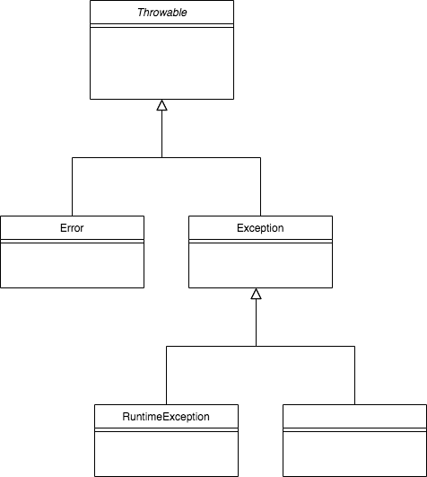

# Java Bootcamp by Hüseyin Karabakla

## Exception handling


Exception, runtime da yani uygulama çalışırken meydana gelen hatalardır. Bu hataların bir kısmı tolere edilebilirken 
bir kısmı ise uygulamanın tamamen durmasına neden olur. Developer olarak bizim amacımız bu hataları yakalamak ve 
mümkünse tolere edip uygulamanın çalışmaya devam etmesini sağlamaktır, tabi hatanın meydana gelmesini önlemek çok daha 
öncelikli hedefimiz, ama yinede bir hata meydana gelirse bu durumda sistemin mümkün olan en iyi şekilde devam etmesini
sağlamamız gerekir.

Java bizlere kullanılması kolay ve esnek bir hata yakalama mekanizması sunuyor. Detaylarına geçmeden önce Java dilinde 
gerçekleştirilen hata hierarşisini anlamak önemli.

Javada tüm hatalar sınıflar tarafından temsil edilir, yani bir hata oluştuğunda bir hata objesi oluşturulur. Java dilinde
tüm hataların atası **Throwable** sınıfıdır. Throwable sınıfının iki tane doğrudan alt sınıfı bulunur, **Exception** 
ve **Error**. Error sınıfı doğrudan bizim kodumuzla ilgili olmayan JVM ile ilgili hatalar için kullanılır ve bu hatalar 
kontrolümüz dışındadır. Ayrıca kod içerisinde tolere edilmesi de mümkün değildir, o nedenle bunlardan çok fazla 
bahsetmeyeceğiz. Exception sınıfı ise doğrudan yazdığımız kodla ilgili bizim kontrolümüzde olan hatalar için kullanılır.




### Exception yakalama bileşenleri
Javada hata yakalama beş anahtar kelime ile yönetilir; **try**, **catch**, **throw**, **throws** ve **finally**.
Hata açısından izlemek istediğimiz kodları try bloğuna yazmalıyız. try bloğu içerisinde bir hata oluşursa bu hata 
fırlatırlır. Fırlatılan hatayı catch bloğu yakalar, tabiki fırlatılan hata ile eşleşen bir catch bloğu varsa. Sistem 
tarafından oluşturulan hatalar otomatik olarak fırlatılır fakat bazı durumlarda bizim de manuel olarak hata fırlatmamız 
gerekir, bu durumda throw ifadesi kullanılır. Bazı durumlarda yazdığımız metodun hangi hataları fırlatabileceğini metod 
imzasında belirtmemiz gerekir. Bu durumda throws ifadesi kullanılır. Bir try bloğundan sonra hata olsun olmasın mutlaka 
yapılması gereken bir iş varsa o da finally bloğunda yapılır.

try ve catch bloğunun genel yapısı aşağıdaki gibidir. try tek başına kullanılabilir ama catch ifadesi sadece try ile 
birlikte kullanılabilir.

```java
try {
    // hata firlatma olasiliği bulunan kod
} catch(ExceptionType1 e) {
    // ExceptionType1 tipinde fırlatılan hataları yakalayan handler
} catch(ExceptionType2 e) {
    // ExceptionType2 tipinde fırlatılan hataları yakalayan handler
}
```
try bloğu içerisinde bir hata oluştuğu zaman, blok içerisinde hatanın gerçekleştiği noktadan sonra gelen kod işletilmez. 
O noktadan itibaren kodun akışı oluşan hata ile en çok uyumlu olan catch bloğuna geçer. O nedenle catch bloğunu 
oluştururken hata tipi seçimi önemlidir. catch bloğuna oluşan hata objesi argüman olarak verilir ve blok içerisinde hata 
işlenir.

Eğer hiçbir hata oluşmaz ise kod akışı en son catch ifadesinden sonraki kod parçasıyla devam eder. catch blokları 
yalnızca ilgili hata try bloğu içinde oluştuğu zaman çalıştırılır.

Kod içerisinde şöyle bir akış olduğunu düşünelim; a() metodu içerisinde bir noktada b() metodunu çağırsın ve b() metodu 
içinde bir noktada c() metodunu çağırsın ve c() metodu çalıştırılırken bir hata alalım. Eğer hata c() metodu içerisinde 
yakalanmıyorsa hata hierarşide bir üst katmana aktarılır yani b() metodunda c() metodunu çağırdığımız noktaya. Eğer o 
noktada da hatayı yakalayan bir catch bloğu yoksa hata bir üst katmana yani a() metodu içinde b() metodunun çağrıldığı 
yere aktarılır. Eğer bu noktada bu hatayı yakalayacak bir catch bloğu varsa hata orada yakalınır ve işlenir. Yok ise bu 
hata main metoduna kadar aktarılır ve uygulamanın durmasına neden olabilir. 

```java

public void a() {
    // .... 
 
    b();
    
    // ....       
}

public void b() {
    // .... 
        
    c();

    // ....
}

public void c() {
    // ...
    
    // Exception fırlatan bir kod parçası
        
    // ...
}


```

Şimdi bütün bu öğrendiklerimizi bir örnekle kod üzerinde görelim;

```java
public class ArrayOperations {

    public void putValue(int[] array, int index, int value) {
        System.out.println("    putValue method started");
        array[index] = value;
        System.out.println("    putValue method ended successfully");
    }
}

public class com.hkarabakla.Main {

    public static void main(String[] args) {

        ArrayOperations operations = new ArrayOperations();
        int[] numbers = new int[7];
        try {
            System.out.println("try block is started");
            operations.putValue(numbers, 10, 27);
            System.out.println("try block is ended");
        } catch (ArrayIndexOutOfBoundsException ex) {
            System.out.println("Exception catched " + ex.toString());
        }

        System.out.println("Program ends gracefully");
    }
}
```
Output :
```
try block is started
    putValue method started
Exception catched java.lang.ArrayIndexOutOfBoundsException: 10
Program ends gracefully
```

Bu örnek bize hata yakalamanın nasıl işlediğine dair pek çok bilgi veriyor. Örnekte görüldüğü gibi putValue() metodunda 
arraye bir int değer koymaya çalışırken ArrayIndexOutOfBoundsException alıyoruz ve bu hatadan sonraki satır işletilmeden 
hata bu metodun çağırıldığı bir üst katmana iletiliyor, yani main() metoduna. main() metodu içinde putValue() metoduna 
çağrı yaptığımız kod parçası try bloğu içinde yer alıyor. Ve catch bloğunda yakaladığımız hata türü runtime da aldığımız 
hata türüyle eşleştiği için program akışı catch bloğuna geçiyor. catch bloğu içinde hata işleniyor ve buradan yeni bir 
hata fırlatılmadığı için akış catch bloğu sonrasından devam ediyor. 

Bu örnekte hatanın yakalanmadığını düşünelim;

```java
public class com.hkarabakla.Main {

    public static void main(String[] args) {

        ArrayOperations operations = new ArrayOperations();
        int[] numbers = new int[7];

        System.out.println("before calling put value");
        operations.putValue(numbers, 10, 27);
        System.out.println("after calling put value");
    }
}

```
Output :
```
before calling put value
    putValue method started
Exception in thread "main" java.lang.ArrayIndexOutOfBoundsException: 10
	at com.hkarabakla.inheritance.ArrayOperations.putValue(ArrayOperations.java:7)
	at com.hkarabakla.inheritance.com.hkarabakla.Main.main(com.hkarabakla.Main.java:11)

Process finished with exit code 1
```
Bu çıktı bize uygulamayı debug ederken hatanın yerini bulmak için yardımcı olurken başkalarının pek işine yaramayacaktır.
O nedenle hatanın uygun şekilde işlenip uygun hata mesajlarının loga basılması gerekir.

Şimdi catch bloğunun bulunması fakat fırlatılan hata ile eşleşmemesi durumunda neler olur ona bakalım;

```java
public class com.hkarabakla.Main {

    public static void main(String[] args) {

        ArrayOperations operations = new ArrayOperations();
        int[] numbers = new int[7];
        try {
            System.out.println("try block is started");
            operations.putValue(numbers, 10, 27);
            System.out.println("try block is ended");
        } catch (ArithmeticException ex) {
            System.out.println("ArithmeticException catched " + ex.toString());
        }

        System.out.println("Program ends gracefully");
    }
}
```
Output : 
```
try block is started
    putValue method started
Exception in thread "main" java.lang.ArrayIndexOutOfBoundsException: 10
	at com.hkarabakla.inheritance.ArrayOperations.putValue(ArrayOperations.java:7)
	at com.hkarabakla.inheritance.com.hkarabakla.Main.main(com.hkarabakla.Main.java:11)

Process finished with exit code 1
```
Sonuç aynı, doğru hata türünü catch bloğunda kullanmak o nedenle önemli, kullanılmadığı taktirde hatayı yakalamak mümkün
değildir.

Hatalar uygun bir şekilde yakalanırsa uygulamanın çalışmaya devam edeceğini söylemiştik, şimdi bunu başka bir örnekle 
görelim;

```java
public class ExceptionDemo3 {

    public static void main(String[] args) {
        int[] numbers = new int[] {1, 34, 56, 23, 78};
        int[] dividers = new int[] {5, 0, 12, 0, 34};

        for (int i = 0; i < numbers.length; i++) {
            try {
                System.out.println(numbers[i] + "/" + dividers[i] + "=" + numbers[i]/dividers[i]);
            } catch (ArithmeticException ex) {
                System.out.println("Division by 0, " + numbers[i] + "/" + dividers[i]);
            }
        }

        System.out.println("Program ended successfully");
    }
}
```
Output :
```
1/5=0
Division by 0, 34/0
56/12=4
Division by 0, 23/0
78/34=2
Program ended successfully
```

Bu örnekte eşit sayıda int değer taşıyan iki array tanımlanmış ve bir for döngüsü yardımıyla arrayler üzerinde dönülüyor.
Her adımda numbers arrayi içindeki ilgili indekste bulunan int değer dividers arrayi içinde ilgili indekste bulunan int 
değere bölünüyor ve sonuç ekrana yazdırılıyor. dividers arrayi içinde sıfır değerleri bulunduğu için sıfıra bölmeden 
dolayı ArithmeticException oluşuyor fakat bu hata yakalandığı için döngü sonraki adımdan devam ediyor ve uygulama normal 
bir şekilde son buluyor.

### Exception sınıflarında super class - subclass ilişkisi ve hata yakalamaya etkisi
Bir try ifadesinin birden fazla catch bloğu ile ilişkilendirilebileceğini söylemiştik. Böyle bir durumda aralarında üst 
sınıf alt sınıf ilişkisi bulunan hata sınıflarından; önce alt sınıf hatayı sonra üst sınıf hatayı catch blokları ile 
yakalamalıyız. Yani herzaman hata sıralamasında özelden genele doğru gidilmeli. Tersi durumda compiler hata verecektir. 
Şimdi daha iyi anlayabilmek için bunu bir örnekle görelim;

```java
public class ExceptionDemo4 {

    public static void main(String[] args) {

        int[] numbers = new int[] {1, 34, 56, 23, 78, 123, 49};
        int[] dividers = new int[] {5, 0, 12, 0, 34};

        for (int i = 0; i < numbers.length; i++) {
            try {
                System.out.println(numbers[i] + "/" + dividers[i] + "=" + numbers[i]/dividers[i]);
            } catch (ArithmeticException ex) {
                System.out.println("Division by 0, " + numbers[i] + "/" + dividers[i]);
            } catch (RuntimeException ex) {
                System.out.println("Another exception catched : " + ex);
            }
        }

        System.out.println("Program ended successfully");
    }
}
```
Output :
```
1/5=0
Division by 0, 34/0
56/12=4
Division by 0, 23/0
78/34=2
Another exception catched : java.lang.ArrayIndexOutOfBoundsException: 5
Another exception catched : java.lang.ArrayIndexOutOfBoundsException: 6
Program ended successfully
```

ArithmeticException sınıfı RuntimeException sınıfından türetilmiş bir hata sınıfıdır. Bu nedenle yukarıdaki örnekte
görüldüğü gibi ArithmeticException hatası ilk catch bloğunda, RuntimeException hataları ise ikinci catch bloğunda 
yakalanmıştır. try-catch blokları yukarıdan aşağı doğru işletildiği için JVM ilk catch bloğunu daha önce ziyaret edecektir.
Sınıf hierarşisi düşünüldüğünde ArithmeticException aynı zamanda bir RuntimeException sınıfından sayıldığı için, eğer
catch bloklarının yerini değiştirirsek JVM RuntimeException ve onun alt sınıflarından türeyen tüm exceptionları ilk blokta 
yakalayacak ve ikinci catch bloğunu hiçbir zaman ziyaret etmecektir. Bu da erişilemez bir kod parçasını uygulamaya eklemiş 
olması demektir. Bu nedenle compiler catch bloklarını yazarken exception hierarşisinde özelden(alt sınıftan) genele 
(üst sınıfa) hata sınıflarını sıralamamızı ister ve doğru sırada yazmazsak bizi hata vererk uyarır.


### throw ile hata fırlatma
Daha önce fırlatılan hataların nasıl yakalanacağını gördük. Bazı durumlarda kod içerisinden çeşitli nedenlerle isteyerek 
ve bilerek  bizim de hata fırlatmamız gerekebilir. Bu durumda bir hata objesi oluşturmamız ve onu throw ifadesi ile 
fırlatmamız gerekir. Yada catch bloğu içinde yakaladığımız bir hatayı işledikten sonra hatayı bir üst katmanda da işlensin
diye bir üst katmana tekrar fırlatmamız gerekebilir. Bu durumda tekrar hata objesi oluşturmamız gerekmez catch bloğuna 
gelen hatayı aynen fırlatabiliriz. Şimdi bunu bir örnekle görelim;

```java
public class ExceptionDemo5 {

    public static void main(String[] args) {
        try {
            int[] numbers = new int[]{1, 34, 56, 23, 78, 123, 49};
            int[] dividers = new int[]{5, 0, 12, 0, 34};

            multipleDivision(numbers, dividers);
        } catch (RuntimeException ex) {
            System.out.println("Fatal error, program terminated");
        }
    }

    private static void multipleDivision(int[] numbers, int[] dividers) {

        if (numbers.length != dividers.length) {
            System.out.println("Array sizes are not equal");
            throw new IllegalArgumentException("Array sizes must be equal");
        }

        for (int i = 0; i < numbers.length; i++) {
            try {
                System.out.println(numbers[i] + "/" + dividers[i] + "=" + numbers[i] / dividers[i]);
            } catch (ArithmeticException ex) {
                System.out.println("Division by 0, " + numbers[i] + "/" + dividers[i]);
            }
        }

        System.out.println("Program ended successfully");
    }
}
```
Output :
```
Array sizes are not equal
Fatal error, program terminated
```

### finally ifadesi
Bazı durumlarda try-catch ifadesini terk etmeden hemen önce çalıştırmamız gereken kodlar olabilir. Bu durumlar genelde 
try bloğu içinde bir dosya açtıysak onu kapatmak için yada bir network bağlantısı kurduysak o bağlantıyı kapatmak için
kullanılan kodlardır. Bu tarz durumlar programlamada oldukça yaygındır ve java bize bu durumu yönetmek için finally 
ifadesini sunuyor. Genel yapısı şu şekildedir;

```java
try {
    // hata firlatma olasiliği bulunan kod
} catch(ExceptionType1 e) {
    // ExceptionType1 tipinde fırlatılan hataları yakalayan handler
} catch(ExceptionType2 e) {
    // ExceptionType2 tipinde fırlatılan hataları yakalayan handler
} finally {
    // try ifadesi içinde yaratılan tüm kaynakları sonlandırmak için finally bloğu
}
```
Bu yapıda finally bloğu catch bloğundan sonra gösterilmiştir ama teoride finally bloğu doğrudan try bloğunun ardından da
gelebilir, exception yakalanmayacağı için finally ifadesi işletildikten sonra hata bir üst katmana iletilecektir. try 
bloğu içinden fırlatılan hata daha üst katmanlarda yakalanmaz ise uygulama son bulur. Bu durum teoride mümkün olsa da 
pratikte gerçekten böyle bir ihtiyaç olmadığı sürece tercih edilmemelidir.

Şimdi finally bloğunu bir örnekle inceleyelim;

```java
public class ExceptionDemo6 {

    public static void main(String[] args) {
        FileInputStream input = null;
        try {
            ClassLoader classLoader = ExceptionDemo6.class.getClassLoader();
            input = new FileInputStream(classLoader.getResource("file.txt").getFile());

            int data = input.read();
            while (data != -1) {
                System.out.print((char) data);
                data = input.read();
            }
        } catch (IOException e) {
            System.out.println("Exception occurred while reading file");
            e.printStackTrace();
        } finally {
            if (input != null) {
                try {
                    input.close();
                } catch (IOException e) {
                    System.out.println("Exception occurred while closing file");
                }
            }
        }
    }
}
```
Bu örnekte try bloğu içerisinde bir dosya okuma işlemi yapılıyor. Bu işlem sırasında dosyadaki verileri almak için bir
FileInputStream açılıyor, bu stream işlem sonrasında kapatılması gerekiyor. Bu kapatma işlemini finally bloğu içinde 
yapabiliriz. FileInputStream kapanma sırasında IOException fırlatabileceği için (önceden kapanma durumunda olduğu gibi) 
input.close(); ifadesi de try bloğu içerisine alınmıştır.

### throws ifadesi
Bazı durumlarda bir metod bir yada birkaç hata yarattığı halde bu hataları kendi içinde yakalamak yerine hata yakalama işini
kendisini çağıran metodlara bırakır. Bu durumda yakalanmayan hatalar metod imzasına throws ifadesi ile eklenir ve bu 
metodu çağıran kod parçası bu hatayı yakalamaya zorlanır. Bu zorlamayı compiler bizim için yapar. Genel yapı şu şekildedir;

```java
return_type methodName(parameter_list) throws exception_list {
}
```
Burada exception_list virgül ile ayrılmış hata listesini içerir.
Şimdi bir önceki örneği biraz değiştirerek throws ifadesinin nasıl kullanıldığını bir örnekle görelim;

```java
import java.io.FileInputStream;
import java.io.IOException;

public class ExceptionDemo7 {

    public static void main(String[] args) throws IOException {
        FileInputStream input = null;
        try {
            ClassLoader classLoader = ExceptionDemo7.class.getClassLoader();
            input = new FileInputStream(classLoader.getResource("file.txt").getFile());

            int data = input.read();
            while (data != -1) {
                System.out.print((char) data);
                data = input.read();
            }
        } finally {
            if (input != null) {
                try {
                    input.close();
                } catch (IOException e) {
                    System.out.println("Exception occurred while closing file");
                }
            }
        }
    }
}
```
catch bloğunun ortadan kalktığına ve throws IOException ifadesinin metod imzasına eklendiğine dikkat edelim.

### try-with-resource
Önceki örneklerde gördüğümüz gibi eğer try bloğu içerisinde bir dosya yada bir network bağlantısı açıyorsak o kaynağın
finally bloğu içinde kapatılması gerekiyor. Java 7 ile birlikte bu tarz durumlar için try-catch-finally blokları yerine
try-with-resource kavramı geldi. try-with-resource içerisinde açılan kaynaklar try bloğu sonrasında otomatik olarak kapatılır.
Bu kaynakların otomatik kapatılabilmeleri için AutoClosable interface ini implemente etmeleri gerekir.

Daha önceki örneklerdee gördüğümüz dosya okuma işlemini şimdi try-with-resource ile tekrar yapalım ve kodun nasıl 
sadeleştiğine dikkat edelim;

```java
import java.io.FileInputStream;
import java.io.IOException;

public class ExceptionDemo8 {

    public static void main(String[] args) {
        ClassLoader classLoader = ExceptionDemo8.class.getClassLoader();

        try (FileInputStream input = new FileInputStream(classLoader.getResource("file.txt").getFile())) {

            int data = input.read();
            while (data != -1) {
                System.out.print((char) data);
                data = input.read();
            }
        } catch (IOException e) {
            System.out.println("Exception occurred while reading file");
            e.printStackTrace();
        }
    }
}
```
Görüldüğü gibi aynı işi yapan kod çok daha kısa ve sade.

Eğer birden fazla kaynağa erişmemiz gerekirse try bloğu içinde, bu drumda aşağıdaki örnekte gösterildiği gibi kaynaklar 
noktalı virgül ile ayrılarak erişilebilir.

```java
try (Scanner scanner = new Scanner(new File("testRead.txt"));
        PrintWriter writer = new PrintWriter(new File("testWrite.txt"))) {
        while (scanner.hasNext()) {
            writer.print(scanner.nextLine());
        }
}
```

### Checked / unchecked exception
Daha önce tüm exceptionların Throwable sınıfından türediğinden ve onun altında Error ve Exception sınıflarının bulunduğundan 
bahsetmiştik. Şimdi bütün exception hiyerarşisine tekrar gözatalım ve bu yapının arkasında yatan mantığı anlamaya çalışalım.


Grafikte görüldüğü gibi tüm exceptionların atası Throwable sınıfı, onun altında Error sınıfı ve Exception sınıfı yer alıyor.
Exception sınıfının altında ise RuntimeException sınıfı ve diğer pekçok exception sınıfı bulunuyor. Bu kısımda daha çok 
RuntimeException ve diğer kardeşlerinden bahsedeceğiz.

Java dilinde uygulama ile ilgili ve runtime da karşımıza çıkabilecek tüm hatalar RuntimeException sınıfından türer. Bu 
hatalar çalışma sırasında karşımıza çıkar ve uygulamanın compile edilmesi sırasında görülmesi mümkün değildir. Bu 
nedenle de compiler bizi bu hataları yakalamak için zorlamaz, bu mantıktan dolayı bunlara unchecked exception denir. 
ArithmeticException, ArrayIndexOutOfBoundException unchecked exceptionlara örnektir.

Exception sınıfından türeyen RuntimeException dışındaki tüm exceptionlar compile time hatalarıdır ve catch edilmesi yada 
throw edilmesi zorunludur. Compiler tarafından kontrol edilen bu hatalara checked exception denilir. IOException,
SQLException checked exceptionlara örnektir.

Peki nezaman checked ne zaman unchecked exception kullanmalıyız ? Oracle'ın resmi dökümanında yeralan tavsiye şu şekilde:
> If a client can reasonably be expected to recover from an exception, make it a checked exception. If a client cannot 
> do anything to recover from the exception, make it an unchecked exception.

Yani hata fırlattığımız metodu çağıran metodun bu hatayı düzeltme ve tekrar metodumuzu çağırma fırsatı varsa checked 
exception, yok ise unchecked exception kullanmak faydalı.

## Generics (Jenerikler)
Java dilinde pek çok özellik çoğunlukla 1.0 versiyonunda eklenmiştir. Eklenen diğer tüm özellikler dilin kapsamını 
genişletmiştir ki bunlardan biri olan Jenerikler dili en çok şekillendirenlerden biridir.

Jenerikler temelde parametrik tip demektir. Yani parametrik bir sınıf, interface yada metod yaratırken aslında o kod 
parçasının hangi tip data üzerinde işlem yapacağını bildiriyoruz. Bu ne demek ? Biraz daha açalım konuyu.

Diyelim ki bir sıralama algoritması yazdınız ve bu algoritmanın int, String, Thread, Object gibi farklı tipler üzerinde 
çalışmasını istiyorsunuz. Jenerikler javaya eklenmeden önce bunu yapmanın iki yolu vardı, ya algoritmayı kullandığımız 
her obje tipi için yeniden yazmak, ki çok miktarda kod tekrarı demektir yada algoritmayı Object sınıfını baz alarak 
yazmak. Yani yaratacağınız sınıf, metodlar hepsi Object tipinde input alacak ve Object tipinde değer dönecek. Ancak bu 
şekilde genel bir algoritma implementasyonu mümkün oluyordu. Tabi çağırdığımız her metoddan sonra bize geri dönen Object 
tipindeki değeri de istediğimiz tipe cast etmemiz gerekiyordu. Bu beraberinde hem performans kaybı hemde runtime da 
hatalar almamıza neden oluyordu.

İşte bu sorunlara çözüm olarak Java dilini tasarlayanlar Jenerikleri dile kazandırdı. Jenerikler sayesinde algoritmalarda
veri tipinden bağımsız genelleme, kodun tekrar kullanılabilirliği ve güvenlik arttı.

Şimdi basit bir jenerik implementasyonu görelim:

```java
public class GenericType<T> {

    private T obj;

    public GenericType(T obj) {
        this.obj = obj;
    }

    public T getObj() {
        return obj;
    }

    void showType() {
        System.out.println("Type of the class is " + this.obj.getClass().getName());
    }
}

public class com.hkarabakla.Main {
    public static void main(String[] args) {

        GenericType<Integer> integerGenericType = new GenericType<>(7);
        integerGenericType.showType();
        Integer value1 = integerGenericType.getObj();
        System.out.println("Value of generic obj " + value1);

        GenericType<String> stringGenericType = new GenericType<>("--Generics--");
        stringGenericType.showType();
        String value2 = stringGenericType.getObj();
        System.out.println("Value of generic type " + value2);
    }
}
```    
Output :
```
Type of the class is java.lang.Integer
Value of generic obj 7
Type of the class is java.lang.String
Value of generic type --Generics--
```

Bu örnekte dikkat etmemiz gereken bir kaç nokta var. Birincisi jenerik sınıfımıza parametre tipini nasıl geçtiğimiz. 
Sınıf isminden hemen sonra gelen <> sembolleri arasına tip ismini veriyoruz. Burada tek harflik bir isim seçmek ve T, V, E 
gibi çok kullanılan tip isimlerini seçmek iyi olacaktır. Daha sonra bu tip ismini sınıf içinde farklı yerlerde kullanacağız.

Aynı T tipinde bir değişken tuttuğumuza ve sınıfın constructor kıısmında bu değişkeni initialize ettiğimize dikkat edelim.

Daha sonra bu değişkene erişebilmek için bir getter metodu ekledik, bu metod daha sonra yarattığımız jenerik değere
ulaşmak için kullanılacak.

Jenerik sınıfın sonunda da bu parametre tipinin gerçek ismini ekrana basan bir metod ekledik.

Bu jenerik sınıftan obje yaratmak için Integer ve String tip parametrelerini ve bu tiplerden değerler kullandık. Bu 
jenerik sınıftan türettiğimiz objelerin değerlerine ulaşmak için getObj metodunu çağırdık ve type casting yapmadık.

Jenerik sınıflar birden fazla tip parametresi ile çalışabilir, örneğin :

```java
public class KeyValuePair<K, V> {
    private K key;
    private V value;

    public KeyValuePair(K key, V value) {
        this.key = key;
        this.value = value;
    }

    public K getKey() {
        return key;
    }

    public V getValue() {
        return value;
    }

    void displayInfo() {
        System.out.println("Type of K " + key.getClass().getName());
        System.out.println("Type of V " + value.getClass().getName());
    }
}

public class com.hkarabakla.Main {
    public static void main(String[] args) {

        KeyValuePair<String, String> strKeyValuePair = new KeyValuePair<>("name", "Java");
        strKeyValuePair.displayInfo();

        KeyValuePair<String, Integer> mixKeyValuePair = new KeyValuePair<>("age", 25);
        mixKeyValuePair.displayInfo();
    }
}
```
Output :
```
Type of K java.lang.String
Type of V java.lang.String
Type of K java.lang.String
Type of V java.lang.Integer
```

### Sınırlandırılmış jenerikler
Daha önceki örneklerde herhangi bir referans tipin bir jenerik sınıf için tip parametresi olabildiğini gördük. Bazı 
durumlarda bu bir avantaj olurken bazen de sadece belli tiplerde tip parametresi kabul etmek isteriz. Örneğin matematiksel 
işlemler yapan bir jenerik sınıf yaratacaksak sadece nümerik değerlerin parametre olmasını isteriz. Örneğin :

```java
public class NumericOperation<T extends Number> {
    private T obj;

    public NumericOperation(T obj) {
        this.obj = obj;
    }

    public T getObj() {
        return obj;
    }

    boolean isDividableByTen() {
        return obj.doubleValue() - obj.intValue() == 0 && obj.intValue() % 10 == 0;
    }
}

public class com.hkarabakla.Main {
    public static void main(String[] args) {

        NumericOperation<Integer> intValue = new NumericOperation<>(23);
        System.out.println("Is " + intValue.getObj() + " dividable by ten : " + intValue.isDividableByTen());

        NumericOperation<Double> doubleValue = new NumericOperation<>(23.12);
        System.out.println("Is " + doubleValue.getObj() + " dividable by ten : " + doubleValue.isDividableByTen());

        NumericOperation<Double> doubleValue2 = new NumericOperation<>(30.0);
        System.out.println("Is " + doubleValue2.getObj() + " dividable by ten : " + doubleValue2.isDividableByTen());

        NumericOperation<String> stringNumericOperation = new NumericOperation<String>("invalid parameter type"); // HATA
    }
}
```
Output :
```
Is 23 dividable by ten : false
Is 23.12 dividable by ten : false
Is 30.0 dividable by ten : true
```

### Wildcard argüman
Daha önceki konuda gördüğümüz tek tipte tip argümanı kullanmak type safety için oldukça faydalı. Fakat bu özellik bizi tek 
tipte veri üzerinde işlem yapmaya zorluyor. Bazen farklı veri tipleri üzerinde işlem yapmak da gerekebilir, örneğin bir 
double değer ile bir float değeri karşılaştırmak gibi. Bu gibi durumlarda wildcard **?** ifadesini kullanabiliriz.

Daha önce gördüğümüz NumericOperation sınıfına iki sayısal değişkenin mutlak değerlerini karşılaştıran ve sonucunu dönen
bir metod ekleyelim. Bu metod tüm Number sınıfından türeyen değerleri karşılaştırabilsin. Örneğin :

```java
public class NumericOperation<T extends Number> {
    private T obj;

    public NumericOperation(T obj) {
        this.obj = obj;
    }

    public T getObj() {
        return obj;
    }

    boolean isDividableByTen() {
        return obj.doubleValue() - obj.intValue() == 0 && obj.intValue() % 10 == 0;
    }

    boolean absEqual(NumericOperation<?> another) {
        return Math.abs(this.obj.doubleValue()) == Math.abs(another.obj.doubleValue());
    }
}

public class com.hkarabakla.Main {
    public static void main(String[] args) {

        NumericOperation<Double> doubleNumeric = new NumericOperation<>(2.5);
        NumericOperation<Float> floatNumeric = new NumericOperation<>(-2.5f);

        System.out.println(doubleNumeric.absEqual(floatNumeric));
    }
}
```
Bu örnekte görüldüğü gibi wildcard ifadesini metod argümanı olarak kullanabildiğimiz gibi sınıf seviyesinde 
sınırlandırılmış jenerik yapımında da kullanabiliriz. Bunun daha önce yaptığımız sınırlandırılmış jenerik kullanımından 
hiç bir farkı yok, T yerine wildcard ifadesini kullanıyoruz.

```java
access_modifier class class_name<? extends super_class> {
    
}
```
Böylece jenerik sınıfımızda süper sınıftan türemiş tüm veri tipleri üzerinde işlem yapabiliriz.

// TODO : bu yukardaki yapiyi orneklendirebilirim

### Jenerik metodlar
Jenerik tip parametresinin sınıflara nasıl uygulandığını görmüştük. Bir sınıf jenerik parametre alırsa otomatikman sınıf 
içinde yeralan tüm metodlar bu jenerik tip üzerinde işlem yapabilme imkanına sahip oluyor. Bazen jenerik tipleri sadece 
belli metodlar üzerinde kullanmak gerekebilir. Bunun için metodun bulunduğu sınıfın tamamen jenerik olması gerekmez.

Örneğin jenerik olmayan bir sınıfta jenerik bir metodun nasıl yer alabileceğine bir bakalım. Bunun için iki arrayi 
karşılaştıran bir örnek yapalım;

```java
public class GenericMethodDemo {

    public <T extends Comparable<T>, V extends T> boolean arraysEqual(T[] arr1, V[] arr2) {
        if (arr1.length != arr2.length) {
            return false;
        }

        for (int i = 0; i < arr1.length; i++) {
            if (!arr1[i].equals(arr2[i])) {
                return false;
            }
        }

        return true;
    }
}

public class com.hkarabakla.Main {
    public static void main(String[] args) {

        GenericMethodDemo genericMethodDemo = new GenericMethodDemo();

        Integer[] integers1 = new Integer[]{1, 2, 3, 4, 5};
        Integer[] integers2 = new Integer[]{1, 2, 3, 4, 5};
        Integer[] integers3 = new Integer[]{1, 2, 3, 4, 5, 7};

        Double[] doubles = new Double[]{1.0, 2.0, 3.0, 4.0, 5.0};

        System.out.println("integers1 is equal to integers1 : " + genericMethodDemo.arraysEqual(integers1, integers1));
        System.out.println("integers1 is equal to integers2 : " + genericMethodDemo.arraysEqual(integers1, integers2));
        System.out.println("integers1 is equal to integers3 : " + genericMethodDemo.arraysEqual(integers1, integers3));

        //System.out.println("integers1 is equal to doubles : " + genericMethodDemo.arraysEqual(integers1, doubles));
    }
}
```
Output :
```
integers1 is equal to integers1 : true
integers1 is equal to integers2 : true
integers1 is equal to integers3 : false
```

Bu örnekte jenerik parametre tanımının metodun dönüş tipinden önce yapıldığına dikkat edelim. Jenerik metodlarda metod 
imzasındaki bu sıralama zorunludur. Yani jenerik metod tanımını erişim belirleyiciden önce yada metodun dönüş tipinden 
sonra yapamayız.

<T extends Comparable<T>, V extends T> bu tanımda ilk tipimizin(T) Comparable interface nden türemesi gerektiğini ve 
ikinci tipin (V) birinci tipten türemesi ya o tip ile aynı olması gerektiği belirttik. Bu durumda örneğin bir Integer 
arrayini bir Double array i ile karşılaştıramayız. Bu nedenle main metodu içinde yer alan son satırı yorum satırına 
çevirdik, aksi durumda compiler hata verecektir.

### Jenerik interface
Jeneriklerin sınıflara ve metodlara uygulanabilir olduğunu gördük. Şimdi sıra geldi interfacelere. Jenerikliğin uygulanışı
bakımından sınıf ve interface in hiçbir farkı yoktur. Örnek :

```java
public interface ContainChecker<T> {
    boolean contains(T obj);
}

public class GenericInterfaceDemo<T> implements ContainChecker<T> {

    T[] values;

    public GenericInterfaceDemo(T[] values) {
        this.values = values;
    }

    public boolean contains(T obj) {
        for (T value : values) {
            if (value.equals(obj)) {
                return true;
            }
        }
        return false;
    }
}

public class com.hkarabakla.Main {
    public static void main(String[] args) {
        Integer[] integers = new Integer[]{1, 2, 3, 6, 7, 9, 10};
        GenericInterfaceDemo<Integer> interfaceDemo = new GenericInterfaceDemo<>(integers);
        System.out.println("Contains 5 : " + interfaceDemo.contains(5));
        System.out.println("Contains 7 : " + interfaceDemo.contains(7));
    }
}
``` 
Output :
```
Contains 5 : false
Contains 7 : true
```

Jenerik interfacelerde dikkat edilmesi gereken birkaç nokta var.

Birincisi jenerik interface i implemente eden sınıf belli bir tip kullanmadığı sürece jenerik olmalıdır ve tip 
parametresini aynen interface e de geçmelidir.
```java
class GenericInterfaceDemo<T> implements ContainChecker<T> // Doğru
class GenericInterfaceDemo implements ContainChecker<T> // Hata
class GenericInterfaceDemo implements ContainChecker<Double> // Doğru
```

Bir diğer önemli nokta sınırlamadır, eğer jenerik bir interface tip parametresinde sınırlamaya gitmiş ise onu implemente 
eden sınıf da gitmek zorundadır.
```java
interface ContainChecker<T extends Number>
class GenericInterfaceDemo<T extends Number> implements ContainChecker<T> // Doğru
class GenericInterfaceDemo<T extends Number> implements ContainChecker<T extends Number> // Hata
```

// TODO : Comple jenerik konusunu özetleyen bir örnek eklenebilir, mesela jenerik queue gibi yada jenerik sorting algoritması gibi

## Lambda ifadeleri ve fonksiyonel interface
Daha önce interface tanımlamayı ve interfacelerin sınıflar tarafından nasıl implemente edildiğini gördük.
Şimdi interface metodlarını implemente etmek için başka bir yol öğreneceğiz, Lambda ifadeleri.
Lambda ifadeleri Java 8 ile birlikte gelen ve tıpkı jenerikler gibi Java dilini yeniden şekillendiren bir özellik. Lambda
ifadeleri ile birlikte Java programlama dili sadece nesneye yönelik bir programlama dili olarak kalmaktan kurtulmuş aynı
zamanda fonksiyonel bir programlama dili olma özelliği de kazanmıştır. Bu yönüyle lambda ifadeler Java geliştiricilerin 
günlük programlama alışkanlıklarını da epey değiştirmiştir.

Lambda ifadesi denilince akla iki şey gelmelidir; birincisi lambda fonksiyonunun kendisi, ikincisi ise fonksiyonel interface
kavramı.

Lambda ifadelerini tanımlamak için arrow operatörünü **->** kullanıyoruz. Arrow operatörünün sol tarafında lambda 
ifadesinin parametre listesi sağ tarafında ise implementasyonu yer alır.

```java
() -> 3.4
```
Yukardaki ifade aşağıdaki ifadeye denktir
```java
double getValue() {
    return 3.4;
}
```

Lambda ifadeleri tek başlarına bir anlam ifade etmezler. Çünkü anonim metodlardır, yani metod ismi ve ait oldukları bir 
sınıfları yoktur. Sadece özünde bir anonim metod implementasyonudur. O nedenle lambda ifadeleri bir fonksiyonel 
interface ile ilişkilendirilmelidir, başka türlü anonim metod kullanılamaz.

Fonksiyonel interface özünde sadece bir abstract metod bulunduran interface lere denir. Bu interfaceler sadece bir işe 
odaklanmıştır o nedenle sadece bir abstract metod içerirler. Bu abstract metodun yanında private yada default yada 
static metodlarda içerebilirler fakat önemli olan **sadece tek bir abstract metodunun** olmasıdır. 

```java
interface MyValue {
    double getValue();
}
```

Lambda ifadelerini aşağıdaki şekilde gösterildiği gibi fonksiyonel interfaceler ile ilişkilendiriyoruz.

```java
interface MyValue {
    double getValue();
}

MyValue value = () -> 3.4;
```
Burada önemli olan lambda ifadesinin ve abstract metodun imzalarının da tamamen birbirine uymasıdır. Aksi durumda compiler
lambda ifadeyi interface ile ilişkilendiremez ve hata verir.

Fonksiyonel interfacelerin önemli özelliklerinden biri de içerdikleri abstract metodun kendisiyle uyumlu birden fazla 
lambda metodu ile ilişkilendirilebiliyor olmasıdır. Bunu daha iyi anlamak için aşağıdaki örneğe bakalım;

```java
public interface NumericTest {

    boolean test(int a, int b);
}

public class com.hkarabakla.Main {
    public static void main(String[] args) {

        NumericTest isFactor = (m, n) -> m % n == 0;

        System.out.println("5 and 3 is factor " + isFactor.test(5, 3));
        System.out.println("27 and 3 is factor " + isFactor.test(27, 3));

        NumericTest lessThan = (x, y) -> x < y;
        System.out.println("5 is less than 3 " + lessThan.test(5, 3));
        System.out.println("11 is less than 17 " + lessThan.test(11, 17));

        NumericTest absEqual = (x, y) -> (x < 0 ? -x : x) == (y < 0 ? -y : y);
        System.out.println("absolute value of -9 is equal to -4 " + absEqual.test(-9, -4));
        System.out.println("absolute value of 17 is equal to -17 " + absEqual.test(17, -17));
    }
}
```
Output :
```
5 and 3 is factor false
27 and 3 is factor true
5 is less than 3 false
11 is less than 17 true
absolute value of -9 is equal to -4 false
absolute value of 17 is equal to -17 true
```

Buraya kadarki örneklerde tek bir işlemden oluşan lambda ifadelerini gördük. Lambda ifadeleri herzaman bukadar basit 
olmayabilir ve birden fazla işlem içerebilir. Bu durumda blok lambda dediğimiz ifadeleri kullanırız.

```java
public interface NumericFunc {
    int func(int a);
}

public class com.hkarabakla.Main {
    public static void main(String[] args) {

        NumericFunc biggestFactorBesidesItSelf = (x) -> {
            int result = 1;

            x = x < 0 ? -x : x;

            for (int i = 2; i <= x/2; i++) {
                if (x % i == 0) {
                    result = i;
                }
            }

            return result;
        };

        System.out.println("Biggest positive factor of 20 is " + biggestFactorBesidesItSelf.func(20));
        System.out.println("Biggest positive factor of 37 is " + biggestFactorBesidesItSelf.func(37));
    }
}
```
Output :
```
Biggest positive factor of 20 is 10
Biggest positive factor of 37 is 1
```

Burada blok içerisinde normal bir sınıf metodu gibi yapıyoruz fakat sonucu return etmemiz gerekiyor, önceki örneklerde 
bu return işlemi JVM tarafından otomatik olarak yapılıyordu.

Lambda ifadelerin bir diğer güzel özelliği ise metodlara argüman olarak gönderilebiliyor olmalarıdır, tıpkı değişkenler 
gibi. Yani lambda ifadeleri yardımıyla bir metodu farklı implemente edilmiş lambda ifadeleri ile çağırmak mümkün.

```java
public interface StringFunc {
    String func(String str);
}

public class com.hkarabakla.Main {

    static String changeStr(StringFunc stringChanger, String value) {
        return stringChanger.func(value);
    }

    public static void main(String[] args) {

        StringFunc reverse = (str -> {
            String result = "";

            for (int i = str.length() - 1; i >= 0; i--) {
                result += str.charAt(i);
            }
            return result;
        });

        System.out.println("Reverse of 'madam' is " + changeStr(reverse, "madam"));

        System.out.println("Cleaned word of '1,45,23,78,99' is " + changeStr(str -> str.replaceAll(",", " "), "1,45,23,78,99"));

    }
}

// TODO : yukardaki örneğin reverse metodu daha duzgun ımplemente edılebılır
```
Output :
```
Reverse of 'madam' is madam
Cleaned word of '1,45,23,78,99' is 1 45 23 78 99
```

Örnekte hem bir referans değere atanmış lambda ifadenin, hemde embedded bir lambda ifadenin nasıl metodlara parametre 
olarak gönderildiğini gördük. Bu kullanım şekliyle çok daha kompleks implementasyonlar yapmak mümkün.

### Jenerik lambda ifadeleri
Daha önceki örneklerde bir fonksiyonel interface içerisinde iki tane integer input alıp boolean değer dönen bir abstract 
metodu lambda ifadeleri ile implemente etmiştik. 

```java
public interface NumericTest {

    boolean test(int a, int b);
}
public class com.hkarabakla.Main {
    public static void main(String[] args) {
        NumericTest lessThan = (x, y) -> x < y;
        System.out.println("5 is less than 3 " + lessThan.test(5, 3));
        System.out.println("11 is less than 17 " + lessThan.test(11, 17));
    }
}
```

Bu implementasyonun aynısının birde double değerleri karşılaştırmak için yapılması gerektiğini düşünelim. Bu drumda 
aynı fonskiyonel interfaceden bir tane daha yaratmamız gerekecekti, fakat özünde implementasyon veri tipinden bağımsız 
olarak aynı olacaktı. İşte bu kod tekrarını önlemek için jeneriklerin kullanılabileceğini daha önce öğrenmiştik. 
Lambda ifadeleri doğaları gereği, bir sınıfa ait olmadıkları için, jenerik olamazlar fakat fonksiyonel interfaceler jenerik
olabilir.

```java
public interface NumericTest<T> {

    boolean test(T a, T b);
}

public class com.hkarabakla.Main {
    public static void main(String[] args) {

        NumericTest<Integer> lessThan = (x, y) -> x < y;
        System.out.println("5 is less than 3 " + lessThan.test(5, 3));
        System.out.println("11 is less than 17 " + lessThan.test(11, 17));

        NumericTest<Double> lessThanDouble = (x, y) -> x < y;
        System.out.println("5.4 is less than 3.2 " + lessThanDouble.test(5.4, 3.2));
        System.out.println("11.9 is less than 17.1 " + lessThanDouble.test(11.9, 17.1));
    }
}
```
Output :
```
5 is less than 3 false
11 is less than 17 true
5.4 is less than 3.2 false
11.9 is less than 17.1 true
```

### Lambda ifadeler ve variable capture
Lambda ifadelerin kendi içinde birer metod olduklarını ve normal metodlar gibi kendi içinde local değişken 
tanımlayabildiklerini gördük. Lambda ifadeler içinde tanımlanan local değişkenler sadece lambda bloğu içinde 
erişilebilirdir, yani lambda dışından erişilemez.

Peki tam tersi mümkün müdür ? Evet lambda ifadeler yaratıldıkları sınıfın instance değişkenlerine, static değişkenlerine 
ve metodlarına erişebilirler. Burada instance değişkenlerine ve static değişkenlerine değer de atayabilirler (özellikle 
final olmadıkları sürece). Ayrıca tanımlandıkları sınıfa da **this** ifadesi ile erişebilirler.

Ayrıca lambda ifadeler yaratıldıkları kod bloğu içinde tanımlanan local değişkenlere de sınırlı olarak erişebilirler, 
sadece değerini kullanabilir yeni değer atayamazlar. Bu olaya **variable capture** denir. Bu durumda local değişkenin 
**final** yada **effectively final** olması gerekir. Effectively final demek bir değişkenin değerinin ilk atamadan sonra 
değiştirilememesi anlamına gelir, özellikle final olarak belirtilmemesine rağmen.

```java
public interface NumericFunc {
    int func(int a);
}

public class com.hkarabakla.Main {

    static int value;

    public static void main(String[] args) {

        value = 10;

        NumericFunc func = (a) -> {
            value = 20;
            return value * a;
        };

        System.out.println("Value before calling lambda " + value);
        int valueFromFunc = func.func(3);
        System.out.println("Value after calling lambda " + value);
    }
}
```
Output :
```
Value before calling lambda 10
Value after calling lambda 20
```

Bu örnekte lambda ifadelerin static sınıf değişkenlerini nasıl değiştirebildiğini ve kullanabildiğini gördük.

```java
public interface NumericFunc {
    int func(int a);
}

public class com.hkarabakla.Main {

    public static void main(String[] args) {

        int value = 10;

        NumericFunc func = (a) -> {
            //value = 20;
            return value * a;
        };
        
        //value = 20;
    }
}
```
Bu comment out edilen iki satıra dikkat edelim. Lambda tarafından erişilen dış dünyanın local değişkenleri effectively
final demiştik. Yani bu drumda ilk yorum satırını açtığımız zaman compiler bize hata verecektir, çünkü effectively final
olan local değişkenler lambda ifadeler tarafından değiştirilemez. Fakat lambda ifade tarafından değerlerine erişilebilir.
Bu nedenle de ikinci yorum satırını comment out etmek zorunda kaldık, lambda tarafından erişilen local değişkenler lambda
dışında dahi değiştirilemez, çünkü effectively final durumuna gelirler.

Peki illa böyle birşey yapmamız gerekirse bu hatalardan kurtulmanın bir yolu yok mu ? Neyseki var, örneği inceleyelim;

```java
public class com.hkarabakla.Main {

    public static void main(String[] args) {

        final int[] value = {10};
        AtomicReference<String> strValue = new AtomicReference<>("sasa");

        NumericFunc func = (a) -> {
            value[0] = 20;
            strValue.set("");
            return value[0] * a;
        };

        System.out.println("Value before calling lambda " + value[0]);
        int valueFromFunc = func.func(3);
        System.out.println("Value after calling lambda " + value[0]);
        value[0] = 30;
        System.out.println("Value in the end " + value[0]);
    }
}
```
Output :
```
Value before calling lambda 10
Value after calling lambda 20
Value in the end 30
```

Örnekte görüldüğü gibi değiştirmek istediğimiz local değişkenleri final bir array içine atarak yada atomic referans 
tanımlayarak ve bu referans ile değiştirmek istediğimiz değeri sarmallayarak bunu yapmak mümkün.

### Lambda ifadeden fırlatılan exceptionlar
Checked ve unchecked olmak üzere iki tip exception olduğunu daha önce görmüştük. Lambda ifadeler de normal metodlar gibi
exception fırlatabilir. Eğer bir lambda ifade checked bir exception fırlatıyorsa bu durumda lambda ifadenin implemente 
ettiği fonksiyonel interface in abstract metodu da imzasında bu checked exceptionı bulundurmalı, aksi durumda compiler 
hata verir.

```java
public interface NumericTest<T extends Number> {

    boolean test(T a, T b);
}

public interface StringFunc {
    String func() throws IOException;
}

public class com.hkarabakla.Main {

    public static void main(String[] args) {

        StringFunc strReader = () -> {
            String result = "";
            InputStreamReader reader = new InputStreamReader(System.in);
            result = String.valueOf(reader.read());

            return result;
        };


        NumericTest<Integer> isFactor = (a, b) -> {
            if (b == 0) {
                throw new IllegalArgumentException("Divider cannot be zero");
            }
            return a % b == 0;
        };

        isFactor.test(20, 5);

        isFactor.test(20, 0);
    }
}
```

Örnekte görüldüğü gibi InputStreamReader sınıfının read metodu bir checked exception fırlattığı için StringFunc 
interfaceinin func metodu throws IOException ifadesini metod imzasında bulundurmak zorunda.

### Metod referanslar
Daha önceki bölümlerde fonksiyonel interfaceler tarafından bize sunulan abstract metodların anonim lambda ifadeleri
tarafından nasıl implemente edildiğini gördük. Şimdi varolan metodlarımızı nasıl lambda ifadeleri ile 
ilişkilendirebileceğimizi göreceğiz. Burada önemli olan referans edeceğimiz metodun imzasının fonksiyonel interface 
tarafından sunulan abstract metodun imzası ile eşleşiyor olması, aksi durumda compiler hatası oluşur.

#### static metodlara metod referans verme
Daha önce oluşturulmuş bir static metodu aşağıda gösterilen şekilde metod referans olarak kullanabiliriz;

```java
ClassName::methodName
```

Sınıf ismi ve metod ismi arasında yeralan çift iki nokta **::** ifadesi Java'ya metod referanslar için JDK8 versiyonuyla 
birlikte eklenmiştir.

```java
public interface IntPredicate {

    boolean test(int a);
}

public class MyIntPredicates {

    static boolean isPrime(int value) {

        if (value < 2) {
            return false;
        }

        for (int i = 2; i < value / i; i++) {
            if (value % i == 0) {
                return false;
            }
        }

        return true;
    }

    static boolean isEven(int value) {
        return value % 2 == 0;
    }

    static boolean isNegative(int value) {
        return value < 0;
    }

    static boolean isPositive(int value) {
        return value > 0;
    }
}

public class com.hkarabakla.Main {

    static boolean numberTest(IntPredicate predicate, int value) {
        return predicate.test(value);
    }

    public static void main(String[] args) {

        boolean result = numberTest(MyIntPredicates::isPrime, 17);
        System.out.println("17 is prime : " + result);

        result = numberTest(MyIntPredicates::isEven, 22);
        System.out.println("22 is even : " + result);

        result = numberTest(MyIntPredicates::isNegative, 13);
        System.out.println("13 is negative : " + result);

        result = numberTest(MyIntPredicates::isPositive, -1);
        System.out.println("-1 is positive : " + result);
    }
}
```
Output :
```
17 is prime : true
22 is even : true
13 is negative : false
-1 is positive : false
```
Aynı anonim lambda ifadelerinde olduğu gibi test metodunu çağırana kadar lambda ifadesi çalıştırılmaz.

#### objeler üzerinden metod referans verme
Aşağıda gösterilen şekilde objeler üzerinden metod referansları verilebilir.

```java
objectName::methodName
```
Daha önce static metodlar ile oluşturduğumuz örneği şimdi biraz değiştirelim,

```java
public interface IntPredicate {

    boolean test(int a);
}

public class MyIntPredicates {

    boolean isPrime(int value) {

        if (value < 2) {
            return false;
        }

        for (int i = 2; i < value / i; i++) {
            if (value % i == 0) {
                return false;
            }
        }

        return true;
    }

    boolean isEven(int value) {
        return value % 2 == 0;
    }

    boolean isNegative(int value) {
        return value < 0;
    }

    boolean isPositive(int value) {
        return value > 0;
    }
}

public class com.hkarabakla.Main {

    public static void main(String[] args) {

        MyIntPredicates predicates = new MyIntPredicates();

        IntPredicate intPredicate = predicates::isPrime;
        System.out.println("17 is prime : " + intPredicate.test(17));

        intPredicate = predicates::isEven;
        System.out.println("22 is even : " + intPredicate.test(22));

        intPredicate = predicates::isNegative;
        System.out.println("13 is negative : " + intPredicate.test(13));

        intPredicate = predicates::isPositive;
        System.out.println("-1 is positive : " + intPredicate.test(-1));
    }
}
```

#### Constructor referans
Lambda ifadeleri aracılığı ile obje yaratmak da mümkün, bunun için yaratmak istediğimiz objenin constructor ına referans 
vermek yeterli.

```java
ClassName::new
```

```java
public interface MyStringFunc {

    String build(char[] chars);
}

public class com.hkarabakla.Main {

    public static void main(String[] args) {
        MyStringFunc stringFunc = String::new;
        char[] chars = new char[]{'J', 'a', 'v', 'a', ' ', 'i', 's', ' ', 'a', 'w', 'e', 's', 'o', 'm', 'e', '!'};
        String newString = stringFunc.build(chars);
        System.out.println(newString);
    }
}
```
Output :
```
Java is awesome!
```
### Öntanımlı fonksiyonel interfaceler
Daha önceki örneklerimizde lambda ifadeleri kullanmak için fonksiyonel interfaceleri kendimiz tanımlamıştık. Fakat Java 
tafından bize sunulan öntanımlı interfaceler pek çok durumda işimizi görecek ve kendi interface imizi tanımlama gereğini
ortadan kaldıracktır. Bu interfaceler java.util.function paketi altına yeralır.


| Interface        | Amacı           |
| ---------------- |:-------------|
| Consumer&lt;T&gt;      | T tipinde bir obje gönderip üzerinde işlem yapmak için kullanılır. Metodu **accept()** |
| Supplier&lt;T&gt;      | T tipinde bir obje dönmek için kullanılır. Metodu **get()**      |
| Function&lt;T,R&gt;    | T tipinde bir obje gönderip üzerinde işlem yapıp R tipinde bir obje dönmek için kullanılır. Metodu **apply()**      |
| Predicate&lt;T&gt;     | T tipinde bir obje gönderip üzerinde işlem yapıp boolean değer dönmek için kullanılır. Metodu **test()**      |

```java
import java.util.function.Predicate;

public class com.hkarabakla.Main {

    public static void main(String[] args) {

        Predicate<Integer> isEven = n -> n % 2 == 0;

        System.out.println("5 is even : " + isEven.test(5));
        System.out.println("12 is even : " + isEven.test(12));
    }
}
```
Output:
```
5 is even : false
12 is even : true
```

## Multithreaded programlama


Pekçoğumuz bilgisayarı açtığımız zaman aynı anda birkaç uygulamayı başlatırız. Öğrneğin kod yazarken bir yandan internette
birşeyler arar bir yandan müzik dinler bir yandan da gelen maillerimizi kontrol ederiz. Bütün bunlar aynı anda olur yada
bize öyle oluyormuş gibi gelir. İşte bu olaya multitasking denilir, yani eş zamanlı görevler.

Bilgisayarda multi tasking yapmanın iki yolu vardır; process ler aracılığıyla yada threadler aracılığıyla. Process
dediğimiz şey işletim sistemi tarafından çalıştırılan her bir uygulamadır, az önce bahsettiğimiz gibi kod yazarken aynı
anda müzik dinlemek gibi. Thread ise processler tarafından yaratılan en küçük iş birimidir, aynı process içinde paralel
işler yapmaya yarar. Örneğin müzik uygulamanızda bir yandan müzik dinlerken bir yandan da listelerde gezinebilirsiniz.

Multithreading çok daha verimli uygulamalar yazmak için önemlidir. Çünkü gerçek hayatta pek çok uygulama bir iş yaparken
ya bir input bekler yada yaptığı bir işin sonucunun dönmesini bekler. Bu durumda CPU idle kalır yani boşta bekler, işte
multithreading ile bu idle zamanlar daha verimli hale getirilebilir.

Son yıllarda multicore yani çok çekirdekli CPU teknolojisi oldukça yaygın bir hale geldi. Tek çekirdekli bir CPU kullanan
bir sistemde aynı anda çalıştırılan threadler aynı CPU yu paylaşır, her bir thread sırayla CPU dan çalışma zamanı alarak
gerçekleştirir bunu. Bu durumda aslında thread ler aynı anda çalışmaz, sırayla çalışır fakat CPU okadar hızlıdır ki bu
işler arası geçişte, bu işlem kullanıcıda eş zamanlılık hissi yaratır. Çok çekirdekli CPU bulunduran sistemlerde aynı
anda gerçekten iki farklı thread farklı çekirdekler üzerinde çalıştırılarak gerçekten eş zamanlı görevler yaratılabilir.
Fakat teoride kod yazarken multithreading denilince tek çekirdekli CPU varmış gibi düşünmek gerekir, bu nedenle
multithreading denildiği zaman akla gelmesi gereken ilk konu CPU kullanımı olmalıdır.

### Thread sınıfı ve Runnable interface
Her bir process en az bir tane thread içermek zorundadır, bu threade _**main thread**_ denilir. main thread gerekli
durumda başka threadleri de yaratabilir.

Java'da multithread kavramı Thread sınıfı ve Runnable interface üzerine kurulmuştur. Yeni bir thread yaratmak ve ona bir
görev atamak için bu iki sınıfı kullanabiliriz; birinci yöntemde doğrudan Thread sınıfını extend edip run metodunu
override edebiliriz böylece yeni bir thread sınıfı yaratmış oluruz ve onun objelerini yaratarak doğrudan thread yaratmış
ve çalıştırmış oluruz. İkinci yöntemde ise Runnable sınıfını implemente eder ve run metodunu override ederek yeni bir
task oluştururuz ve bu oluşturduğumuz taskı bir thread objesine verip çalıştırmasını isteriz.

```java
public class MyThread extends Thread {
    
    public void run() {
        // any code    
    }
}

public class MyTask implements Runnable {

    public void run() {
        // any code    
    }
}
```

run() metodu oluşturacağımız thread çalıştığı zaman çağrılacak olup, bu metodun uygulama içindeki diğer metodlardan
hiçbir farkı yoktur. Sadece farklı bir thread tarafından çalıştırılır.

Bu noktaya kadar sadece thread in nasıl çalışacağını tanımlamış olduk, henüz thread i yaratmadık. Thread i yaratmak için
aşağıda gösterildiği gibi new ile yeni bir thread objesi yaratmamız gerekir.

```java
1. Yöntem - MyThread myThread = new MyThread();
2. Yöntem - MyTask task - new MyTask();
            Thread realThread = new Thread(task); 
```

Artık gerçek bir thread objemiz var, fakat bu sadece thread objesinin yaratılma kısmı, bu thread biz start() metodunu
çağırana kadar çalışmayacaktır. Şimdi bu noktaya kadar gördüklerimizi bir örnekle kod üzerinde inceleyelim.

```java
public class MultiThreadDemo1 implements Runnable {

    private String threadName;

    public MultiThreadDemo1(String name) {
        this.threadName = name;
    }

    public void run() {
        System.out.println(threadName + " is starting.");
        for (int i = 0; i < 10; i++) {
            try {
                Thread.sleep(400);
                System.out.println("In " + threadName + " count is " + i);
            } catch (InterruptedException e) {
                System.out.println(threadName + " is interrupted");
            }
        }

        System.out.println(threadName + " is terminating");
    }
}

public class MultiThreadDemoMain1 {

    public static void main(String[] args) {
        System.out.println("com.hkarabakla.Main thread is starting");

        MultiThreadDemo1 task = new MultiThreadDemo1("child1");

        Thread thread = new Thread(task);

        thread.start();

        for (int i = 0; i < 10; i++) {
            System.out.print(".");
            try {
                Thread.sleep(100);
            } catch (InterruptedException e) {
                System.out.println("com.hkarabakla.Main thread is interrupted");
            }
        }

        System.out.println("com.hkarabakla.Main thread is terminating");
    }
}
```
Output :
```
com.hkarabakla.Main thread is starting
.child1 is starting.
...In child1 count is 0
....In child1 count is 1
..com.hkarabakla.Main thread is terminating
In child1 count is 2
In child1 count is 3
In child1 count is 4
In child1 count is 5
In child1 count is 6
In child1 count is 7
In child1 count is 8
In child1 count is 9
child1 is terminating
```

Örnekte görüldüğü gibi main thread child1 isminde bir task yarattı ve bu taskı yeni yarattığı bir threade verip başlattı.
Bu noktadan itibaren iki thread paralel olarak çalıştı ve ekrana çıktı üretti. Bu işlemi yaparken de belli aralıklarla
çalışan threadler sleep() metodu çağrılarak durduruldu, bunu işlem akışını yavaş gösterimde daha iyi anlayabilmek için
yaptık.

Bir uygulama o uygulama tarafından yaratılan bütün threadler son bulduğunda uygulama da son bulur. Örneğin çıktısına
baktığımız zaman main threadin child thread den daha önce sonlandığını görüyoruz. Normalde önerilen main threadin en son
bitmesidir fakat threadlerin birbirini nasıl beklediğini ilerleyen konularda göreceğiz.

Bu örnekte MultiThreadDemo1 sınıfının bir name değişkeni tuttuğunu, ve MultiThreadDemo1 sınıfından bir obje oluşturup bu
objeyi oluşturacağımız Thread tipinde objeye input olarak verdiğimizi görüyoruz. Bu Runnable interface i kullanarak
yaptığımız örnekti, şimdi bir de aynı örneği Thread sınıfını extend ederek ve daha fazla thread yaratarak oluşturalım.

```java
public class MultiThreadDemo2 extends Thread {

    public MultiThreadDemo2(String name) {
        super(name);
    }

    public void run() {
        System.out.println(getName() + " is starting.");
        for (int i = 0; i < 10; i++) {
            try {
                Thread.sleep(400);
                System.out.println("In " + getName() + " count is " + i);
            } catch (InterruptedException e) {
                System.out.println(getName() + " is interrupted");
            }
        }

        System.out.println(getName() + " is terminating");
    }
}

public class MultiThreadDemoMain2 {

    public static void main(String[] args) {
        System.out.println("com.hkarabakla.Main thread is starting");

        MultiThreadDemo2 myThread = new MultiThreadDemo2("child1");
        MultiThreadDemo2 myThread2 = new MultiThreadDemo2("child2");
        MultiThreadDemo2 myThread3 = new MultiThreadDemo2("child3");

        myThread.start();
        myThread2.start();
        myThread3.start();

        for (int i = 0; i < 10; i++) {
            System.out.print(".");
            try {
                Thread.sleep(100);
            } catch (InterruptedException e) {
                System.out.println("com.hkarabakla.Main thread is interrupted");
            }
        }

        System.out.println("com.hkarabakla.Main thread is terminating");
    }
}
```
Output :
```
com.hkarabakla.Main thread is starting
.child2 is starting.
child1 is starting.
child3 is starting.
....In child2 count is 0
In child1 count is 0
In child3 count is 0
...In child1 count is 1
In child2 count is 1
In child3 count is 1
..com.hkarabakla.Main thread is terminating
In child3 count is 2
In child1 count is 2
In child2 count is 2
In child3 count is 3
In child1 count is 3
In child2 count is 3
In child3 count is 4
In child1 count is 4
In child2 count is 4
In child3 count is 5
In child1 count is 5
In child2 count is 5
In child3 count is 6
In child1 count is 6
In child2 count is 6
In child3 count is 7
In child1 count is 7
In child2 count is 7
In child3 count is 8
In child1 count is 8
In child2 count is 8
In child3 count is 9
child3 is terminating
In child2 count is 9
child2 is terminating
In child1 count is 9
child1 is terminating

```
Görüldüğü gibi task yaratmak yerine doğrudan Thread sınıfını extend ettiğimiz için direk start() metodunu çalıştırabiliyoruz,
ihtiyaca göre Runnable yada Thread tercih edilebilir. Fakat thread yaratma işleminin task yaratma işlemine göre daha
maliyetli olduğunu ve thread objelerinin farklı taskları çalıştırabilecek şekilde tekrar kullanılabilir olduğunu göz önünde
bulundurarak gerçek uygulamalarda tasklar yaratıp bu taskları threadlere vermeyi tavsiye ederim. Bunun nasıl yapılacağını
ilerleyen konularda göreceğiz.

Burada dikkat edilmesi gereken threadlerin bizim start() metodunu çağırdığımız sırada başlamamış olması, burada yarattığımız
threadleri JVM arka tarafta istediği gibi planlayabiliyor. Bu nedenle aynı kodu kendi bilgisayarınızda çalıştırmanız
durumunda bilgisayarınızın ve CPUnun durumuna göre farklı sırada çıktılar görmek mümkün.

### Bir threadin bitmesini nasıl bekleriz ?
Önceki örneklerde child threadleri yaratan main threadin child threadler işlemini bitirmeden son bulduğunu ve bunun iyi
bir pratik olmadığını söylemiştik. Normalde main thread yarattığı tüm threadler çalışmasını bitirene kadar beklemeli
sonra kendisi son bulmalıydı. Java dilinde bunu yapmanın üç tane yolu bulunuyor;

Birincisi main threadin uzunca bir süre, child threadlerin çalışma süresini kapsayacak şekilde, sleep() metodu ile
uyutulması. Bu yöntem child threadlerin nekadar süre çalışacağını kestiremediğimiz için uyuma süresini belirlemek çok
zor olduğundan tercih edilebilecek en kötü yöntem olarak karşımıza çıkıyor.

İkinci yöntem ise her bir threadin isAlive() metodunu çağırarak threadlerin çalışma durumunu bir döngü ile takip etmek ve bu süre
zarfında main threadi sürekli uyutmak. isAlive() metodu söz konusu thread çalıştığı sürece true döner ve thread son bulduğu
zaman dönüş değeri false değerini alır. Örneği inceleyelim;

```java
public class MultiThreadDemo2 extends Thread {

    public MultiThreadDemo2(String name) {
        super(name);
    }

    public void run() {
        System.out.println(getName() + " is starting.");
        for (int i = 0; i < 10; i++) {
            try {
                Thread.sleep(400);
                System.out.println("In " + getName() + " count is " + i);
            } catch (InterruptedException e) {
                System.out.println(getName() + " is interrupted");
            }
        }

        System.out.println(getName() + " is terminating");
    }
}

public class MultiThreadDemoMain3 {

    public static void main(String[] args) {
        System.out.println("com.hkarabakla.Main thread is starting");

        MultiThreadDemo2 myThread = new MultiThreadDemo2("child1");
        MultiThreadDemo2 myThread2 = new MultiThreadDemo2("child2");
        MultiThreadDemo2 myThread3 = new MultiThreadDemo2("child3");

        myThread.start();
        myThread2.start();
        myThread3.start();

        do {
            System.out.print(".");
            try {
                Thread.sleep(100);
            } catch (InterruptedException e) {
                System.out.println("com.hkarabakla.Main thread is interrupted");
            }
        } while (myThread.isAlive() || myThread2.isAlive() || myThread3.isAlive());

        System.out.println("com.hkarabakla.Main thread is terminating");
    }
}
```
Output:

```
com.hkarabakla.Main thread is starting
.child2 is starting.
child3 is starting.
child1 is starting.
...In child3 count is 0
In child2 count is 0
In child1 count is 0
....In child3 count is 1
In child2 count is 1
In child1 count is 1
....In child2 count is 2
In child1 count is 2
In child3 count is 2
....In child2 count is 3
In child3 count is 3
In child1 count is 3
....In child2 count is 4
In child3 count is 4
In child1 count is 4
....In child2 count is 5
In child3 count is 5
In child1 count is 5
....In child2 count is 6
In child3 count is 6
In child1 count is 6
....In child2 count is 7
In child3 count is 7
In child1 count is 7
....In child2 count is 8
In child3 count is 8
In child1 count is 8
....In child2 count is 9
In child3 count is 9
child3 is terminating
In child1 count is 9
child1 is terminating
child2 is terminating
com.hkarabakla.Main thread is terminating
```
Örnekte görüldüğü gibi main thread yarattığı child threadlerden sonra son bulmuştur. Bu yöntem ilk yönteme göre daha
verimli olsa da yine de zaman yönetimi konusunda en ideal yöntem değildir. Çünkü do-while döngüsü içerisinde main threadi
bekletmek ve ilk isAlive() kontrolünü yapmak için 100ms bekledik.

Üçüncü ve en verimli yöntem ise join() metodunun kullanımıdır. join() metodu child threadleri yaratan thread tarafından
çağrılır ve isminden de anlaşılacağı gibi child threadlerin işlerini bitirip tekrar main threade katılmalarını söyler.
Böylece sleep() metodunu kullanmaya gerek kalmaz ve işi biten child thread main threadi bunun hakkında bilgilendirir.
Şimdi thread join metodunun nasıl kullanıldığını örnekle görelim;

```java
public class MultiThreadDemo2 extends Thread {

    public MultiThreadDemo2(String name) {
        super(name);
    }

    public void run() {
        System.out.println(getName() + " is starting.");
        for (int i = 0; i < 10; i++) {
            try {
                Thread.sleep(400);
                System.out.println("In " + getName() + " count is " + i);
            } catch (InterruptedException e) {
                System.out.println(getName() + " is interrupted");
            }
        }

        System.out.println(getName() + " is terminating");
    }
}

public class MultiThreadDemoMain4 {

    public static void main(String[] args) {
        System.out.println("com.hkarabakla.Main thread is starting");

        MultiThreadDemo2 myThread = new MultiThreadDemo2("child1");
        MultiThreadDemo2 myThread2 = new MultiThreadDemo2("child2");
        MultiThreadDemo2 myThread3 = new MultiThreadDemo2("child3");

        myThread.start();
        myThread2.start();
        myThread3.start();

        try {
            myThread.join();
            myThread2.join();
            myThread3.join();
        } catch (InterruptedException e) {
            System.out.println("com.hkarabakla.Main thread is interrupted");
        }

        System.out.println("com.hkarabakla.Main thread is terminating");
    }
}
```
Output :
```
com.hkarabakla.Main thread is starting
child1 is starting.
child3 is starting.
child2 is starting.
In child1 count is 0
In child2 count is 0
In child3 count is 0
In child2 count is 1
In child1 count is 1
In child3 count is 1
In child2 count is 2
In child1 count is 2
In child3 count is 2
In child2 count is 3
In child1 count is 3
In child3 count is 3
In child1 count is 4
In child3 count is 4
In child2 count is 4
In child1 count is 5
In child3 count is 5
In child2 count is 5
In child3 count is 6
In child1 count is 6
In child2 count is 6
In child3 count is 7
In child2 count is 7
In child1 count is 7
In child3 count is 8
In child1 count is 8
In child2 count is 8
In child1 count is 9
In child2 count is 9
child2 is terminating
In child3 count is 9
child3 is terminating
child1 is terminating
com.hkarabakla.Main thread is terminating
```
Örnekte görüldüğü gibi main thread yarattığı child threadlerden sonra son bulmuştur. Threadler arası iletişim yardımıyla
main threadin child threadleri beklemesi sağlanmıştır. Bu yöntem threadler arası etkileşimi tetiklediği için herhangi bir
noktada sleep metodunu çağırmaya gerek yoktur ve işi biten thread doğrudan main threadi çağırdığından zaman kayıpları
yaşanmaz.

### Thread önceliklendirme
Çok threadli bir uygulamada threadlerin CPU zamanını paylaşarak çalıştığından bahsetmiştik. Hangi threadin ne kadar CPU
zamanı, diğer threadlere görece, alacağına threadin öncelik değerine göre karar verilir.

Bir threadin görece olarak daha yüksek önceliğe sahip olması o threadin daha düşük öncelikli bir threade göre daha hızlı
yada daha fazla CPU zamanı alarak çalışacağı anlamına gelmez. Çünkü bir threadin ne kadar CPU zamanı alacağını belirlemede
öncelik dışında başka faktörler de vardır. Bunlar arasında işletim sisteminin multitaskingi nasıl uyguladığı, öncelikli
threadin çeşitli nedenlerle bloklanıp bloklanmadığı sayılabilir.

Her threadin bir öncelik değeri vardır, bu değer 1 ve 10 arasında değişir. Biz bir değer atamazsak yarattığımız thread
5 ortalama öncelik değerine sahip olur. En düşük değer için MIN_PRIORITY, en yüksek değer için MAX_PRIORITY ve ortalama
değer için NORM_PRIORITY Thread sınıfı içinde sabit değişken olarak tanımlanmıştır. Bir threadin önceliğini atamak için
setPriority()metodu, aynı şekilde öncelik değerini okumak için de getPriority() metodu kullanılır. Şimdi thread
önceliklendirmenin nasıl yapıldığını örnekle görelim;

// TODO bu ornegı bırdaha ıncele statıc kullanmak ne kadar dogru
```java
public class MultiThreadDemo5 extends Thread {
    private int count = 0;
    public static boolean counting = true;
    private static final int maxCount = 100_000_000;

    @Override
    public void run() {
        System.out.println(this.getName() + " is starting.");
        do {
            this.count++;
            if(this.count == maxCount) {
                counting = false;
            }
        } while (counting && this.count < maxCount);

        System.out.println("In " + this.getName() + " count : " + count);
    }
}

public class MultiThreadDemoMain5 {
    public static void main(String[] args) {

        System.out.println("Number of processors : " + Runtime.getRuntime().availableProcessors());

        MultiThreadDemo5[] threads = new MultiThreadDemo5[30];

        for (int i = 0; i < threads.length; i++) {
            threads[i] = new MultiThreadDemo5();
        }

        threads[0].setPriority(Thread.MAX_PRIORITY);
        threads[1].setPriority(Thread.MAX_PRIORITY);
        threads[2].setPriority(Thread.MAX_PRIORITY);
        threads[3].setPriority(Thread.MAX_PRIORITY);
        threads[4].setPriority(Thread.MIN_PRIORITY);
        threads[5].setPriority(Thread.MIN_PRIORITY);
        threads[6].setPriority(Thread.MIN_PRIORITY);

        for (MultiThreadDemo5 thead : threads) {
            thead.start();
        }

        try {
            for (MultiThreadDemo5 thread : threads) {
                thread.join();
            }
        } catch (InterruptedException e) {
            System.out.println("com.hkarabakla.Main thread interrupted");
        }
    }
}
```
Output :
```
Number of processors : 12
Thread-1 is starting.
Thread-0 is starting.
Thread-2 is starting.
Thread-3 is starting.
Thread-4 is starting.
Thread-5 is starting.
Thread-6 is starting.
Thread-7 is starting.
Thread-8 is starting.
Thread-9 is starting.
Thread-10 is starting.
Thread-11 is starting.
Thread-12 is starting.
Thread-13 is starting.
Thread-14 is starting.
Thread-15 is starting.
Thread-16 is starting.
Thread-17 is starting.
In Thread-7 count : 100000000
In Thread-17 count : 1
In Thread-0 count : 100000000
In Thread-1 count : 100000000
In Thread-14 count : 9296
In Thread-10 count : 74334
Thread-19 is starting.
In Thread-19 count : 1
In Thread-15 count : 6878
Thread-21 is starting.
In Thread-21 count : 1
Thread-22 is starting.
In Thread-22 count : 1
In Thread-5 count : 120781
Thread-23 is starting.
In Thread-12 count : 100000000
Thread-24 is starting.
In Thread-24 count : 1
In Thread-13 count : 4180
Thread-25 is starting.
In Thread-4 count : 100000000
In Thread-23 count : 1
In Thread-3 count : 100000000
Thread-27 is starting.
Thread-28 is starting.
Thread-20 is starting.
Thread-18 is starting.
In Thread-8 count : 100000000
In Thread-2 count : 100000000
In Thread-6 count : 100000000
In Thread-9 count : 100000000
In Thread-16 count : 8193
In Thread-11 count : 100000000
In Thread-18 count : 1
In Thread-20 count : 1
Thread-29 is starting.
In Thread-29 count : 1
In Thread-28 count : 1
In Thread-27 count : 1
Thread-26 is starting.
In Thread-25 count : 1
In Thread-26 count : 1
```

Bu örnekte bir thread sınıfı yarattık ve threadin sıfırdan yüz milyona kadar saymasını istedik. main() metodu içerisinde
ise 30 tane thread objesi yarattık bu sınıftan. Bu thread objelerinden bazılarına MAX_PRIORITY bazılarına ise MIN_PRIORITY
öncelik değerini atadık. Yüz milyona ulaşan threadin diğer threadlerin çalışmasını durdurmak için de thread sınıfına static
bir boolean değer koyduk. Yüz milyona ulaşan ilk thread bu boolean değişkenin değerine false atadı ve diğer threadlerin de
sayma işlemini sonlandırmasını sağladık. Sonuç olarak da yukarıdaki çıktıyı elde ettek. 12 çekirdeğe sahip bir bilgisayarda
çalıştırdığımız bu kod thread öncelik değerinin ne kadar etkili olduğunu bunun yanında maksimum thread önceliğine sahip
olmayan başka threadlerin de sayma işlemini aynı zamanda bitirebildiğini gösterdi.

### Senkronizasyon
Çok threadli bir uygulama söz konusu olduğu zaman threadlerin aktivitelerini kontrol etmek gerekebilir. Bazı durumlarda
iki yada daha fazla thread paylaşılan bir kaynağa aynı anda erişmek ve üzerinde değişiklik yapmak isteyebilir. Örneğin
bir threadin bir dosyaya yazma işlemi yaptığı sırada bir başka threadin de aynı işlemi yapmak istemesi gibi. Böyle
durumlarda kaynağa ilk ulaşan threadin işini tamamlayıncaya kadar ilgili kaynağın lock dediğimiz kilit mekanizması ile
erişime kapatılması daha sonra ise tekrar erişime açılması gerekir. Java programlama dilinde her obje bu lock mekanizması
ile koruma altına alınabilir ve bu işlem **synchronized** ifadesi ile sağlanır.

#### Metodlar ile synchronized kullanımı
synchronized ifadesi ile metodlara erişim kontrol altına alınabilir. Bir sınıftaki herhangi bir metod synchronized ifadesini
aldığı zaman o metoda bir thread girdiğinde metodun bulunduğu obje otomatikman olarak lock mekanizması ile erişime kapatılır.
Bu durumda başka bir thread o sınıf içindeki hiçbir synchronized metoda erişemez. synchronized metod üzerinde işlem yapan
thread metoddan çıktığı zaman ise lock kaldırılır ve tüm obje yeniden erişilebilir hale gelir. Şimdi bu işlemin nasıl
yapıldığını örnekle görelim;

```java
public class ArrayOperations {

    int sum = 0;

    synchronized int sum(int[] array) {

        for (int value : array) {
            sum += value;
            System.out.println("Sum : " + sum + " Thread name : " + Thread.currentThread().getName());

            try {
                Thread.sleep(10);
            } catch (InterruptedException e) {
                System.out.println("com.hkarabakla.Main thread interrupted");
            }
        }

        return sum;
    }
}

public class MultiThreadDemo6 extends Thread {

    int[] array;
    static ArrayOperations op = new ArrayOperations();

    public MultiThreadDemo6(int[] array) {
        super();
        this.array = array;
    }

    @Override
    public void run() {
        System.out.println(this.getName() + " is starting");
        System.out.println("Sum of the array is : " + op.sum(this.array));

        System.out.println(this.getName() + " is finishing");
    }
}

public class MultiThreadDemoMain6 {

    public static void main(String[] args) {

        int[] array = {1, 23, 45, 9, 52, 78};

        MultiThreadDemo6 thread1 = new MultiThreadDemo6(array);
        MultiThreadDemo6 thread2 = new MultiThreadDemo6(array);

        thread1.start();
        thread2.start();

        try {
            thread1.join();
            thread2.join();
        } catch (InterruptedException e) {
            System.out.println("com.hkarabakla.Main thread is interrupted");
        }

        System.out.println("com.hkarabakla.Main thread is finishing");
    }
}
```
Output :
```
Thread-0 is starting
Thread-1 is starting
Sum : 1 Thread name : Thread-0
Sum : 24 Thread name : Thread-0
Sum : 69 Thread name : Thread-0
Sum : 78 Thread name : Thread-0
Sum : 130 Thread name : Thread-0
Sum : 208 Thread name : Thread-0
Sum of the array is : 208
Sum : 209 Thread name : Thread-1
Thread-0 is finishing
Sum : 232 Thread name : Thread-1
Sum : 277 Thread name : Thread-1
Sum : 286 Thread name : Thread-1
Sum : 338 Thread name : Thread-1
Sum : 416 Thread name : Thread-1
Sum of the array is : 416
Thread-1 is finishing
com.hkarabakla.Main thread is finishing
```
Örnekte bir int arrayinin tüm elemanlarını toplamak için ArrayOperations sınıfı içerisinde synchronized bir sum() metodu
yarattık. Daha sonra bu sınıftan sınıf düzeyinde static bir obje yaratarak oluşturduğumuz thread sınıfından sum() metodunu
çağırdık. Burda amaç threadlerin aynı obje üzerinde işlem yapmasını sağlamak. sum() metodu içerisinde de multitaskingi
mümkün kılmak için sleep() metodunu bilinçli olarak çağırdık. Son olarak main() metodu içerisinden 2 tane thread
yaratarak bu threadlere oluşturduğumuz int arrayini toplamalarını istedik. Bu işlem sonunda yukarıdaki çıktıyı alarak
synchronized ifadesinin threadleri nasıl blokladığını gördük.

#### synchronized blok kullanımı
synchronized ifadesini kontrolü bizde olan metodlara uygulanabilir. Fakat herzaman bu mümkün olmayabilir. Bazı durumlarda
kontrolü bizde olmayan yani başkası tarafından yazılmış metodları synchronized olarak çağırmamız gerekebilir. Böyle
durumlarda synchronized blok yardımımıza yetişiyor. synchronized metod örneğini şimdi bir de synchronized blok ile yapalım;

```java
public class ArrayOperations2 {

    int sum = 0;

    int sum(int[] array) {

        for (int value : array) {
            sum += value;
            System.out.println("Sum : " + sum + " Thread name : " + Thread.currentThread().getName());

            try {
                Thread.sleep(10);
            } catch (InterruptedException e) {
                System.out.println("com.hkarabakla.Main thread interrupted");
            }
        }

        return sum;
    }
}

public class MultiThreadDemo7 extends Thread {

    int[] array;
    static ArrayOperations op = new ArrayOperations();

    public MultiThreadDemo7(int[] array) {
        super();
        this.array = array;
    }

    @Override
    public void run() {
        System.out.println(this.getName() + " is starting");
        synchronized (op) {
            System.out.println("Sum of the array is : " + op.sum(this.array));
        }

        System.out.println(this.getName() + " is finishing");
    }
}

public class MultiThreadDemoMain7 {

    public static void main(String[] args) {

        int[] array = {1, 23, 45, 9, 52, 78};

        MultiThreadDemo7 thread1 = new MultiThreadDemo7(array);
        MultiThreadDemo7 thread2 = new MultiThreadDemo7(array);

        thread1.start();
        thread2.start();

        try {
            thread1.join();
            thread2.join();
        } catch (InterruptedException e) {
            System.out.println("com.hkarabakla.Main thread is interrupted");
        }

        System.out.println("com.hkarabakla.Main thread is finishing");
    }
}
```
Output :
```
Thread-0 is starting
Thread-1 is starting
Sum : 1 Thread name : Thread-0
Sum : 24 Thread name : Thread-0
Sum : 69 Thread name : Thread-0
Sum : 78 Thread name : Thread-0
Sum : 130 Thread name : Thread-0
Sum : 208 Thread name : Thread-0
Sum of the array is : 208
Thread-0 is finishing
Sum : 209 Thread name : Thread-1
Sum : 232 Thread name : Thread-1
Sum : 277 Thread name : Thread-1
Sum : 286 Thread name : Thread-1
Sum : 338 Thread name : Thread-1
Sum : 416 Thread name : Thread-1
Sum of the array is : 416
Thread-1 is finishing
com.hkarabakla.Main thread is finishing
```
Çıktıda görüldüğü gibi synchronized blok synchronized metod ile benzer bir davranış sergiledi. sum() metodunda bulunan
synchronized ifadesini kaldırıp thread sınıfı içerisinde ArrayOperations2 objesine synchronized blok içerisinden eriştik.

### Threadler arası iletişim
Bazı durumlarda birden fazla thread tarafından paylaşılan obje geçici olarak kullanıma uygun olmayabilir. Bu durumda
thread objeyi kullanmak yerine wait() metodunu çağırarak kendini beklemeye alır ve diğer threadlerin işlemleri bitirmesi
için beklemeye geçer. Bu durumu notify() yada notifyAll() metodlarını çağırarak obje üzerinde işlem yapmak için bekleyen
diğer threadlere bildirir. O threadler de işlemlerini bitirince aynı biçimde notify() yada notifyAll() metodlarını
çağırarak diğer bekleyen threadleri uyarır. wait(), notify() ve notifyAll() metodları Object sınıfından gelir ve
synchronized kapsamı içinden çağrılmalıdır.

Bu durumu basit bir tick tock uygulaması yaparak yakından görelim;

```java
public class MessageGenerator {

    String state;

    synchronized void tick(boolean running) {

        if (!running) {
            state = "ticked";
            notify();
            return;
        }

        System.out.print("Tick ");
        state = "ticked";

        notify();

        try {
            while (!state.equals("tocked")) {
                wait();
            }
        } catch (InterruptedException e) {
            e.printStackTrace();
        }
    }

    synchronized void tock(boolean running) {

        if (!running) {
            state = "tocked";
            notify();
            return;
        }

        System.out.println("tock");
        state = "tocked";

        notify();

        try {
            while (!state.equals("ticked")) {
                wait();
            }
        } catch (InterruptedException e) {
            e.printStackTrace();
        }
    }
}

public class MultiThreadDemo8 extends Thread {

    MessageGenerator generator;

    public MultiThreadDemo8(String name, MessageGenerator generator) {
        super(name);
        this.generator = generator;
    }

    @Override
    public void run() {
        System.out.println(this.getName() + " is starting");

        if(this.getName().equals("Tick")) {
            for (int i = 0; i < 5; i++) {
                generator.tick(true);
            }
            generator.tick(false);
        }  else {
            for (int i = 0; i < 5; i++) {
                generator.tock(true);
            }
            generator.tock(false);
        }

        System.out.println(this.getName() + " is finishing");
    }
}

public class MultiThreadDemoMain8 {

    public static void main(String[] args) {

        MessageGenerator generator = new MessageGenerator();
        MultiThreadDemo8 thread1 = new MultiThreadDemo8("Tick", generator);
        MultiThreadDemo8 thread2 = new MultiThreadDemo8("Tock", generator);

        thread1.start();
        thread2.start();

        try {
            thread1.join();
            thread2.join();
        } catch (InterruptedException e) {
            System.out.println("com.hkarabakla.Main thread is interrupted");
        }

        System.out.println("com.hkarabakla.Main thread is finishing");
    }
}
```
Output :
```
Tick is starting
Tock is starting
Tick tock
Tick tock
Tick tock
Tick tock
Tick tock
Tick is finishing
Tock is finishing
com.hkarabakla.Main thread is finishing
```
Örnekte görüldüğü gibi iki thread farklı mesajları ekrana bastırmak için ayarlanmıştır ve threadler mesajları yazdırmak
için birbirini beklemektedir. İlk thread 'Tick' mesajını yazdırdıktan sonra beklemeye geçer ve topu diğer threade atar.
O thread de aynı şekilde 'tock' mesajını yazdıktan sonra beklemeye geçer ve yeni den 'tick' mesajı yazılması için diğer
threadi uyarır.
