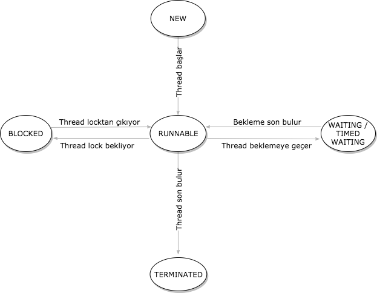
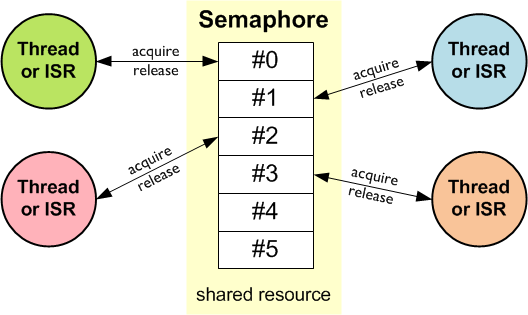
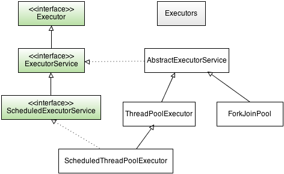
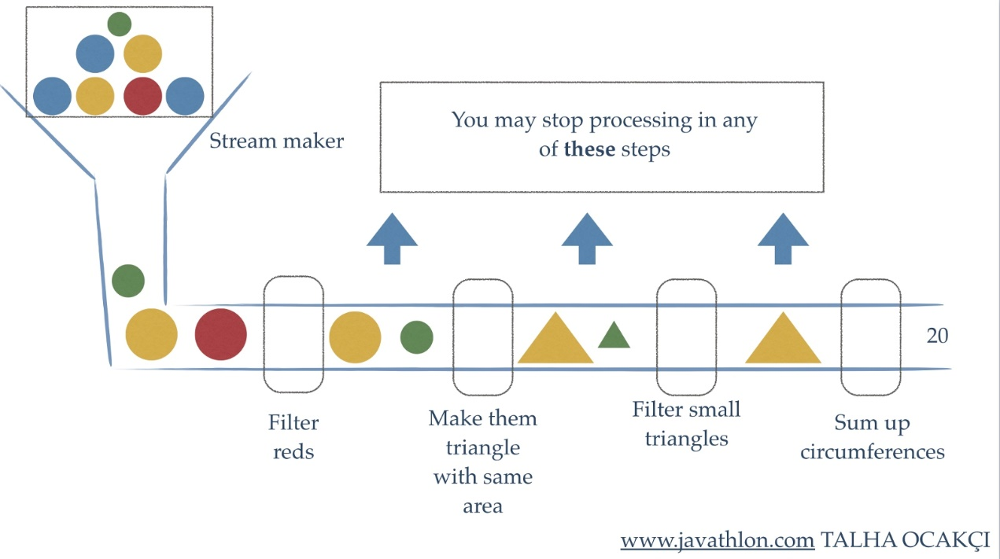
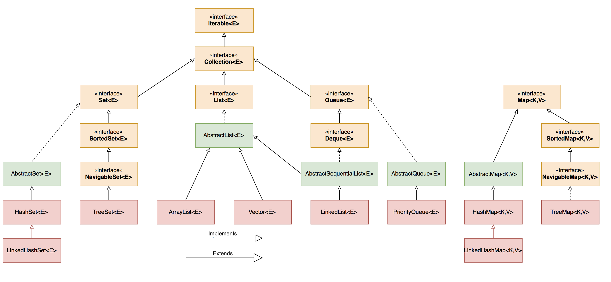
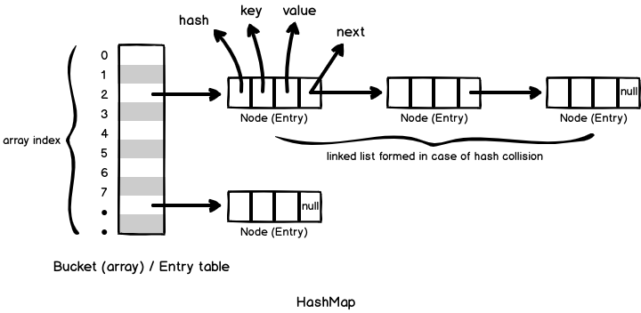

# Java Bootcamp - 3. Hafta

## Multithread programlama

### Deadlock kavramı
Deadlock kelimesinin Türkçe anlamı çıkmaza girmek demektir ve multithread uygulamalarda birden fazla threadin synchronized
objeler üzerinde döngüsel bağımlılığa düşmesi durumudur. Örneğin bir thread bir A objesinin synchronized metodundan 
başka bir B objesinin synchronized metodunu çağırıyorsa ve aynı zamanda başka bir thread B objesinin bir synchronized metodu
içerisinden A objesinin synchronized metodunu çağırıyor ise bu durumda deadlock oluşur. Bu durumda threadler çıkmaz bir yola
girmiş olup birbirlerini sonsuza kadar beklerler. Böyle durumlar çok nadir oluştuğundan ve threadlerın aynı CPU cycle ında 
bu durumu gerçekleştirmesi gerektiğinden bu durumu debug etmek ve test etmek zordur. Ama yine de multithread bir uygulama 
yazıyorsak synchronized kod içeren sınıfların bağımlılıklarını kontrol etmek gerekir.

### Thread yaşam döngüsü
Bir thread var olmaya başladığı andan itibaren bir durum(state) bilgisine sahip olur. Bu state bilgisi threadin o anki
durumuna göre şu değerleri alabilir; NEW, RUNNABLE, BLOCKED, WAITING, TIMED_WAITING ve TERMINATED. State bilgisi değerleri 
Thread sınıfı içinde tanımlanmıştır.



NEW : Bir thread ilk yaratıldığı anda bu state bilgisine sahip olur.

RUNNABLE : start() metodunu çağırdığımız anda threadin state bilgisi Runnable olarak atanır ve artık thread çalışmaya hazırdır.
Fakat biz start() metodunu çağırdığımızda direk çalışmaya başlamaz sadece scheduler (planlayıcı) ın kendisine CPU zamanı
vermesini bekler.

BLOCKED : Bir thread bir input beklerken yada başka bir thread tarafından lock edilmiş bir obje üzerinde çalışmayı beklerken
Blocked durumuna geçer.

WAITING : Bir thread başka bir threadin çalışıp işini bitirmesini bekliyorsa sahip olduğu durumdur.

TIMED_WAITING : sleep() yada wait() metodlarının timeout bilgisi ile çağırılması sonucu threadin sahip olduğu durumdur.

TERMINATED : Bir threadin başarıyla yada hata olarak son bulması durumunda sahip olduğu durumdur.

Bir threadin state bilgisi **getState**() metodu çağrılarak alınabilir fakat bu state bilgisi threadi kontrol etmek için
kullanılamaz, çünkü bir bu değeri okuduktan hemen sonra değer değişebilir. Bu bilgiyi daha çok debug amaçlı kullanmakta fayda var.

### Concurrent API
Bu kısma kadar Java'da thread yaratma, threadler arası iletişim ve öncelik atama gibi yönetim işlemlerinin nasıl yapıldığını
gördük. Bunu yaparken Thread sınıfı ve Runnable interface ini ve Object sınıfının bize sağladığı wait(), notify(), notifyAll()
metodlarını kullandık. Bunlar her nekadar kullanışlı araçlar olsa da bazı uygulamalar için gerekli olan üst seviye fonksiyonları
sağlamıyorlar. İşte tam da bu ihtiyacı karşılamak için java diline concurrent paketi eklendi. Bu paket içerisinde semaphor,
thread pool ve execution manager gibi üst seviye fonksiyonları sağlayan sınıflar yeralmaktadır.

#### Senkronizasyon sınıfları
Thread senkronizasyonu önemli olduğu kadar bazı durumlarda çok karmaşık bir hal alabilmekte. İhtiyaçların çeşitliliği ve
senkronizasyon işleminin karmaşıklığı karşısında Java dili concurrent paketi içerisinde çeşitli senkronizasyon araçları 
sunuyor bize, şimdi bunları tek tek görelim.

##### Semaphore
Semaphore sınıfı ortak kullanılan objeler üzerinde threadlerin sıra ile işlem yapmasına olanak verir. Bu işlemi daha önce 
de klasik thread ve Object sınıfının fonksiyonları ile de yapmıştık. Fakat Semaphore sınıfı bu işlemi çok daha kolay hale
getiriyor.



Semaphore sınıfı arka planda bir değişken tutar ve bir thread paylaşılan bir objeye erişmek istediğinde semaphore objesinin 
acquire() metodunu çağırması gerekir. Semaphore bu durumda eğer kaynak üzerinde çalışan aktif bir thread yoksa erişim isteyen
o threade erişim verir ve bu değişkenin değerini artırır. Eğer kaynak üzerinde çalışan başka bir thread varsa bu durumda
erişim isteyen thread kaynak müsait oluncaya kadar bloklanır. Daha sonra kaynak üzerinde çalışan thread işini bitirdiği zaman 
aynı semaphore objesinin release() metodunu çağırır ve kaynağı serbest bırakır. Bu durumda ise semaphore objesinde tutlan 
değişkenin değeri azaltılır, bu değişkenin değeri 0 olduğu zaman kaynak erişime müsait demektir.

Semaphore sınıfının 2 tane constructoru vardır;

```java
Semaphore(int permits)
Semaphore(int permits, boolean fair)
```

Burada permits parametresi başlangıçta verilecek erişim sayısını ayarlamak için fair parametresi ise true olması durumunda 
erişim isteyen threadlere erişim isteme sırasına göre erişim verme imkanı sunuyor.

Şimdi Semaphore sınıfının nasıl kullanıldığını görmek için bir [örnek](../../examples/src/com/hkarabakla/concurrency/SemaphoreDemoMain2.java) yapalım;

```java
public class SharedObject {

    private static int value = 0;

    static int incrementAndGet() {
        return ++value;
    }

    static int decrementAndGet() {
        return --value;
    }
}

import java.util.concurrent.Semaphore;

public class SemaphoreDemo2 implements Runnable {

    private boolean increment;
    private String name;
    private Semaphore semaphore;

    public SemaphoreDemo2(boolean increment, String name, Semaphore semaphore) {
        this.increment = increment;
        this.name = name;
        this.semaphore = semaphore;
    }

    public void run() {
        try {
            semaphore.acquire();

            if (increment) {
                for (int i = 0; i < 5; i++) {
                    System.out.println(name + " value : " + SharedObject.incrementAndGet());
                    Thread.sleep(10);
                }
            } else {
                for (int i = 0; i < 5; i++) {
                    System.out.println(name + " value : " + SharedObject.decrementAndGet());
                    Thread.sleep(10);
                }
            }
        } catch (InterruptedException e) {
            e.printStackTrace();
        }

        semaphore.release();
    }
}

public class SemaphoreDemoMain2 {

    public static void main(String[] args) throws InterruptedException {

        Semaphore semaphore = new Semaphore(1, true);

        SemaphoreDemo2 taskInc = new SemaphoreDemo2(true, "Incrementer", semaphore);
        SemaphoreDemo2 taskDec = new SemaphoreDemo2(false, "Decrementer", semaphore);

        Thread tInc = new Thread(taskInc);
        Thread tDec = new Thread(taskDec);

        tInc.start();
        tDec.start();

        tInc.join();
        tDec.join();
    }
}

```
Çıktı :
```
Incrementer value : 1
Incrementer value : 2
Incrementer value : 3
Incrementer value : 4
Incrementer value : 5
Decrementer value : 4
Decrementer value : 3
Decrementer value : 2
Decrementer value : 1
Decrementer value : 0
```

Örnekte iki task ve bir tane de threadler tarafından paylaşılacak task yarattık. Paylaşılan objenin içindeki statik int 
değişkeninin değerini bir thread ile artırırken diğer thread ile azalttık. Threadlerin aynı anda paylaşılan objeye erişmesini
engellemek için ise bir semaphore objesi yarattık ve threadlere haberleşmeleri için verdik. Çıktıda da görüldüğü gibi 
artırma ve azaltma threadleri semaphor objesi yardımıyla birbirlerini kesmediler. 

Bu örnekte semaphor objesini yaratırken constructora ilk erişim sayısını 1 olarak verdiğimize dikkat edelim. Burada arguman 
olarak 1 değil de 0 verseydik bu durumda iki thread birden birbirini beklemeye başlayacaktı, cünkü semaphoreun permit sayısı 
0 olduğu zaman erişim yetkisini vermek için bir threadin release() metodunu çağırmasını gerekir. Eğer erişim sayısını 1den 
daha büyük bir değer versekdik bu durumda da iki thread birden aynı anda çalışacak ve paylaşılan objeye erişimi istediğimiz 
gibi engelleyemeyecektik. Bu nedenle semaphore objesini yaratırken bu durumları göz önünde bulundurmak gerekir.

> LAB : Semaphore sınıfını kullanarak bir consumer producer patterni implementasyonu yapalım. Bir queue ya 3 farklı producerdan
> veri yollayalım ve 3 farklı consumerun bu kuyruktan veri okumasını sağlayalım.

##### CountDownLatch
Bazen bir threadin belli sayıda bir event gerçekleşinceye kadar beklemesini isteriz, işte bu durumda CountDownLatch kullanılabilir.
CountDownLatch sınıfından objeler yaratmak için aşağıdaki constructor kullanılabilir;

```java
CountDownLatch(int number)
```
Burada number threadin çalışmaya başlamadan önce bekleyeceği event sayısını belirler, beklenen eventler geldikçe counter
sıfıra doğru sayar ve sıfıra ulaşınca bekleyen threadi uyarır. Bekleyen thread CountDownLatch objesi üzerinde await() metodunu
çağırmalıdır, eventleri gönderen thread ise aynı CountDownLatch objesi üzerinden countDown() metodunu çağırır.

Şimdi bunları bir [örnekle](../../examples/src/com/hkarabakla/concurrency/SemaphoreDemoMain2.java) görelim;

```java
public class SharedObject {

    private static int value = 0;

    static int incrementAndGet() {
        return ++value;
    }

    static int decrementAndGet() {
        return --value;
    }
}


import java.util.concurrent.CountDownLatch;

public class CountDownLatchDemo implements Runnable {

    private boolean increment;
    private String name;
    private CountDownLatch latch;

    public CountDownLatchDemo(boolean increment, String name, CountDownLatch latch) {
        this.increment = increment;
        this.name = name;
        this.latch = latch;
    }

    public void run() {
        try {
            if (increment) {
                for (int i = 0; i < 5; i++) {
                    System.out.println(name + " value : " + SharedObject.incrementAndGet());
                    Thread.sleep(10);
                    latch.countDown();
                }
            } else {
                latch.await();
                for (int i = 0; i < 5; i++) {
                    System.out.println(name + " value : " + SharedObject.decrementAndGet());
                    Thread.sleep(10);
                }
            }
        } catch (InterruptedException e) {
            e.printStackTrace();
        }
    }
}

import java.util.concurrent.CountDownLatch;

public class CountDownLatchDemoMain {

    public static void main(String[] args) throws InterruptedException {

        CountDownLatch latch = new CountDownLatch(5);

        CountDownLatchDemo taskInc = new CountDownLatchDemo(true, "Incrementer", latch);
        CountDownLatchDemo taskDec = new CountDownLatchDemo(false, "Decrementer", latch);

        Thread tInc = new Thread(taskInc);
        Thread tDec = new Thread(taskDec);

        tInc.start();
        tDec.start();

        tInc.join();
        tDec.join();
    }
}
```
Çıktı :
```
Incrementer value : 1
Incrementer value : 2
Incrementer value : 3
Incrementer value : 4
Incrementer value : 5
Decrementer value : 4
Decrementer value : 3
Decrementer value : 2
Decrementer value : 1
Decrementer value : 0
```
Bu örnekte yine bir önceki örnekteki SharedObject sınıfını threadler tarafından paylaşılacak objeyi yaratmak için kullandık.
main() metodu içinde 5 tane event bekleyen bir CountDownLatch yarattık. Bu latch objesini sayım yapan threadlerimize verdik
ve artırma işleminin önce gerçekleşmesini istediğimiz için decrement işlemi içinde doğrudan latch objesi üzerinden await()
metodunu çağırdık. Increment işlemi içerisinde ise her bir adımda latch geri doğru sayması için latch objesi üzerinden 
countDown() metodunu çağırdık. Burada for döngüleri içindeki counterların latch objesine verilen counter ile aynı olduğuna
dikkat edelim. Olurda increment işlemi içindeki for döngüsünün counter değerini latch objesinin counter değerinden daha büyük 
bir değer ile çalıştırırsak bu durumda; increment işlemi 5 defa çalışacak ve sonra sıra decrement threadine geçecek, sonrasında 
her iki işlemde de sleep() metodu kullanıldığı için threadler sırayla çalışacak. decrement işlemi bittikten sonra ise 
increment işlemini yürüten thread kalan işlemlerine devam edecektir.

##### CyclicBarrier
CyclicBarrier belli sayıda threadin istenilen noktaya ulaşıncaya dek ulaşan threadlerin o noktada diğerlerini beklemesi gerektiği
durumlarda kullanılır. İstenilen tüm threadlerin herbiri istenilen noktaya ulaşması ile CyclicBarrier objesi üzerinden await() metodunu 
çağrırarak diğer threadleri beklemeye başlar. CyclicBarrier sınıfının iki constructor u vardır;

```java
CyclicBarrier(int numThreads)
CyclicBarrier(int numThreads, Runnable action)
```
numThreads kaçtane threadin bariyer noktasına ulaşması gerektiğini, action ise bariyer geçildiği anda gerçekleştirilmesi
gereken taskı belirtir. Şimdi bütün bunların nasıl kullanıldığı bir [örnekle](../../examples/src/com/hkarabakla/concurrency/CyclicBarrierDemoMain.java) görelim;

```java
public class CyclicBarrierDemo implements Runnable{

    private String name;
    private CyclicBarrier barrier;

    public CyclicBarrierDemo(String name, CyclicBarrier barrier) {
        this.barrier = barrier;
        this.name = name;
    }

    public void run() {
        System.out.println(name + " is starting");

        for (int i = 1; i <= 15; i++) {
            if (i % 5 == 0) {
                try {
                    System.out.println(name + " is reached to " + i);
                    barrier.await();
                } catch (InterruptedException e) {
                    e.printStackTrace();
                } catch (BrokenBarrierException e) {
                    e.printStackTrace();
                }
            }
        }

        System.out.println(name + " is finishing");
    }
}

public class CyclicBarrierAction implements Runnable {

    private int counter = 1;

    public void run() {
        System.out.println(counter++ + ". Barrier achieved");
    }
}

public class CyclicBarrierDemoMain {

    public static void main(String[] args) throws InterruptedException {

        CyclicBarrier barrier = new CyclicBarrier(3, new CyclicBarrierAction());
        CyclicBarrierDemo cb1 = new CyclicBarrierDemo("T1", barrier);
        CyclicBarrierDemo cb2 = new CyclicBarrierDemo("T2", barrier);
        CyclicBarrierDemo cb3 = new CyclicBarrierDemo("T3", barrier);

        Thread t1 = new Thread(cb1);
        Thread t2 = new Thread(cb2);
        Thread t3 = new Thread(cb3);

        t1.start();
        t2.start();
        t3.start();

        t1.join();
        t2.join();
        t3.join();
    }
}
```
Çıktı :
```
T1 is starting
T1 is reached to 5
T3 is starting
T2 is starting
T3 is reached to 5
T2 is reached to 5
1. Barrier achieved
T2 is reached to 10
T1 is reached to 10
T3 is reached to 10
2. Barrier achieved
T3 is reached to 15
T2 is reached to 15
T1 is reached to 15
3. Barrier achieved
T1 is finishing
T3 is finishing
T2 is finishing
```
Bu örnekte 3 tane thread yarattık ve herbirinin 1den 15e kadar saymasını ve 5, 10 ve 15. adımlarda birbirlerini o noktaya
kadar beklemelerini istedik. Bu adımlara ulaşan threadler CyclicBarrier objesinin await() metodunu çağırdı ve diğerlerini
beklemeye başladı, her bir bariyer aşıldığında da ekrana bir aşılan bariyer sayını bastırdık. Bu örnekte CyclicBarrier objelerinin
bariyere ulaşınca tüm threadleri serbest bıraktığını gördük. Bu örnek bize aynı zamanda CyclicBarrier objelerinin tekrar kullanılabilir
olduğunu da gösterdi.

##### Exchanger
Exchanger iki thread arasında aynı türden veri değiştirmeye yarar. Burada veri değiştirmek isteyen threadler aynı Exchanger
objesinin exchange() metodunu değiştirmek istedikleri veri ile çağırır. Bir thread exchange() metodunu çağırınca diğer thread
de aynı metodu çağırana kadar ilk thread bloklanır. İki thread de exchange() metodunu çağırdığı noktaya geldiği zaman veri
değişimi gerçekleşir, burada veri değişimi çift yönlüdür. Şimdi Exchanger sınıfının nasıl kullanıldığını bir [örnekle](../../examples/src/com/hkarabakla/concurrency/ExchangerDemoMain.java) görelim;

```java
public class ExchangerDemo implements Runnable {

    private Exchanger<String> exchanger;
    private String value;

    public ExchangerDemo(Exchanger<String> exchanger, String value) {
        this.exchanger = exchanger;
        this.value = value;
    }

    public void run() {
        char starter = 'a';

        for (int i = 0; i < 3; i++) {

            for (int j = 0; j < 3; j++) {
                value += starter++;
            }

            try {
                value = exchanger.exchange(value);
            } catch (InterruptedException e) {
                e.printStackTrace();
            }
        }

        try {
            exchanger.exchange(null);
        } catch (InterruptedException e) {
            e.printStackTrace();
        }
    }
}

public class ExchangerDemo2 implements Runnable {

    private Exchanger<String> exchanger;
    private String value;

    public ExchangerDemo2(Exchanger<String> exchanger, String value) {
        this.exchanger = exchanger;
        this.value = value;
    }

    public void run() {
        try {
            do {
                value = exchanger.exchange(new String());
                if (value != null) {
                    System.out.println(value);
                } else {
                    break;
                }

            } while (true);
        } catch (InterruptedException e) {
            e.printStackTrace();
        }
    }
}

public class ExchangerDemoMain {

    public static void main(String[] args) throws InterruptedException {

        Exchanger<String> exchanger = new Exchanger<>();
        ExchangerDemo task1 = new ExchangerDemo(exchanger, new String());
        ExchangerDemo2 task2 = new ExchangerDemo2(exchanger, new String());

        Thread t1 = new Thread(task1);
        Thread t2 = new Thread(task2);

        t1.start();
        t2.start();

        t1.join();
        t2.join();

    }
}
```

Çıktı :

```
abc
def
ghi
```

Bu örnekte iki threadin birbirine nasıl veri gönderdiğini gördük. Yarattığımız threadlerden birisi iç içe for döngüleri
ile veri üretirken diğer thread o verileri alarak ekrana yazdırdı. Exchanger ile bir nevi producer-consumer konseptini
implemente etmiş olduk.

##### Phaser
Phaser son senkronizasyon sınıfımız, bir kaç adımdan oluşan bir fonksiyonumuz olduğunu düşünelim. Örneğin bir e ticaret 
sitemiz var ve basket dediğimiz satın alınmış ürünlerin eklendiği sonunda da, stok kontrolü, kullanıcı bilgileri kontrolü,
ödeme ve satın alma işleminden oluşan bir dizi adımdan oluşan bir süreç. Bu süreci hızlandırmak için satın al butonuna 
tıklandığı zaman çalışan tüm alt fonksiyonları farklı threadlere vererek süreci hızlandırabiliriz. İşte Phaser tam da bu noktada
birden fazla adımdan oluşan süreçleri koordine etmeye yarıyor.

Phaser aslında bir noktada CyclicBarrier a da benziyor. CyclicBarrier ile benzer işlemi döngüler kullanarak yapmıştık 
fakat bazen ihtiyacımız olan işlem döngülerle yönetemeyeceğimiz bir işlem olabilir. Bu durumda daha doğal ve sade olan
Phaser ı kullanmak çok daha kolay ve iyi olacaktır. Ayrıca CyclicBarrier sınıfını kullanırken en başta kaç tane threadin 
senkronizasyona katılacağını belirtiyoruz fakat Phaser kullanırken thread katılımını dinamik olarak yönetebiliyoruz.
Şimdi bu anlattıklarımızı bir [örnekle](../../examples/src/com/hkarabakla/concurrency/PhaserDemoMain.java) görelim;

```java
public class PhaserDemo implements Runnable {

    private String name;
    private Phaser phaser;

    public PhaserDemo(String name, Phaser phaser) {
        this.name = name;
        this.phaser = phaser;
        phaser.register();
        new Thread(this).start();
    }

    public void run() {

        System.out.println(name + " is starting phase 1");
        phaser.arriveAndAwaitAdvance();

        sleepThread(10);

        System.out.println(name + " is starting phase 2");
        phaser.arriveAndAwaitAdvance();

        sleepThread(10);

        System.out.println(name + " is starting phase 3");
        phaser.arriveAndDeregister();
    }

    private void sleepThread(int duration) {
        try {
            Thread.sleep(duration);
        } catch (InterruptedException e) {
            e.printStackTrace();
        }
    }
}

public class PhaserDemoMain {

    public static void main(String[] args) {

        int currentPhase;
        Phaser phaser = new Phaser();
        phaser.register();

        PhaserDemo p1 = new PhaserDemo("P1", phaser);
        PhaserDemo p2 = new PhaserDemo("P2", phaser);
        PhaserDemo p3 = new PhaserDemo("P3", phaser);

        currentPhase = phaser.getPhase();
        phaser.arriveAndAwaitAdvance();
        System.out.println("Phaser completed phase " + currentPhase);


        currentPhase = phaser.getPhase();
        phaser.arriveAndAwaitAdvance();
        System.out.println("Phaser completed phase " + currentPhase);


        currentPhase = phaser.getPhase();
        phaser.arriveAndAwaitAdvance();
        System.out.println("Phaser completed phase " + currentPhase);

        phaser.arriveAndDeregister();

        if( phaser.isTerminated()) {
            System.out.println("Phaser terminated");
        }
    }
}
```
Çıktı :
```
P1 is starting phase 1
P3 is starting phase 1
P2 is starting phase 1
Phaser completed phase 0
P2 is starting phase 2
P1 is starting phase 2
P3 is starting phase 2
Phaser completed phase 1
P3 is starting phase 3
P2 is starting phase 3
P1 is starting phase 3
Phaser completed phase 2
Phaser terminated
```
Bu örnekte main thread ile birlikte 3 tane daha thread yarattık ve hepsini oluşturduğumuz phaser objesine register ettik.
sonrasında her bir threadin birden çok adımdan oluşan görevleri senkron bir şekilde birlikte yürütmesini sağladık. Her 
bir threadin bir adımı bitirdiğinde diğer threadleri beklemek için phaser objesi üzerinden arriveAndAwaitAdvance() metodnu 
çağırdığını gördük. Ayrıca her bir threadin işlemini bitirince phaser objesi üzerinden arriveAndDeregister() metodunu 
çağırarak phaserdan çıktığını gördük.

Phaser bize thread senkronizasyonunu yönetme konusunda pek çok kullanışlı metod sunuyor; her bir adım tamamlandığında bir
işlem yaptırmak istiyorsak onAdvance() metodunu ovveride etmemiz gerek, register olan kaç tane thread var bunu görmek için
getRegisteredParties(), şuanda phaserın ulaştığı adıma ulaşan thread sayısını almak için getArrivedParties() metodunu,
ulaşamayan thread sayısını almak için getUnarrivedParties() metodunu, phaser belli bir adıma ulaşıncaya kadar beklemek için
awaitAdvance() metodunu yada phaser objesini terminate etmeye zorlamak için forceTermination() metodunu kullanabiliriz.

#### Executor kullanımı



Bu noktaya kadarki tüm örneklerimizde Runnable interfaceini kullanarak tasklarımızı yarattık ve daha sonra bu taskları 
çalıştırmak üzere thread leri kendimiz manuel olarak yarattık. Bu işlem basit örnekler için yeterli olsa da gerçek hayat 
uygulamalarında thread yaratmak ve onları yönetmek çok maliyetli bir işlem. İşte bu noktada threadleri yaratmak ve yönetmek
için Java programlama dilinin bize sunduğu farklı ihtiyaçlara cevap veren executorları kullanabiliriz.

Executorların en tepesinde yukardaki resimde görüldüğü gibi Executor interface i yer alır. Bu Executor interface execute() 
isimli bir adet Runnable interfaceinden türetilmiş task alır, başka bir metodu yoktur. 

Executor interfaceini extend eden ve threadler üzerinde daha fazla işlem yapmaya yarayan metodlar içeren aynı zamanda threadleri
işletip sonuç dönmeye yarayan metodlar da bulunduran ExecutorService interfacei de concurrent paket altında yeralır.

ExecutorService interfaceini extend eden ScheduledExecutorService interfacei ise threadleri schedule etmeye yarayan metodları
barındırır.

Bu interfaceleri implemente eden 3 adet sınıf bulunur concurrent API'da; ThreadPoolExecutor, ScheduledThreadPoolExecutor ve
ForkJoinPool. ForkJoinPool sınıfı ForkJoin framework tarafından kullanılır ve bu eğitimin konusu değildir.

ThreadPoolExecutor sınıfı dolaylı yoldan ExecutorService interfaceini implemente eder ve threadlerden oluşan bir havuzu
yönetmeye yarar. ScheduledThreadPoolExecutor sınıfı ise ThreadPoolExecutor sınıfını extend eder ve üzerine de ScheduledExecutorService
interfaceini implemente ederek threadlerden oluşan bir havuzu yönetirken bunun üzerine zamanlama işlevselliğini ekler.

Bir thread pool bir grup taskı her bir task için ayrı thread yaratmadan havuzda var olan threadleri tekrar tekrar kllanarak
işletmeye yarar. Bu işlemi yönetmek için bir executor yaratmak gerekir. Yeni executor yaratmak için Java'da **Executors**
isimli utility sınıfının static metodları kullanılabilir, bu metodlar aşağıdaki gibidir;

```java
static ExecutorService newCachedThreadPool( )

static ExecutorService newFixedThreadPool(int numThreads)

static ScheduledExecutorService newScheduledThreadPool(int numThreads)
```
newFixedThreadPool() metodu belli sayıda threadden oluşan ve yeni thread ekleme yapmadan gerektiğinde boş durumdaki threadleri
kullanmaya yarayan bir executor yaratır. newCachedThreadPool() metodu ise gerektiğinde havuzdaki boşta olan threadleri kullanmaya
yarayan ama boşta thread olmadığında ise havuza yeni thread ekleyen bir executor yaratır. newScheduledThreadPool() ise
thread pool mantığını ve threadlerin üzerinde zamanlamayı mümkün kılan bir executor yaratır.

##### Callable ve Future kavramları
Daha önce Runnable interfaceini kullanarak nasıl tasklar yarattığımızı görmüştük. Runnable interfacei içinde void tipinde 
dönüş değeri olan run() metodu içerisinde çalıştırmak istediğimiz işlemleri yapıp taskın son bulmasını bekliyorduk. Burada 
run() metodu void tipinde olduğu için bize bir sonuç dönmüyor, işte bu noktada çalıştırdığımız threadlerden sonuç da alabilmek
için Callable interfaceini kullanabiliriz. Callable interfacei jeneric bir fonksiyonel interface, içerisinde bulunan call()
mettodunun yapısı aşağıdaki gibi;
```java
public interface Callable<V> {
    V call() throws Exception;
}
```
call() metodunu implemente ederek yapmak istediğimiz işlemleri buraya koyabilir sonucunu da dönebiliriz.

Executor service içerisinde Callable tipinde tasklar çalıştırmak için submit() metodu yeralır. Bu metod bir callable
taskı alır ve tasktan dönen değeri Future isimli bir objenin içerisine koyarak bize döner. submit() metodunun genel
yapısı aşağıdaki gibidir;
```java
<T> Future<T> submit(Callable<T> task)
```

Submit metodunu çağırdığımız zaman bize Future tipinde bir obje dönüyor, bu obje task thread tarafından çalıştırılıp bir 
sonuç döndüğü zaman bu sonuca erişmemizi sağlar. Bu sonucu alabilmek için Future tipindeki objeden get() metodunu çağırmamız
gerekir. Burada get metodunun iki farklı implementasyonu vardır;
```java
V get( ) throws InterruptedException, ExecutionException;
V get(long wait, TimeUnit tu) throws InterruptedException, ExecutionException, TimeoutException;
```

Birinci get() metodu herhangi bir bekleme parametresi almadığı için sonucun dönmesini sonsuza kadar bekleyebilirken
ikinci implementasyon bir maksimum bekleme parametresi alır. Ve bu bekleme süresi son buluncaya kadar değer dönmesini
bekler ve bekleme süresi zaman aşımına uğrarsa bir TimeoutException fırlatılır. Burada önemli olan nokta şudur, bir Future
objesi aldığımızda get() metodunu çağırdığımız zaman bu işlemi yaptığımız yani metodu çağıran thread sonuç gelinceye kadar 
bloklanır.

Şimdi Callable ve Future sınıflarının nasıl kullanıldığına bir [örnekle](../../examples/src/com/hkarabakla/concurrency/CallableDemoMain.java) bakalım;

```java
public class CallableDemoMain {

    public static void main(String[] args) throws ExecutionException, InterruptedException {

        System.out.println("com.hkarabakla.Main thread gets started");

        int value = 10;

        Callable<Integer> factorial = () -> {
            int result = 1;
            for (int i = 1; i <= value; i++) {
                result *= i;
            }
            Thread.sleep(3000);
            return result;
        };

        Callable<Integer> sum = () -> {
            int result = 0;
            for (int i = 0; i < value; i++) {
                result += i;
            }
            Thread.sleep(3000);
            return result;
        };

        ExecutorService executorService = Executors.newFixedThreadPool(2);
        Future<Integer> submitFactorial = executorService.submit(factorial);
        Future<Integer> submitSum = executorService.submit(sum);

        System.out.println("Future results are being collected");
        System.out.println("Factorial of " + value + " is " + submitFactorial.get());
        System.out.println("Sum of " + value + " is " + submitSum.get());
        System.out.println("Future results are collected");

        executorService.shutdown();
        System.out.println("com.hkarabakla.Main thread completed");
    }
}
```
Çıktı :
```
com.hkarabakla.Main thread gets started
Future results are being collected
Factorial of 10 is 3628800
Sum of 10 is 45
Future results are collected
com.hkarabakla.Main thread completed
```
Bu örnekte bir sayının factorial değerini ve birden o sayıya kadar olan sayıların toplamını hesaplayan iki tane Callable taskı 
yarattık ve bu taskları bir executor service aracılığı ile çalıştırdık. com.hkarabakla.Main threadin  future objeleri üzerinden get() 
metodunu çağırdığında nasıl bloklandığını görmek için ise callable tasklarını çalıştıran threadlerin sleep() metodu yardımıyla 
3er saniye uyumasını sağladık. Böylece executor service, callable ve future kavramlarının nasıl kullanıldığını görmüş olduk.

#### concurrent paketinde başka neler var ?
concurrent paketi oldukça büyük bir paket ve içerisinde daha kullanabileceğimiz öğrenmemiz gereken pek çok sınıf var; 
bu anlattıklarımıza ek olarak concurrent collection sınıfları, ForkJoin frameworku ve Lock sınıfları yer alıyor. 
Bu sınıfların detaylarına ise başka bir eğitimde değineceğiz.


## Stream API
Java 8 versiyonuna eklenen en önemli özelliklerden biri olan Stream API, bir grup veri üzerinde sıralı yada paralel olarak
fonksiyonel yaklaşımla işlemler yapmaya yarar. Bu işlemlerin başında filtreleme, veri dönüştürme, döngü, minimum yada maksimum
değer bulma sayılabilir. Aşağıdaki diagram bir stream pipeline ının nasıl çalıştığını gösteriyor;



### Stream yaratma
Stream objesi çok farklı kaynaklar kullanılarak farklı şekillerde yaratılabilir. Şimdi bunları tektek görelim;

#### Boş stream yaratma
Boş bir stream objesi yaratmak için Stream sınıfının empty() metodunu yaratmak yeterlidir. Stream objeleri de diğer objeler 
gibi metodlar tarafından return edilebilir, eğer böyle stream dönen bir metodumuz varsa ve stream objesi yaratılamıyorsa 
bu durumda boş stream dönmek faydalı olur.
```java
public class StreamDemo {

    public static void main(String[] args) {

        Stream<String> lines = getLinesFromAFile("anyFileName.txt");
    }

    private static Stream<String> getLinesFromAFile(String fullFileName) {
        Stream<String> lines;

        try {
            Path path = Paths.get(StreamDemo.class.getClassLoader().getResource("fileTest.txt").toURI());
            lines = Files.lines(path);
        } catch (URISyntaxException | IOException e) {
            e.printStackTrace();
            lines = Stream.empty();
        }

        return lines;
    }
}
```

#### Bir arrayden stream yaratma
Arraylerden stream yaratmak için Java bize iki tane yöntem sunuyor; birincisi Stream sınıfının of() metodunu bir array 
input vererk çağırmak, ikincisi ise Arrays utility sınıfının stream() metoduna bir array input vererek çağırmak.
```java
Stream<String> valuesStream = Stream.of("val1", "val2", "val3");

Integer[] intValues = {1, 2, 3, 4, 5};
Stream<Integer> integerStream = Arrays.stream(intValues);
Stream<Integer> integerStreamFromIndexZeroToThree = Arrays.stream(intValues, 0, 3);
```

#### Stream.builder() ile stream yaratma
Stream sınıfının builder metodu bize bir builder objesi döner, bu obje üzerinden elimizde bulunan aynı tipteki verileri
tek tek ekleyip daha sonra builderın build metodunu çağırarak stream objesi yaratabiliriz.
```java
Stream<String> stringStream = Stream.<String>builder().add("val1").add("val2").add("val3").build();
```
Burada builder metodunun hemen önündeki <String> ifadesine dikkat etmek gerekir, builder metodu jenerik bir metod olduğu
için özellikle hangi tipte bir stream oluşturacağımızı bu şekilde vermemiz gerekir.

#### Stream.generate() ile stream yaratma
Stream sınıfı altında bulunan generate() metodu bir Supplier argüman alır ve supplier ın ürettiği verilerden sonsuz bir 
stream üretir. Bu sonsuz stream biz bir limit vermediğimiz sürece memory dolana kadar stream objesini doldurur. O nedenle
üretilecek streamin boyutunu limit() metodu yardımıyla vermek gerekir. Bu yöntem sabit streamler yada random değerler taşıyan 
streamler üretmek için oldukça kullanışlıdır.
```java
Stream<String> limitedStream = Stream.generate(() -> "java is awesome !").limit(10);
```
Bu örnek içinde 10 tane "java is awesome !" değeri bulunduran bir stream yaratır.

#### Stream.iterate() ile stream yaratma
iterate() metodu bir ilk değer ve bir adet fonksiyonu parametre olarak kabul eder, daha sonra bu ilk değeri önce streamin
ilk elemanı olarak ekleyip sonra bu fonksiyona parametre olarak verir, sonrasında fonksiyondan dönen değeri streame koyar ve 
tekrar fonksiyonu bu dönen değer ile çağırır. Bu işlemi sonsuz defa yaparak streami doldurur, o nedenle generate() metodunda 
yaptığımız gibi limit() fonksiyonu ile streamin boyutunu belirlemek gerekir.
```java
Stream<Integer> integerStream = Stream.iterate(20, (n) -> n * 2).limit(5);
```
Bu örnek çalıştığı zaman şöyle bir stream oluşturur; 20, 40, 80, 160, 320

#### Numeric stream yaratma
Java programlama dilinde sayısal(numeric) streamler yaratmak için üç tane sınıf bulunuyor; IntStream, LongStream, DoubleStream.
Bu sınıfların range() ve rangeClosed() metodlarını çağırarak sayısal streamler yaratmak mümkün. Bu metodların genel yapısı 
aşağıda gösterildiği gibidir;

```java
IntStream range(int startInclusive, int endExclusive)
IntStream rangeClosed(int startInclusive, int endInclusive) 
```
Bu sınıfların dışında Random sınıfı içinde de random sayısal sttreamler yaratmak için ints(), longs() ve doubles() isminde
metodlar yer alır.

```java
IntStream intStream = IntStream.range(0, 5);
LongStream longStream = LongStream.rangeClosed(0, 5);
DoubleStream doubleStream = new Random().doubles(5);
```

#### String stream yaratma
Bir string değeri bir regular expression ile parçalara ayırarak bir string streami yaratabiliriz.
```java
Stream<String> stringStream = Pattern.compile("|").splitAsStream("name|surname|birthDate|email");
```

#### Collection lardan stream yaratma
Java dilinde collectionlardan stream yaratma ve collection elemanları üzerinde işlem yapmak mümkündür. Fakat bu konuya 
collection API ı anlattığımız zaman değineceğiz.

// TODO link ver

### Stream pipeline
Stream pipeline bir stream üzerinde birden fazla işlem yapmaya yarayan bir metod zinciri gibi düşünebiliriz. Bir stream
pipeline üç bileşenden oluşur; Streami besleyen source(kaynak), ara işlemler(intermediate operations) ve sonlandırı 
işlem(terminal opeartion). Ara işlemler ile stream üzerinde işlem yaparız ve streame erişmeye devam ederiz, fakat sonlandırıcı
işlemler streami sonlandırır ve artık o stream üzerinde bir daha işlem yapılamaz. Bu nedenle bir stream pipelineda sadece 
bir tane sonlandırıcı işlem yer alır. Şimdi bir stream pipeline örneğine bakalım;

```java
Random random = new Random();
IntStream ints = random.ints(10);

int sum = ints.filter(a -> a < 10).sorted().sum();

// ints.sorted(); bu satır runtime da stream tekrar kullanılamayacağı için IllegalStateException fırlatır
```
Örneekte Random sınıfı kullanılarak bir intstream yaratılmış ve bu stream üzerinde önce 10dan küçük olan değerler filtrelenmiş
sonra filtrelenen değerler sıralanmış son olarak da bu değerler toplanmış. sum() metodu sonlandırıcı bir işlem olduğu için 
artık stream erişilemez hale gelmiştir.

### Başlıca stream işlemleri

#### Döngü
Stream elemanları üzerinde döngü kurmak için forEach() metodu kullanılabilir. forEach metodu bir consumer alır ve bu metoda
vereceğimiz consumer lambda fonksiyonu ile tektek stream elemanları üzerinde dolaşarak işlem yapabiliriz.
```java
Random random = new Random();
IntStream ints = random.ints(10);

ints.forEach(value -> System.out.println(value));
```

#### Filtreleme
Stream üzerinde filter() metodu çağrılarak filtreleme yapılabilir. filter() metodu bir predicate alır ve stream üzerindeki
her bir eleman için bu predicate çalıştırılır ve predicate hangi eleman için true dönerse o elemanlar filtrelenir.

```java
Random random = new Random();
IntStream ints = random.ints(10);

ints.filter(value -> value > 0).forEach(value -> System.out.println(value));
```

#### Mapleme
Stream üzerinde dolaşırken bazen elimizdeki değerleri farklı tipte verilere dönüştürmek yada tipini değiştirmeden sadece
değer üzerinde değişiklik yapmak isteyebiliriz. İşte bu durumda map() metodu yardımıyla dönüşüm işlemini yapabiliriz.

```java
String[] values = {"1", "2", "3"};
Arrays.stream(values).map(val -> Integer.parseInt(val)).forEach(a -> System.out.println(a));
```

Bazi durumlarda da elimizde kendi fieldlarını içeren bir grup obje olabilir ve biz sadece o objelerin bir fieldında bulunan
değerlerden bir stream yaratmak isteyebiliriz. İşte bu durumda flatMap() metodu kullanılabilir, flatMap metoduna verilen
fonksiyon bir stream dönmelidir;

```java
public static void main(String[] args) {
    User[] users = {new User("user1", "email1"), new User("user2", "email2"),
            new User("user3", "email3")};

    Arrays.stream(users).flatMap(user -> Stream.of(user.email)).forEach(a -> System.out.println(a));
}

private static class User {
     String name;
     String email;

    public User(String name, String email) {
        this.name = name;
        this.email = email;
    }
}
```
#### Matching
Bazen de elimizde bulunan stream içerisinde belli bir şartı yerine getiren bir eleman var mı yok mu sadece bunu bilmek isteeriz.
İşte bu durumda matching metodları bu kriteri test etmemize yardımcı olur;

```java
Stream<String> emails = Arrays.stream(users).flatMap(user -> Stream.of(user.email));

boolean isValid = emails.anyMatch(element -> element.contains("h"));
boolean isValidOne = emails.allMatch(element -> element.contains("h"));
boolean isValidTwo = emails.noneMatch(element -> element.contains("h"));

boolean areThereAnyEmpty = emails.anyMatch(email -> email == null || email.isEmpty());
```

#### Reduction
Stream sınıfı içinde yeralan reduce() metodu stream içinde yeralan bir grup elemandan tek bir değer yaratmaya yarar.

```java
int[] values = {5, 6, 7, 8, 9, 10};
int reduced = Arrays.stream(values).reduce(1, (a, b) -> a * b);
```

## Collections framework
Collections framework hiyerarşik interface ve sınıflardan oluşan Java programlama dilinde obje gruplarını yönetmeye yarayan
kısımdır. 

Collections framework obje gruplarını yönetme işlemini yaparken birtakım kriterleri göz önünde bulundurmaktadır.
Bunlardan birinci yüksek performans hedefidir. Collections framework tuttuğu veriler üzerinde işlem yaparken bunu oldukça
yüksek performansla sunar, performans sorunlarından ötürü bir collection ı yeniden implemente etme ihtiyacı çok çok nadir 
karşılaşılan bir durumdur. Bir diğer önemli kriter ise collectionlara getirdiği standarttır. Ayrıca collections framework 
genişlemeye uygun olarak tasarlanmıştır. Yani içerisindeki bütün collectionlar interfacelere dayanır, eğer özel 
ihtiyaçlardan dolayı yeni bir collection yazma ihtiyacı ortaya çıkarsa bunu yapmak çok kolaydır.

### Collection hiyerarşisi
Collection framework hierarşik interface ve sınıflardan oluşur demiştik, şimdi bunu daha iyi anlayabilmek için sınıf hierarşi
diagramına bir bakalım;



Burada görüldüğü gibi sınıf hierarşisinde en üst noktada Iterable interfacei yer alır. Bu interface collectionlar üzerinde
döngü kurmaya yarayan metodları barındırır. Collectionlar üzerinde döngü kurarken en çok ihtiyaç duyulan forEach() metodu 
Iterator interface i tarafından sağlanır.

Iterator interfaceini extend eden Collection interfacei ise collectionlar üzerinde arama, ekleme, uzunluk bulma, stream yaratma
gibi temel fonksiyonların abstract metodlarını barındırır. Her bir collection sınıfı bu metodları farklı implemente etse de 
bu interface de yeralan abstract metodlar bize tüm collectionlar üzerinde temel işlemleri aynı şekilde yapma imkanı sunar.

Collection interfaceini extend eden interfacelerden ilki Set interface i. Bu collection matematikteki küme mantığını implemente 
eder aynı(e1.equals(e2)) elemandan iki tane konulmasına izin vermez. Set interfaceine sıralama özelliği kazandırmak için 
Set interfaceini extend eden SortedSet interafcei eklenmiştir.

Collection interfaceini implemente eden bir diğer interface de List interfaceidir. Bu interface collectiona index üzerinden 
veri ekleme ve erişme imkanı sunar.

Collection interfaceini implemente eden son önemli interface Queue interfaceidir. Bu interface içerisine gönderilen verilere
aynı sıra ile erişme imkanı sağlar.

Bu interfacelerin yanında bir de Map interfacei vardır, bu interface collection frameworkün bir parçası olmasa da öneminden
ve içinde bulunduğu paketten dolayı collection framework ile birlikte anılır. Key-value şeklinde veriler tutmaya yarar.

ArrayList sınıfı dinamik arrayler kullanarak verileri saklar, arraylere yeni eleman eklendikçe arka planda dinamik arrayin 
boyutunu artırır eleman çıkardıkça arrayin boyutunu azaltır. Yeni elemanları ekleme sırasına göre tutar fakat sıralı olarak 
tutmaz, elemanlara index üzerinden erişme izni verir. Tekrarlı veya null değerler bulundurabilir. Ayrıca da thread safe değildir. 
```java
import java.util.ArrayList;

public class com.hkarabakla.Main {
  public static void main(String[] args) {
    ArrayList<String> cars = new ArrayList<>();
    cars.add("Volvo");
    cars.add("BMW");
    cars.add("Ford");
    cars.add("Mazda");
    for (int i = 0; i < cars.size(); i++) {
      System.out.println(cars.get(i));
    }
  }
}
```

LinkedList sınıfı linked list veri yapısının implementasyonudur. Javada linked list iki yönlü olarak çalışır, yani hem başına 
hem sonuna eleman eklenip çıkarılabilir. LinkedList sınıfıda verileri geliş sırasına göre tutar fakat sıralı değildir. Ayrıca
tekrarlı ve null değerlere izin verirken thread safe değildir.
```java
import java.util.LinkedList;

public class com.hkarabakla.Main {
  public static void main(String[] args) {
    LinkedList<String> cars = new LinkedList<>();
    cars.add("Volvo");
    cars.add("BMW");
    cars.add("Ford");
    cars.add("Mazda");
    System.out.println(cars);
  }
}
```

HashSet sınıfı hem Set interfaceini implemente eder ve tekrarlı elemanlara izin vermez hemde her bir değeri HashMap üzerinde
tutarak elemanlara daha hızlı erişim imkanı verir. Böylece elemanları ekleme sırasına göre değil eklediği elemanın hash 
değerine göre göre saklar ve sıralı olarak tutmaz. Ayrıca thread safe de değildir.
```java
import java.util.*;

class HashSetDemo {
  public static void main(String[] args) {

    HashSet<String> hs = new HashSet<>();
    
    hs.add("B");
    hs.add("A");
    hs.add("D");
    hs.add("E");
    hs.add("C");
    hs.add("F");

    System.out.println(hs);
  }
}
```
Çıktı :
```
[D, E, F, A, B, C]
```

LinkedHashSet ise HashSet e benzer bir şekilde bir set gibi davranıp tekrarlı elemanlara izin vermezken, elemanlarını da 
HashMap yerine LinkedList üzerinde geliş sırasına göre saklar. Ayrıca thread safe değildir.
```java
import java.util.LinkedHashSet;  
  
public class LinkedHashSetExample  
{   
    
    public static void main(String[] args)  
    {   
        LinkedHashSet<String> linkedset = new LinkedHashSet<>();   
        
        linkedset.add("A");   
        linkedset.add("B");   
        linkedset.add("C");   
        linkedset.add("D");  
  
        // This will not add new element as A already exists  
        linkedset.add("A");  
        linkedset.add("E");   
  
        System.out.println("Size of LinkedHashSet = " + 
                                    linkedset.size());   
        System.out.println("Original LinkedHashSet:" + linkedset);   
        System.out.println("Removing D from LinkedHashSet: " + 
                            linkedset.remove("D"));   
        System.out.println("Trying to Remove Z which is not "+ 
                            "present: " + linkedset.remove("Z"));   
        System.out.println("Checking if A is present=" +  
                            linkedset.contains("A")); 
        System.out.println("Updated LinkedHashSet: " + linkedset);   
    }   
} 
```
Çıktı :
```
Size of LinkedHashSet=5
Original LinkedHashSet:[A, B, C, D, E]
Removing D from LinkedHashSet: true
Trying to Remove Z which is not present: false
Checking if A is present=true
Updated LinkedHashSet: [A, B, C, E]
```

TreeSet sınıfı ise arka planda elemanları saklamak için tree kullanır, bu nedenle de tuttuğu veriler sıralıdır. Aynı zamanda da
bir set gibi davranır ve tekrarlı kayıtlara ve null değerlere izin vermez. Ayrıca thread safe değildir.
```java
import java.util.*;

class TreeSetDemo {
  public static void main(String[] args) {

    TreeSet<String> ts = new TreeSet<>();
    
    ts.add("C");
    ts.add("A");
    ts.add("B");
    ts.add("E");
    ts.add("F");
    ts.add("D");

    System.out.println(ts);
  }
}
```
Çıktı :
```
[A, B, C, D, E, F]
```

PriorityQueue sınıfı elemanlarını saklamak için arka planda bir queue kullanır ve elemanları dışardan kabul ettiği yada 
default comparator ile artan şekildee sıralar. Tekrarlı elemanlara izin verir ve thread safe değildir.
```java
import java.util.*;
 
class PriorityQueueDemo {
   
    public static void main(String[] args)
    {
        PriorityQueue<Integer> pQueue = new PriorityQueue<>();
 
        pQueue.add(10);
        pQueue.add(20);
        pQueue.add(15);
 
        System.out.println(pQueue.peek());
        
        System.out.println(pQueue.poll());
 
        System.out.println(pQueue.peek());
    }
}
```
Çıktı :
```
10
10
15
```

ArrayDequeue sınıfı stack veri yapısının implementasyonudur, arka planda verileri saklamak için dinamik array kullanır.
Threead safe değildir.

```java
import java.util.*;

class ArrayDequeDemo {
  public static void main(String[] args) {
    ArrayDeque<String> adq = new ArrayDeque<>();

    adq.push("A");
    adq.push("B");
    adq.push("D");
    adq.push("E");
    adq.push("F");

    System.out.print("Popping the stack: ");

     while(adq.peek() != null)
       System.out.print(adq.pop() + " ");

     System.out.println();
  }
}
```
Çıktı :
```
Popping the stack: F E D B A
```

### Map
Map interfacei key-value çiftlerini tutmayan yarayan sınıfların üretilmesinde kullanılır. 3 tane map sınıfı vardır;

HashMap sınıfı ise kendisine gelen key-value çiftlerden key değerinin hash codunu hesaplar ve bu hashcode a karşılık gelen 
indekste key valude çiftini saklar. HashMap sınıfının çalışma şekli aşağıdaki gibidir;



HashMap her key-value çiftinin key değerinden bir hash code hesaplar ve bu hash codea karşılık gelen bir indeks değeri
üretir. Her key-value çiftinden resimde görüldüğü gibi bir node objesi yaratır. Bu node objesini daha önce hesapladığı 
indeks değerini kullanarak bucket üzerinde uygun yere koyar. Bazı durumlarda hash code birden fazla obje için aynı olabilir,
bu duruma hash code collision denir ve gerçekleşmesi durumunda key-value çiftlerinden üretilen node objeleri resimde görüldüğü
linked list mantığında birlikte aynı indeksi paylaşarak tutulur.

```java
import java.util.*;

class HashMapDemo {
  public static void main(String[] args) {

    HashMap<String, Double> hm = new HashMap<>();

    hm.put("John Doe", 3434.34);
    hm.put("Tom Smith", 123.22);
    hm.put("Jane Baker", 1378.00);
    hm.put("Tod Hall", 99.22);
    hm.put("Ralph Smith", -19.08);

    Set<Map.Entry<String, Double>> set = hm.entrySet();

    for(Map.Entry<String, Double> me : set) {
      System.out.print(me.getKey() + ": ");
      System.out.println(me.getValue());
    }

    System.out.println();

    double balance = hm.get("John Doe");
    hm.put("John Doe", balance + 1000);

    System.out.println("John Doe's new balance: " +
      hm.get("John Doe"));
  }
}
```
Çıktı :
```
Ralph Smith: -19.08
Tom Smith: 123.22
John Doe: 3434.34
Tod Hall: 99.22
Jane Baker: 1378.0

John Doe's new balance: 4434.34
```
TreeMap sınıfı kendisine gönderilen key-value çiftlerini tree üzerinde keylerin artan şekilde sıralayarak saklar.

LinkedHashMap ise kendisine gelen key-value çiftlerini bir linked list üzerinde geliş sırasına göre saklar.

### Collectiondan stream yaratma
Daha önce stream api konusunu anlatırken collectionlardan da stream yaratılabildiğinden bahsetmiştik, şimdi bunu bir
örnekle görelim;
```java
List<String> items = new ArrayList<String>();

items.add("one");
items.add("two");
items.add("three");

String reduced = items.stream()
        .filter( item -> item.startsWith("o"))
        .reduce("", (acc, item) -> acc + " " + item);

System.out.println(reduced);
```

### Comparator kullanımı ve collectionlarda sıralama

Collectionları sort etmek için Collections utility sınıfı tarafından sağlanan sort() metodlarını kullanabiliriz.
sort() metodu collection içinde yeralan elemanları artan şekilde sıralar, bunu default comparatoru kullanarak yapar;

```java
import java.util.*; 
  
public class Collectionsorting 
{ 
    public static void main(String[] args) 
    { 
        
        List<String> al = new ArrayList<>(); 
        al.add("BMW"); 
        al.add("Mercedes"); 
        al.add("Audi"); 
        al.add("Wolksvagen"); 
        al.add("Skoda"); 
        
        Collections.sort(al); 
        
        System.out.println("List after the use of" + 
                           " Collection.sort() :\n" + al); 
    } 
} 
```
Çıktı :
```
List after the use of Collection.sort() :
[Audi, BMW, Mercedes, Skoda, Wolksvagen]
```

Eğer tam tersi yönde azalan sıralamak istiyorsak, Collections sınıfından reverseOrder() metodunu çağırarak tersten sıralam
comporatorunu kullanabiliriz;

```java
public class StreamDemo3 {

    public static void main(String[] args) {

        List<String> al = new ArrayList<>();
        al.add("BMW");
        al.add("Mercedes");
        al.add("Audi");
        al.add("Wolksvagen");
        al.add("Skoda");

        Collections.sort(al, Collections.reverseOrder());

        System.out.println("List after the use of" +
                " Collection.sort() :\n" + al);
    }
}
```
Çıktı :
```
List after the use of Collection.sort() :
[Wolksvagen, Skoda, Mercedes, BMW, Audi]
```

Bazende elimizdeki veriler daha compleks olabilir ve bizim kendi comparatorumuzu yazmamız gerekebilir;

```java
public class Student {
    int rollno;
    String name, address;

    public Student(int rollno, String name, String address) {
        this.rollno = rollno;
        this.name = name;
        this.address = address;
    }

    public String toString() {
        return this.rollno + " " + this.name +
                " " + this.address;
    }
}

public class com.hkarabakla.Main {

    public static void main (String[] args)
    {
        List<Student> ar = new ArrayList<>();
        ar.add(new Student(111, "bbbb", "london"));
        ar.add(new Student(131, "aaaa", "nyc"));
        ar.add(new Student(121, "cccc", "jaipur"));

        System.out.println("Unsorted");

        System.out.println(ar);

        Comparator<Student> myComparator = (o1, o2) -> o1.rollno - o2.rollno;

        Collections.sort(ar, myComparator);

        System.out.println("Sorted by rollno");
        System.out.println(ar);
    }
}
```

#### Comparator vs Comparable
// TODO Acikla
???

Comparator chain()