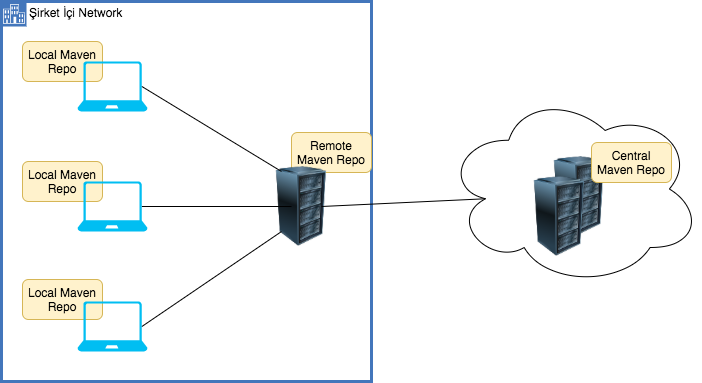
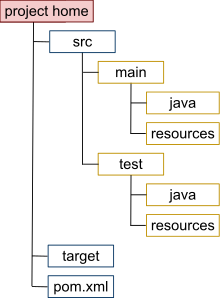
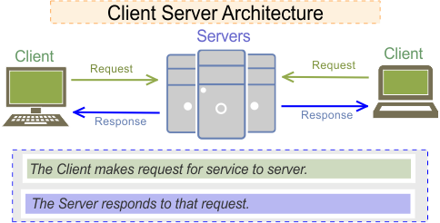

# Java Bootcamp - 5. Hafta

## Maven ile proje yönetimi
Profesyonel Java uygulamalarında uygulamanın yazılmasından sunucuya deploy edilmesine kadar geçen süreç bir dizi
karmaşık işlemden oluşur. Bu işlemleri dependencylerin download edilmesi ve classpathe eklenmesi, kaynak kodların derlenmesi,
testlerin koşulması, dökümantasyonun yaratılması, uygulamanın sunucuya deploy edilebilir JAR/WAR/ZIP arşif dosyalarında 
paketlenmesi ve uygulamanın deploy edilmesi şeklinde sıralayabiliriz. Bütün bu işlemlerin doğru sırada ve sürekli hatasız bir şekilde
insan eliyle yerine getirilmesi zor olduğundan ve çok zaman aldığından Apache Maven bütün bu işlemleri yazılım geliştiriciler
için otomatize etmenin yolunu sağladı, hem de bunu belli bir standart içerisinde yaptı. Yani siz bir projede Maven kullandığınız ve yapısını
anladığınız zaman yine Maven kullanan başka bir projeye geçtiğinizde yeni projenin bütün süreçlerine otomatikman aşina olursunuz. 
Bu nedenle Maven her ne kadar bir build aracı olarak anılsa da aslında build işleminden çok daha fazlasını yapma yeteneğine 
sahiptir ve bu nedenle Maven bir proje yönetim aracı olarak adlandırılabilir.

Yazılım geliştiriciler yeni bir proje yarattıkları zaman hemen kod yazma aşamasına geçmek ve çalışan birşeyler üretmek ister. 
Fakat bu aşamaya gelmeden önce aşmaları gereken bir konfigürasyon ve dependency yönetimi sorunu vardır. Biz developerlar 
açısından Maven kullanmanın en büyük avantajı hızlı ve kolay proje konfigürasyonu ve dependency yönetimidir. Maven ile bir 
proje yaratırken Maven tarafından bize sağlanan ve archtypes olarak adlandırılan proje şablonlarını kullanabilir, böylece 
yarattığımız proje için ihtiyacımız olan pek çok konfigürasyonu hazır halde elde edebiliriz. Maven ortaya çıkmadan önce 
dependency konfigürasyonu süreci de oldukça sancılı bir süreeçti, çünkü o dönemlerde monolith uygulamalar çok yaygındı ve bir 
proje çok fazla kodu bünyesinde bulundurması gerekirdi. Çok fazla kod çok fazla dependency demektir ve ne kadar çok 
dependencyniz varsa projede, bu dependencylerin birbiri ile uyumlu versiyonlarını bulmak, download etmek ve classpathe 
eklemek de bir okadar zor olur. Maven bize sunduğu dependency yönetim özelliği ile bu süreci çok daha kolay yönetilebilir 
bir hale getirdi.

Böylece Maven ile proje yaratma ve kod yazmaya başlama süreçleri arasında ki zamanı minimuma indirmiş olduk, bu yönüyle 
de yazılımcının üretkenliğine olumlu katısı vardır diyebiliriz.

Şimdi Mavenin bunları nasıl yaptığına detayları ile birlikte bakalım;

### POM (Project Object Model)
Maven projelerinde proje konfigürasyonu POM adı verilen ve XML formatında saklanan dosya ile yönetilir. pom.xml adı verilen 
bu özel dosya proje ile ilgili tüm konfigürasyonu, dependencyleri ve build işlemi için gerekli olan pluginleri bünyesinde
bulundurur. Bu dosyanın genel yapısı aşağıdaki gibidir;

```xml
<?xml version="1.0" encoding="UTF-8"?>
<project xmlns="http://maven.apache.org/POM/4.0.0"
         xmlns:xsi="http://www.w3.org/2001/XMLSchema-instance"
         xsi:schemaLocation="http://maven.apache.org/POM/4.0.0 http://maven.apache.org/xsd/maven-4.0.0.xsd">
    
    <modelVersion>4.0.0</modelVersion>

    <groupId>com.hkarabakla</groupId>
    <artifactId>maven-example</artifactId>
    <version>1.0-SNAPSHOT</version>
    <packaging>jar</packaging>

    <properties>
        <maven.compiler.source>8</maven.compiler.source>
        <maven.compiler.target>8</maven.compiler.target>
        <spring.version>4.3.13.RELEASE</spring.version>
    </properties>

    <dependencies>
        <dependency>
            <groupId>org.springframework</groupId>
            <artifactId>spring-core</artifactId>
            <version>${spring.version}</version>
        </dependency>

        <dependency>
            <groupId>org.springframework</groupId>
            <artifactId>spring-messaging</artifactId>
            <version>${spring.version}</version>
        </dependency>
    </dependencies>

</project>
```
Maven, projeleri repositoryde ayırt etmek için pom.xml dosyasında aşağıdaki alanları kullanır;

* groupId : Uygulamanın ait olduğu organizasyonu gösterir, çakışma olmaması için genelde organizasyonun web adresinin ters sıralanması ile oluşturulur (hkarabakla.com -> com.hkarabakla gibi)
* artifactId : Uygulamanın ismi, organizason içinde emsalsiz(unique) olmalıdır
* version : Uygulamanın versiyonu
* packaging : Uygulamayı paketleme metodu (jar/war/zip)

### Dependency yönetimi
Maven uygulamalarında dependencyler yukarda pom.xml dosyasında gösterildiği gibi <dependencies></dependencies> tagleri arasında,
groupId, artifactId ve version bilgileri ile birlikte tanımlanır. Maven her bir dependencyi önce local repoda arar eğer local
repoda var ise local repodan uygulamaya dahil eder. Eğer local repoda yok ise bu durumda Mavenın kendisine ait olan merkezi
repoya bakar burada bulması durumunda dependency önce local repoya download edilir ardından uygulamaya dahil edilir. Eğer 
dependency merkezi repoda da yok ise bu durumda bulunduğu repo pom.xml dosyasına repository olarak eklenmelidir. Dependency 
Mavenin erişebileceği başka bir repoda da yoksa bu durumda dependency manuel olarak download edilmeli ve local repo altına şu dizin yapısına 
**groupId/artifactId/version** uygun olarak saklanmalıdır.

Maven dependency yönetiminin en güzel taraflarından biri de transitive dependency dediğimiz dependencynin ihtiyaç duyduğu dependencyleri
de projeye dahil edebiliyor olmasıdır. Örneğin ABC isimli bir kütüphaneye projede ihtiyacınız var ve ABC isimli kütüphane
de çalışmak için XYZ isimli kütüphaneye ihtiyaç duduyor ve XYZ kütüphanesi de KLM kütüphanesine ihtiyaç duyuyor. İşte bu durumda
ABC bizim için ana dependency, XYZ ve KLM ise transitive dependency oluyor ve Maven tüm bu kütüphaneleri projeye ekleyebiliyor.

### Maven repository mimarisi


Maven repositorysi projelerin ihtiyacı olan jar dosyalarını ve bu dosyalar ile ilgili meta verilerin saklandığı özel bir depolama
alanı olarak düşünülebilir. Maven projelerin bağımlı oldukları kütüphaneleri bu depolama sistemi aracılığı ile yönetir.

Bir bilgisayara Maven kurulduğu zaman arka planda hemen bir local repo yaratılır, default olarak `$USER_HOME/.m2` konumunda.
Local repo o bilgisayar üzerinde derlenecek olan uygulamaların ihtiyacı olan dependencyleri barındırır ve aynı bağımlılığa
sahip yeni bir uygulama yaratılması durumunda dependency tekrar download edilmez bu local repodan kullanılır.

Eğer dependency local repoda yok ise bu durumda local bilgisayarda kurulu olan Maven bağımlı olunan kütüphaneyi ve onun bağımlı
olduğu diğer kütüphaneleri recursive olarak merkezi repodan local repoya download eder ve buradan ihtiyacı olan uygulamaların
kullanımına sunar.

Yarattığımız kütüphaneleri bizlerde bu merkezi kütüphaneye gönderebilir ve başka yazılımcıların kullanımına açabiliriz. Bazı
firmalar bu tarz kütüphanelerini kendilerine ait merkezi bir repoda saklamak isteyebilir. Bu durumda yeni bir dependency eklediğimizde
projeye, Maven önce local repoya bakar, eğer local repoda bulamaz ise bu durumda firmaya ait merkezi repo kontrol edilir,
burada da bulunamazsa bu durumda merkezi maven reposuna sorgulama yapılır. Ve dependency önce firmanın merkezi reposuna oradan
da local repoya download edilir. Yukardaki resimde gösterilen kullanım tam olarak böyledir.

### Maven build yaşam döngüsü
Maven proje yönetim aracında built-in olarak 3 tane yaşam döngüsü bulunur; clean, default ve site. clean yaşam döngüsü projenin 
build işlemi sonrası oluşan dosyalarını temizlenmek için, default yaşam döngüsü projenin build edilmesi, paketlenmesi vee deploy edilmesi
için ve site yaşam döngüsü ise dökümantasyon için gerekli olan fazları sunar. Default yaşam göngüsünün fazları aşağıdaki gibidir:

* validate - projeyi doğrulamak ve gerekli olan tüm bilgileri sağladığından emin olmak için
* compile - projenin kaynak kodunu derlemek için
* test - uygun bir unit test frameworkü kullanılarak testlerin çalıştırılması için
* package - derlenmiş dosyaları alarak dağıtılabilir şekildee uygulamayı paketlemek için; JAR/WAR/ZIP formatlarında
* verify - entegrasyon testlerini koşmak için
* install - üretilen jar/war/zip uzantılı paketi local repoya koymak için
* deploy - daha önce local repoya konulan paketi uzaktaki repoya koymak için

Bu fazlar daha sonra uygulama üzerinde `mvn <faz>` şeklinde çalıştırılabilir. Örneğin;

Uygulamayı uygulamayı derlemek için : `mvn compile`
Uygulamayı uygulamayı temizlemek, derlemek ve paketlemek için : `mvn clean compile package`

### Maven ile ilk proje
Maven ile proje yaratmak için üç tane yöntemi kullanabiliriz;
1. Kullandığımız IDE nin bize sağlamış olduğu proje yaratma seçeneklerinden maven kullanılabilir.
2. Maven tarafından bize sunulan archetype proje şablonları kullanılarak maven projesi yaratabiliriz. Örnek kullanım aşağıdaki gibi;
   ```shell
       mvn archetype:generate
            -DgroupId=com.hkarabakla
            -DartifactId=maven-example
            -DarchetypeArtifactId=maven-archetype-quickstart
            -DinteractiveMode=false
   ```
3. Maven proje dizin yapısına uygun olarak sınıflarımızı ve pomm.xml dosyasını konumlandırarak manuel bu işlemi yapabiliriz.



## Spring Data JPA ile veritabanı işlemleri
Daha önce JPA standartlarını implemente eden Hibernate kütüphanesi ile nasıl veritabanı işlemleri yapıldığını görmüştük.
O örnekte veritabanına erişmek için pek çok manuel konfigürasyon yapmıstık ve objeler yaratmıştık. Bunun yanında sorgularımızı
çalıştırabilmek için sürekli bir session açmamız gerekmişti. Spring Data JPA işte bu tarz boilerplate kod dediğimiz aynı proje içinde yada
projeden projeye sürekli tekrar eden ve temelde projeye business anlamında bir katkısı olmayan kod tekrarlarını ortadan 
kaldırmak için ortaya çıkmıştır.

Spring Data JPA bize sağladığı birtakım interfaceler sayesinde entitylerimizi işaretleyebilir ve bu interfaceleri extend ederek
sorgu metodlarımızı yaratabiliriz. Spring Data JPAnın gücü bu interfacelerden gelir ve interface hiyerarşisinin en tepesinde
Repository interface gelir. Repository<T, ID> interfacei entity sınıflarını ve bu sınıfların id alanlarının tipini parametre 
olarak alan jenerik bir interfacedir. 

Repository interfaceini extend eden CrudRepository<T, ID> entityler üzerinde CRUD (Create, Read, Update, Delete) işlemleri
yapmaya yarayan jenerik abstract metodları bulundurur. Genel yapısı aşağıdaki gibidir;

```java
public interface CrudRepository<T, ID> extends Repository<T, ID> {
    <S extends T> S save(S var1);

    <S extends T> Iterable<S> saveAll(Iterable<S> var1);

    Optional<T> findById(ID var1);

    boolean existsById(ID var1);

    Iterable<T> findAll();

    Iterable<T> findAllById(Iterable<ID> var1);

    long count();

    void deleteById(ID var1);

    void delete(T var1);

    void deleteAll(Iterable<? extends T> var1);

    void deleteAll();
}
```

CrudRepository dışında bir de entityler üzerinde pagination ve sıralama için abstraction sunan PagingAndSortingRepository<T, ID>
interface i vardır, onun da yapısı aşağıdaki gibidir;

```java
public interface PagingAndSortingRepository<T, ID> extends CrudRepository<T, ID> {
    Iterable<T> findAll(Sort var1);

    Page<T> findAll(Pageable var1);
}
```
### Query metodlar
Spring Data JPA bizlere sunduğu sorgu metodları sayesinde CRUD işlemleri için custom sorguları yaratmak çok kolay halee gelmiştir.
Sorgu metodlarını oluşturabilmek ve kullanabilmek için aşağıdaki 4 adım takip edilebilir;

1. Repository<T, ID> yada bu interfacein alt interfacelerini extend eden bir repository interfacei yaratılır.
```java
interface PersonRepository extends Repository<Person, Long> { … }
```
2. Sorgu metodu yukarda tanımlanan interface e eklenir;
```java
interface PersonRepository extends Repository<Person, Long> {
  List<Person> findByLastname(String lastname);
}
```
3. Yarattığımız repositoryleri spring contextine eklemek için @EnableJpaRepositories anotasyonu kullanılır;
```java
import org.springframework.data.jpa.repository.config.EnableJpaRepositories;

@EnableJpaRepositories
class Config { … }
```
4. Yarattığımız repository kullanmak istediğimiz sınıfa inject edilir;
```java
class SomeClient {

  private final PersonRepository repository;

  SomeClient(PersonRepository repository) {
    this.repository = repository;
  }

  void doSomething() {
    List<Person> persons = repository.findByLastname("Matthews");
  }
}
```

Örnek sorgu metodları;
```java
interface PersonRepository extends Repository<Person, Long> {

  List<Person> findByEmailAddressAndLastname(EmailAddress emailAddress, String lastname);

  // Enables the distinct flag for the query
  List<Person> findDistinctPeopleByLastnameOrFirstname(String lastname, String firstname);
  List<Person> findPeopleDistinctByLastnameOrFirstname(String lastname, String firstname);

  // Enabling ignoring case for an individual property
  List<Person> findByLastnameIgnoreCase(String lastname);
  // Enabling ignoring case for all suitable properties
  List<Person> findByLastnameAndFirstnameAllIgnoreCase(String lastname, String firstname);

  // Enabling static ORDER BY for a query
  List<Person> findByLastnameOrderByFirstnameAsc(String lastname);
  List<Person> findByLastnameOrderByFirstnameDesc(String lastname);
}
```
#### Propert expression
```java
List<Person> findByAddressZipCode(ZipCode zipCode);
List<Person> findByAddress_ZipCode(ZipCode zipCode);
```

### Paging ve siralama
```java
Page<User> findByLastname(String lastname, Pageable pageable);

Slice<User> findByLastname(String lastname, Pageable pageable);

List<User> findByLastname(String lastname, Sort sort);

List<User> findByLastname(String lastname, Pageable pageable);
```

```java
Sort sort = Sort.by("firstname").ascending()
  .and(Sort.by("lastname").descending());

TypedSort<Person> person = Sort.sort(Person.class);

Sort sort = person.by(Person::getFirstname).ascending()
.and(person.by(Person::getLastname).descending());

Pageable firstPageWithTwoElements = PageRequest.of(0, 2);

Pageable secondPageWithFiveElements = PageRequest.of(1, 5);

Pageable sortedByName =
PageRequest.of(0, 3, Sort.by("name"));

Pageable sortedByPriceDesc =
PageRequest.of(0, 3, Sort.by("price").descending());

Pageable sortedByPriceDescNameAsc =
PageRequest.of(0, 5, Sort.by("price").descending().and(Sort.by("name")));
```

### Sorgu limitleme
```java
User findFirstByOrderByLastnameAsc();

User findTopByOrderByAgeDesc();

Page<User> queryFirst10ByLastname(String lastname, Pageable pageable);

Slice<User> findTop3ByLastname(String lastname, Pageable pageable);

List<User> findFirst10ByLastname(String lastname, Sort sort);

List<User> findTop10ByLastname(String lastname, Pageable pageable);
```

### Named query kullanimi
```java
@Entity
@NamedQuery(name = "User.findByEmailAddress",
  query = "select u from User u where u.emailAddress = ?1")
public class User {

}

public interface UserRepository extends JpaRepository<User, Long> {

   List<User> findByLastname(String lastname);

   User findByEmailAddress(String emailAddress);
}
```

### @Query kullanimi
```java
public interface UserRepository extends JpaRepository<User, Long> {

  @Query("select u from User u where u.emailAddress = ?1")
  User findByEmailAddress(String emailAddress);
}

public interface UserRepository extends JpaRepository<User, Long> {

   @Query(value = "SELECT * FROM USERS WHERE EMAIL_ADDRESS = ?1", nativeQuery = true)
   User findByEmailAddress(String emailAddress);
}

public interface UserRepository extends JpaRepository<User, Long> {

   @Query(value = "SELECT * FROM USERS WHERE LASTNAME = ?1",
           countQuery = "SELECT count(*) FROM USERS WHERE LASTNAME = ?1",
           nativeQuery = true)
   Page<User> findByLastname(String lastname, Pageable pageable);
}

public interface UserRepository extends JpaRepository<User, Long> {

   @Query("select u from User u where u.firstname = :firstname or u.lastname = :lastname")
   User findByLastnameOrFirstname(@Param("lastname") String lastname,
                                  @Param("firstname") String firstname);
}
```

## REST API 

### Rest API nedir ?
REST API modern yazılım dünyasında uygulamaların birbiri ile iletişim kurmak için kullandıkları dildir. 
Daha teknik bir tanım yapmak gerekir ise, REST mimarisini kullanarak uygulamalar arası veri transferini mümkün kılan 
webservice lere REST API denir.

Bir API ın REST API olabilmesi için ihtiyacı olan 3 şey vardır.



1. Server : Söz konusu API'ı servis eden yazılım.
2. Resource : Server tarafından API aracılığıyla servis edilen veri, bu text formatında bir kullanıcı bilgisi, bir dosya, 
   bir fotoğraf yada bunlar gibi heerhangi bir veri olabilir. Burada önemli olan her resourceun unique bir idsi olması gerekir.    
3. Client : Server tarafından servis edilen API'ı kullanan yazılım.

Fakat bunlar tek başına bir API'ı Restful yapmaya yetmez, uyması gereken bazı kurallar ve kısıtlar vardır. Bu kurallar API'ın
kolay kullanılabilmesini mümkün kılar. REST ifadesi **RE**presentational **S**tate **T**ransfer kavramının kısaltmasıdır ve 
client tarafından talep edilen resource'un o anki durumunun server'dan clienta transfer edilmesi olarak Türkçe'ye çevrilebilir.
Bu transfer işlemi JSON formatında olabileceği gibi XML yada binary formatında da olabilir. Peki bu kurallar ve kısıtlar nelerdir;

* Uniform interface : Tek tip bir API olmalıdır ve tüm clientlardan servera gelen istekleer hep aynı şekilde olmalıdır
* Client — server separation : Client ve server tamamen birbirinden bağımsız olarak hareket edebilmelidir
* Stateless : Seerver tarafında clientla ilgili herhangi bir state tutulmamalıdır, servera gelen requestler kendi başına 
  çalışabilecek her bilgiyi içermelidir.
* Layered system : Client herzaman doğrudan servera bağlı olmayabilir, arada load balancer yada proxy gibi ara servisler olabilir. 
  Bu servisler sistemin scalable olmasını ve performansını artırırken client ve server arasındaki iletişimi etkilememeli. 
* Cacheable : Server tarafından üreetilen responselar keşlenebilir olup olmadıklarını belirtmeli.
* Code-on-demand(optional) : Server geçici olarak clientın çalışmasını genişletebilir, bunu clienta çalıştırılmak üzere 
javascript gönderebilir

Peki bir client bir resourcea ihtiyaç duyarsa bunu isteği servera nasıl iletir ? Bu drurumda servera ilgilendiği kaynağın 
unique idsini iletmesi gerekir, bu id Rest API için o resourceun URLidir. URL ifadesi Uniform Resource Locator kavramının 
kısaltmasıdır. Bir de servera resource üstünde gerçekleştirmek istediği operasyonu iletmelidir, bu işlemi HTTP metodlarını
kullanarak gerçekleştirir. Veritabanı uygulamalarında CRUD diye isimlendirdiğimiz Create, Read, Update ve Delete işlemlerine,
API düzeyinde karşılık gelen başlıca HTTP metodları resource üzerinde işlem yapmak için kullanılır. Bu metodlar aşağıda gösterildiği
gibidir;

| Veritabanı işlemleri  | HTTP Metodları  | HTTP Metod amacı  |
| --------------------- |-----------------| ------------------|
| Create                | POST            | Yeni bir resource u serverda oluşturmak |
| Read                  | GET             | Clientın ihtiyacı olan resourceu serverdan almak |
| Update                | PUT             | Güncellenen resourceu serverda güncellemek |
| Delete                | DELETE          | Serverda bulunan resourceu silmek |

Daha önce de söylediğimiz gibi REST bir mimaridir, HTTP ise bir web protokolü. Zaman zaman insanlar REST ve HTTP kafa karışıklığı 
yaşamakta ve bu iki kavramı kıyaslamaya çalışmaktadır. Fakat yukarıda da belirttiğimiz gibi ikisi de kıyaslanamayacak kadar
farklı kavramlardır ve birbirine alternatif değillerdir.  

### HTTP bileşenleri

#### HTTP Request
Reequest bir client server uygulamasında clieent tarafından üretilen ve servera gönderilen, resopurcelar üzerinde işlem yapmaya 
yarayan kaynaklara denir. Bir HTTP request aşağıdaki temel bileşeenlerden oluşur;

* Method (Operation) : Resource üzerinde yapmak istediğimiz işlem
* Header : İşlemin gerçekleşmesi için gerekli olan meta veriler
* Endpoint : Resourcea erişmek için geerekli olan unique id (URL)
* Param/Body : Üzerinde işlem yapılacak resourceun kendisi yada onunla ilgili veriler

#### HTTP Response
Serveera gelen http requeste karşılık seerver tarafından üretileen cevaptır. Bir http reponse aşağıdaki bileşenlerden oluşur;

* Status code : İşlemin sonucunu belirtmeye yarayan 100-599 arasında değişen sayısal değerdir.
* Body : İşlem sonucunda oluşan resource
* Header : Resource la ilgili meta veriler

#### https://developer.mozilla.org/en-US/docs/Web/HTTP/Status


## Spring MVC ile Rest API

### Spring MVC nedir ?
Spring MVC, Spring frameworkun bir parçası olan DispatcherServlet etrafında MVC patternini uygulayan modüldür.
DispatcherServlet uygulamaya gelen tüm requestleeri yakalar ve geerekli çözümlemeyi yaptıktan sonra requesti uygun handlera
iletir. Request handler @Controller ve @RequestMapping anotasyonlarını kullanarak gelen requestlerden kendisine uygun olanı 
işleyen sınıf ve metodlardan oluşan yapıdır.


### Spring MVC anotasyonları

* @Controller
* @RestController
* @RequestMapping
* @RequestBody
* @PathVariable
* @RequestParam
* @RequestHeader
* @ResponseBody
* @ResponseStatus

### Exception yakalama
Hata yakalama her uygulamada olduğu gibi Rest API yazarken de uygulanması gereken bir pratiktir. Spring MVC farklı seviyelerde 
hata yakalamayı mümkün kılan birkaç farklı seçenek sunar. O nedenle bir Spring MVC uygulamasında hata yakalama işlemi yapmadan
önce bu hatayı hangi seviyede yakalamak istediğimize karar vermeliyiz.

#### Uygulama seviyesinde global exception handling
Tüm uygulama genelinde servera gelen herbir request için oluşan hataları tek bir noktada yakalamak ve yönetmek istiyorsak
@RestControllerAdvice anotasyonu yardımı ile global exception handler metodları ekleyebiliriz. Genel yapısı aşağıdaki gibidir;

```java
@RestControllerAdvice
public class GlobalExceptionHandler extends ResponseEntityExceptionHandler {

    @ExceptionHandler(value = { IllegalArgumentException.class, IllegalStateException.class })
    protected ResponseEntity<Object> handleConflict(RuntimeException ex, WebRequest request) {
        return handleExceptionInternal(ex, new CustomError("error message", HttpStatus.CONFLICT.value()), new HttpHeaders(), HttpStatus.CONFLICT, request);
    }
}
```
Bu metod tercih edildiği zaman döndüğümüz hata responsu için custom bir hata sınıfı yaratmalıyız, yukarda kullanımı 
görüldüğü gibi handler metodu CustomError tipinde ResponseEntity objesi dönmektedir. Bu yöntemin avantajı olarak tüm hata durumlarını 
uygulama genelinde tek bir yerde yönetme ve dönecek olan reponse üzerindeki hata mesajının kontrolü tamamen bizde olması diyebiliriz.

#### Controller seviyesinde exception handling
Bir Controller yazarken sadece o kontrollerdaki endpointlerden fırlatılacak hataları yakalamak için controller seviyesinde 
exception handling tercih edilebilir. Controller seviyesinde exception handling yapılabilmesi için o controller içerisine 
aşağıda gösterildiği gibi bir exception handler metodu eklenebilir;

```java
@Controller
public class SimpleController {
    
    // ...
 
    @ExceptionHandler({FileSystemException.class, RemoteException.class})
    public ResponseEntity<CustomError> handle(Exception ex) {
        // ...
    }

    @ExceptionHandler({BusinessDataException.class})
    public ResponseEntity<CustomError> handleNotFound(Exception ex) {
        // ...
    }

    @ExceptionHandler
    public ResponseEntity<CustomError> handleTheRest(Exception ex) {
        // ...
    }
}
```
Bu örnekte farklı exception türleri için iki tane ve bir tane de genel exception handler ekledik. Bu metod tercih edildiği
zaman döndüğümüz hata responsu için custom bir hata sınıfı yaratmalıyız, yukarda kullanımı görüldüğü gibi handler metodları
CustomError tipinde ResponseEntity objesi dönmektedir. ResponseEntity yaratmak ve http status kod atamak için aşağıdaki
yöntem kullanılabilir;

```java
@ExceptionHandler
public ResponseEntity<String> handle(Exception ex) {
    return ResponseEntity.status(HttpStatus.INTERNAL_SERVER_ERROR)
            .body(ex.getLocalizedMessage());
}
```

#### Endpoint seviyesinde exception handling
Spring 5 ile birlikte genel exception sınıfı ResponseStatusException, endpoint seviyesinde yakaladığımız hataları status code
ile birlikte fırlatmak için kullanılabilir. Bu durumda try-catch blokları ile birlikte yakaladığımız hataları istediğimiz http
status code ile birlikte fırlatabiliriz.

```java
@GetMapping(value = "/{id}")
public User get(@PathVariable UUID id) {

    try {
        return userService.getById(id);
    } catch (Exception e) {
        throw new ResponseStatusException(HttpStatus.NOT_FOUND, "User not found with id : " + id);
    }
}
```
Response :
```json5
{
    "timestamp": "2021-01-20T20:54:20.444+00:00",
    "status": 404,
    "error": "Not Found",
    "message": "",
    "path": "/api/user/3b243db5-162e-40d3-be33-fac52ded3b99"
}
```
Bu örnekte gördüğümüz gibi endpoint metodu içerisinde yakaladığımız exception için bir ResponseStatusException fırlattık.
Response alanında default olarak message alanı boş geldi, bu alanı ResponseStatusException içerisinde versiğimiz mesaj ile
doldurmak istiyorsak `server.error.include-message=always` ifadesini application.properties dosyasına eklemeliyiz.

Bu yöntemin artısı ResponseStatusException exception sınıfının farklı http status kodlarıyla birlikte kullanılabilmesi ve
uygun status code dönmek için yeni exception sınıfları yaratmaya gerek olmaması.