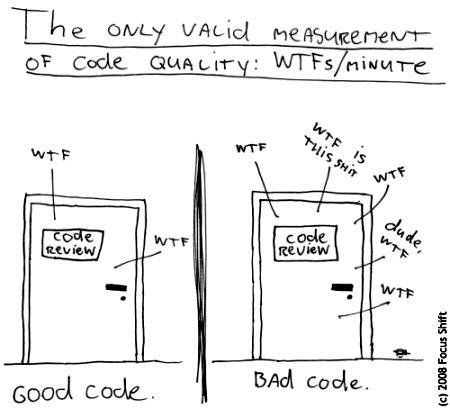
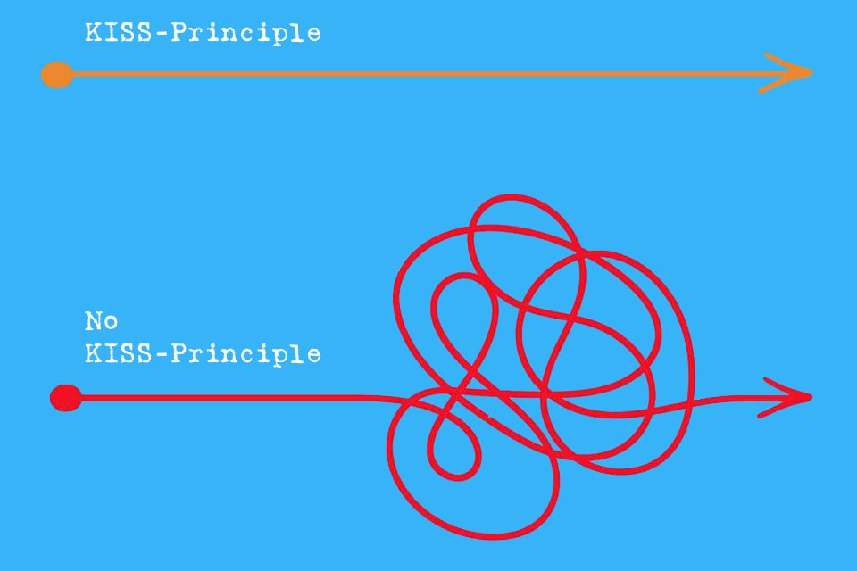
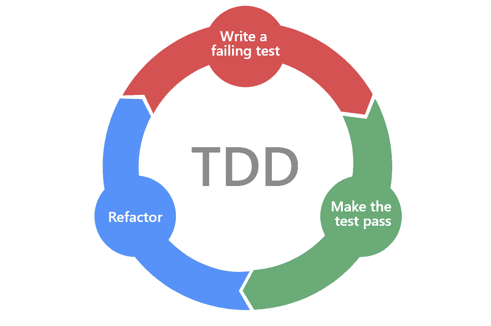
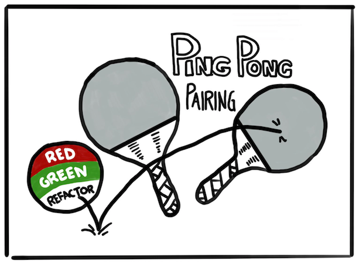

# Java Bootcamp - 6. Hafta

## RESTFULL API tasarımı
- Request body kısmında JSON kabul et ve servisten JSOn tipinde reponse dön
- Fiiller yerine urlde sadece isimlere yer verilmeli, örneğin bir post endpointinin urli `POST /api/user/create` olmamalı
  POST metodu bu işlemin bir resource yaratma işlemi olduğunu belirtiyor zaten bunun yerine `POST /api/user` tercih edilmeli
- Eğer endpoint bir collection dönüyor ise bu durumda endpoint urlinde çoğul isimler tercih edilmeli, `GET /api/users` gibi
- Hiyerarşik objelerimiz varsa bunlara karşılık gelen resourcelar da hiyerarşik ve iç içe olmalı
- Exceptionlar doğru şekilde yakalanmalı ve uygun hata http status kodları kullanılmalı
- Filtreleme, sıralama ve paging API'ın endpointlerinde bulunmalı
- Security pratiklerini implemente etmeli
- Resource caching performans artırmak için kullanılmalı
- API lar da versiyonlama yapılmalı, `GET /api/v1/user` gibi

### Lab session
- API versiyonlama
- API cagirma
- Client side content caching - ETag ShallowEtagHeaderFilter
- API dokumentasyonu - Swagger



## SOLID Prensipler
SOLID prensipler yazılım kodlarını daha okunabilir, anlaşılabilir, esnek ve kolay bakım yapılabilir hale getirmek için 
ortaya çıkmış yazılım geliştirme yaklaşımlarıdır. _SOLID_ ifadesindeki her bir harf ayrı bir prensibe karşılık gelmektedir.

* **S** : Single Responsibility Principle
* **O** : Open-Closed Principle
* **L** : Liskov’s Substitution Principle
* **I** : Interface Segregation Principle
* **D** : Dependency Inversion Principle

### Single responsibility principle (Tek sorumluluk prensibi)
Yazılımda bir sınıfın tek ama tek bir sorumluluğu olmalıdır ve o sınıfı değiştirmek için tek bir neden olmalıdır. Bir sınıf 
birden fazla sorumluluğu yerine getirdiği zaman olması gerekenden çok daha karmaşık bir hal alır ve ilerleyen süreçte 
anlaşılması ve bakımı zorlaşır. Bu tarz bir durumla karşılaşılması halinde söz konusu sınıfın tek bir sorumluluğu kalıncaya
kadar bölünmesi gerekir.

Örnek :

```java
public class Person 
{
    private Long personId;
    private String firstName;
    private String lastName;
    private String age;
    private String accountNumber;
    private String accountName;
    private String accountStatus;
    private String accountType;
}

public class PersonService {
    
    public void savePerson(Person p) {
        // ... implementation details
    }

    public void updatePerson(Person p) {
        // ... implementation details
    }

    public void deletePerson(Person p) {
        // ... implementation details
    }

    public void changeAccountName(Person p, String name) {
        // ... implementation details
    }

    public void changeAccountStatus(Person p, String status) {
        // ... implementation details
    }
}
```
Yukarıdaki örnekte Person sınıfı hem kişi detaylarını hem de hesap (account) detaylarını tutmakta bu nedenle de PersonService
sınıfı hem kişi hemde hesapla ilgili fonksiyonlar barındırmakta. Bu karışıklığı önlemek ve kodu daha anlaşılır hale getirmek
için Person ve PersonService sınıfları bölünebilir.

```java
public class Person 
{
    private Long personId;
    private String firstName;
    private String lastName;
    private String age;
    private Account account;
}

public class Account
{
    private Long guid;
    private String accountNumber;
    private String accountName;
    private String status;
    private String type;
}

public class PersonService {
    
    public void savePerson(Person p) {
        // ... implementation details
    }

    public void updatePerson(Person p) {
        // ... implementation details
    }

    public void deletePerson(Person p) {
        // ... implementation details
    }
}

public class AccountService {
    
    public void changeAccountName(Account a, String name) {
        // ... implementation details
    }

    public void changeAccountStatus(Account a, String status) {
        // ... implementation details
    }
}
```

### Open-Closed principle (Açık-Kapalı prensibi)
Sınıflar ve metodlar genişlemeye açık fakat değişime kapalı olmalıdır. Diyelimki bir özellik ekledik yazılıma daha sonra 
bu özelliği geliştirmek istediğimizde çok fazla kod değişikliği yapmadan özellik geliştirilebilir olmalıdır. Bunu sağlamanın
en iyi yolu da abstraction kullanmaktan geçer.

Örnek :

```java
public class Product {

    private double basePrice;

    public Product(double basePrice) {
        this.basePrice = basePrice;
    }

    public double getBasePrice() {
        return basePrice;
    }

    public void setBasePrice(double basePrice) {
        this.basePrice = basePrice;
    }
}

public class Person {
    // ... implementation
}

public class Employee extends Person {
    // ... implementation
}

public class Student extends Person {
    // ... implementation
}

public class PriceCalculator {

    public static double getPriceBasedOnUserType(Product product, Person person) {

        if (person instanceof Employee) {
            return product.getBasePrice() * 0.9;
        } else if (person instanceof Student) {
            return product.getBasePrice() * 0.8;
        } else {
            return product.getBasePrice();
        }
    }
}

public class Main {

    public static void main(String[] args) {


        Person employee = new Employee();
        Person student = new Student();

        Product p1 = new Product(10);

        System.out.println(PriceCalculator.getPriceBasedOnUserType(p1, employee));
        System.out.println(PriceCalculator.getPriceBasedOnUserType(p1, student));
    }
}

```
Yukardaki örnekte gösterildiği gibi bir senaryo olduğunu düşünelim. Bir ürünümüz var ve bu ürünün fiyatı sistemdeki kullanıcı
tipine farklılık gösteriyor. Öğrenciler için %20, çalışanlar için %10 indirimli fiyat hesabı yapılıyor ve bu hesaplama
PriceCalculator sınıfı içindeki getPriceBasedOnUserType metodu içinde gerçekleşiyor. Bu durumda yeni bir kullanıcı tipi
eklendiği zaman sisteme PriceCalculator sınıfında da değişiklik yapılması gerekir. Bu kodu aşağıdaki gibi refactor edebiliriz;

```java
public class Product {

    private double basePrice;

    public Product(double basePrice) {
        this.basePrice = basePrice;
    }

    public double getBasePrice() {
        return basePrice;
    }

    public void setBasePrice(double basePrice) {
        this.basePrice = basePrice;
    }
}

public interface Discounter<T extends Product> {

    double getPrice(T product);
}

public class Person {
    private Discounter<Product> discounter = (product) -> product.getBasePrice();
    // ... implementation


    public Discounter<Product> getDiscounter() {
        return discounter;
    }
}

public class Student extends Person {

    private Discounter<Product> discounter = (product) -> product.getBasePrice() * 0.8;
    // ... implementation


    public Discounter<Product> getDiscounter() {
        return discounter;
    }
}

public class Employee extends Person {

    private Discounter<Product> discounter = (product) -> product.getBasePrice() * 0.9;
    // ... implementation


    public Discounter<Product> getDiscounter() {
        return discounter;
    }
}

public class Main {

    public static void main(String[] args) {


        Person employee = new Employee();
        Person student = new Student();

        Product p1 = new Product(10);

        System.out.println(employee.getDiscounter().getPrice(p1));
        System.out.println(student.getDiscounter().getPrice(p1));
    }
}
```
Refactor işlemi sonunda Discounter isimli bir interface tanımladık ve bu interface içine Product objesinin fiyatı üzerinden
indirimli fiyatı hesaplayıp dönecek metodu ekledik. Daha sonra bu interface i kullanarak Person, Employee ve Student sınıfları içine
default implementasyonu olan lambda değişkenler ekledik. Son olarak da PriceCalculator sınıfını silip kullanıcı tipine göre
fiyat hesaplayan algoritmaları olmaları gereken yere kullanıcı tipi sınıflarına taşıdık. Yeni bir kullanıcı tipi eklemek
istediğimizde sadece yeni kullanıcı tipi için gerekli olan kodu yazmamız yeterli olacaktır, diğer kısımlarda bir değişiklik
yapmaya gerek yok.

### Liskov’s Substitution Principle (Liskov'un yerine geçme prensibi)
Bu prensip bize üst sınıftayan türeyen alt sınıflara ait objelerin birbiri yerine kullanılabilmesi gerektiğini söylüyor.

```java
public class Bird {
    void fly() {
        System.out.println("Birds can fly");
    }

    void swim() {
        System.out.println("Birds can swim");
    }
}

public class Eagle extends Bird {
}

public class Penguin extends Bird {
}

public class Main {
    public static void main(String[] args) {
        Bird eagle = new Eagle();
        Bird penguin = new Penguin();

        eagle.fly();
        penguin.fly(); // ???
        
        penguin.swim();
        eagle.swim(); // ??
    }
}
```
Yukarıdaki örnekte görüldüğü gibi Bird sınıfı bir fly() ve swim() metodlarına sahiptir ve bu metodları inheritance yardımıyla alt sınıfları 
olan Eagle ve Penguin sınıflarına aktarıyor. Fakat burada sorun penguenlerin uçamamasından ve kartalların yüzememesinden 
kaynaklanıyor. Yani penguen objeleri tam anlamıyla kartal objeleri yerine, kartal objeleri de penguen objeleri yerine kullanılamaz.

```java
public interface Flyer() {
    default void fly() {
        System.out.println("Some birds can fly");
    }
}

public interface Swimmer() {
    default void swim() {
        System.out.println("Some birds can swim");
    }
}

public class Bird {
}

public class Eagle extends Bird implements Flyer {
}

public class Penguin extends Bird implements Swimmer {
}

public class Main {
    public static void main(String[] args) {
        Bird eagle = new Eagle();
        Bird penguin = new Penguin();

        eagle.fly();
        penguin.swim();
    }
}
```
Böylece her iki kuş türü de sadece yerine getirebilecekleri yeteneklere sahip oldular.

### Interface Segregation Principle (Interface bölme prensibi)
Yazılımda interfaceler kendilerini implemente eden sınıflara özellik kazandırır, fakat genel amaçlı içinde pek çok farklı 
özelliği barındıran interfaceler bu interfaceleri implemente eden sınıfları ihtiyaçları olmayan metodları implemente etmeye 
zorlar. İşte bu sorunu çözmenin yolu her bir özelliğe ait tek bir interface yaratmaktan geçer.

```java
public interface Vehicle {
    void drive();

    void stop();

    void fillTheTank();
}

public class Car implements Vehicle {
    
    // ...
    
    @Override
    public void fillTheTank() {

    }
}

public class Bicycle implements Vehicle {

    // ...
    
    @Override
    public void fillTheTank() {
        
    }
}
```
Yukaridaki örnekte görüldüğü gibi Vehicle interfacei fillTheTank() metoduna sahip, Car ve Bicycle sınıfları bu metodu
implemente etmek zorunda kalıyor. Bu durumu önlemenin yolu Vehicle interfaceini bölmektir.

```java
public interface Vehicle {
    void drive();
    void stop();
}

public interface TankContainer {

    void fillTheTank();
}

public class Car implements Vehicle, TankContainer {
    
    // ...
    
    @Override
    public void fillTheTank() {

    }
}

public class Bicycle implements Vehicle {

    // ...
}
```

### Dependency Inversion Principle
Yazılımda sınıflar birbirine dependent yani bağımlı olabilir. Bu bağımlılığı en alt seviyeye indirgemek için abstraction kullanılmalı.
Yani sınıflar concrete sınıflara değil abstractionlara bağımlı olmalıdır.

```java
public class Car {
    private Engine engine;
    
    public Car(Engine e) {
        engine = e;
    }
    public void start() {
        engine.start();
    }
}

public class Engine {
    public void start() {
        // ...
    }
}
```
Burada Car sınıfı Engine sınıfına bağımlıdır ve bu bağımlılık abstraction kullanılmadan kurulduğu için ilerde eklenebilecek
farklı motor türlerini yazılıma entegre etmek zor olacaktır.

```java
public interface EngineStarter {
    void start();
}

public class PetrolEngine implements EngineStarter {
    public void start() {
        // ...
    }
}

public class DieselEngine implements EngineStarter {
    public void start() {
        // ...
    }
}

public class Car {
    private EngineStarter engine;
    
    public Car(EngineStarter e) {
        engine = e;
    }
    
    public void start() {
        engine.start();
    }
}
```


### KISS (Keep It Simple Stupid)


Bir metod tek bir işe odaklanmalı ve o odaklandığı iş dışında başka işlem yapmamalı.

### DRY (Don't repeat yourself)


Yazdığımız kodlar uygulama içinde tekrar etmemeli, gerektiği durumda tekrar kullanılabilmeli.

### YAGNI (You Aren't Going To Need It)


İhtiyacımız olmayan fonksiyonlar uygulamaya eklenmemli. Genellikle yazılım geliştiriciler akıllarına gelen güzel
fonksiyonları metodları unutmamak için uygulamaya eklemeye meyillidir. Bu tarz durumlarda o özellik ne kadar iyi
olursa olsun ihtiyaç oluncaya kadar uygulamaya eklenmemeli.

## Unit test

### Unit test nedir neden önemlidir ?
Yazılım projelerinde kodun en küçük birimine metod denir, unit test ise bu küçük birimlerin yazılımın tamamından bağımsız 
olarak test edilmesi için yazdığımız test kodlarına denir. Evet yapmak isteediğimiz iş için kod yazıyoruz daha sonra bu kodları
test etmek için yine kod yazıyoruz. Burada amaç ürettiğimiz yazılımın otomatik olarak test edilmesini sağlamaktır. Ürettiğimiz
yazılım paketlenmeden önce bu testler otomatik olarak build araçları (maven, gradle gibi) çalıştırılır ve kodun herhangi bir
yerinde yeni yapılan geliştirmenin etkisi var mı gözlemlenir. Bu nedenle unit test önemlidir, eklediğimiz yeni özelliğin yada 
yaptığımız iyileştirmenin uygulama genelinde bir zarar yol açıp açmadığını kod canlı ortama gitmeden anlayabiliyoruz. Bu 
da biz geliştiricilere korkmadan rahatça geliştirme yapma rahatlığı veriyor.

Java uygulamalarında unit test yazabilmek için ek kütüphanelere ihtiyaç vardır, biz eğitimde JUnit5 kütüphanesini kullanacağız.

Yazdığımız kodları nasıl sınıflar ile anlamlı gruplara ayırıp yönetiyorsak testlerimizi de aynı şekilde test sınıfları içerisine 
yazmamız gerekiyor. Test sınıfları src/main/test dizini altına kodlarımızla aynı paket yapısında konulmalıdır. Her bir sınıf 
için bir test sınıfı yazılır, diyelimki _Calculator_ diye bir sınıfımız var ise _CalculatorTests_ diye test sınıfını yaratabiliriz.

JUnit5 kütüphanesini ekledikten ve dizin yapısını ayarladıktan sonra ilk test metodunu aşağıda gösterildiği gibi oluşturabiliriz.

```java
import static org.junit.jupiter.api.Assertions.assertEquals;
import org.junit.jupiter.api.Test;
import example.util.Calculator;

class CalculatorTests {

    private final Calculator calculator = new Calculator();
    
    @Test
    void addition() {
        assertEquals(2, calculator.add(1, 1));
    }

}
```

Unit testleri IDE üzerinden tek tek çalıştırmak için test metodu yanında beliren yeşil butonlar kullanılabilir, bunun yanında
maven ile uygulamadaki tüm testleri çalıştırabilmek için `mvn clean test` komutu koşulabilir.

### Önemli anotasyonlar

| Anotasyon        | Açıklama  | 
| ------------- |-------------|
| @Test      | İşaretlediği metodun bir test metodu olduğunu gösterir | 
| @ParameterizedTest     | İşaretlediği metodun bir test metodu olduğunu ve farklı parametreler ile çağrılabildiğini gösterir      | 
| @RepeatedTest | İşaretlediği metodun tekrarlı çalıştırılabilir bir test metodu olduğunu gösterir      |
| @TestMethodOrder | İşaretlediği test sınıfındaaki test metodlarının belli bir sıra ile çalıştırılması gerektiğini belirtir      |
| @DisplayName | İşaretlediği test metodunun test sonucu raporunda hangi isimle gösterilmesi gerektiğini belirtir     |
| @BeforeEach | Bu anotasyonla işaretlenen metod içinde bulunduğu test sınıfındaki her bir test metodundan önce çalıştırlısması gerektiğini belirtir      |
| @AfterEach | Bu anotasyonla işaretlenen metod içinde bulunduğu test sınıfındaki her bir test metodundan sonra çalıştırlısması gerektiğini belirtir     |
| @BeforeAll | Bu anotasyonla işaretlenen metod içinde bulunduğu test sınıfındaki tüm test metodlarından önce çalıştırlısması gerektiğini belirtir      |
| @AfterAll | Bu anotasyonla işaretlenen metod içinde bulunduğu test sınıfındaki tüm test metodlarından sonra çalıştırlısması gerektiğini belirtir      |
| @Disabled | İşaretlediği test metodunun çalıştırılmasını engellere      |
| @Timeout | İşaretlediği test metodunun maksimum nekadar zamanda çalışması gerektiğini belirtir, bu zaman dilimi aşılırsa test fail eder      |

### Örnekler

```java
import static org.junit.jupiter.api.Assertions.fail;
import static org.junit.jupiter.api.Assumptions.assumeTrue;

import org.junit.jupiter.api.AfterAll;
import org.junit.jupiter.api.AfterEach;
import org.junit.jupiter.api.BeforeAll;
import org.junit.jupiter.api.BeforeEach;
import org.junit.jupiter.api.Disabled;
import org.junit.jupiter.api.Test;

class StandardTests {

    @BeforeAll
    static void initAll() {
    }

    @BeforeEach
    void init() {
    }

    @Test
    void succeedingTest() {
    }

    @Test
    void failingTest() {
        fail("a failing test");
    }

    @Test
    @Disabled("for demonstration purposes")
    void skippedTest() {
        // not executed
    }

    @Test
    void abortedTest() {
        assumeTrue("abc".contains("Z"));
        fail("test should have been aborted");
    }

    @AfterEach
    void tearDown() {
    }

    @AfterAll
    static void tearDownAll() {
    }

}
```

```java
import org.junit.jupiter.api.DisplayName;
import org.junit.jupiter.api.Test;

@DisplayName("A special test case")
class DisplayNameDemo {

    @Test
    @DisplayName("Custom test name containing spaces")
    void testWithDisplayNameContainingSpaces() {
    }

    @Test
    @DisplayName("╯°□°）╯")
    void testWithDisplayNameContainingSpecialCharacters() {
    }

    @Test
    @DisplayName("😱")
    void testWithDisplayNameContainingEmoji() {
    }

}
```

```java
import static java.time.Duration.ofMillis;
import static java.time.Duration.ofMinutes;
import static org.junit.jupiter.api.Assertions.assertAll;
import static org.junit.jupiter.api.Assertions.assertEquals;
import static org.junit.jupiter.api.Assertions.assertNotNull;
import static org.junit.jupiter.api.Assertions.assertThrows;
import static org.junit.jupiter.api.Assertions.assertTimeout;
import static org.junit.jupiter.api.Assertions.assertTimeoutPreemptively;
import static org.junit.jupiter.api.Assertions.assertTrue;

import java.util.concurrent.CountDownLatch;

import example.domain.Person;
import example.util.Calculator;

import org.junit.jupiter.api.Test;

class AssertionsDemo {

    private final Calculator calculator = new Calculator();

    private final Person person = new Person("Jane", "Doe");

    @Test
    void standardAssertions() {
        assertEquals(2, calculator.add(1, 1));
        assertEquals(4, calculator.multiply(2, 2),
                "The optional failure message is now the last parameter");
        assertTrue('a' < 'b', () -> "Assertion messages can be lazily evaluated -- "
                + "to avoid constructing complex messages unnecessarily.");
    }

    @Test
    void groupedAssertions() {
        // In a grouped assertion all assertions are executed, and all
        // failures will be reported together.
        assertAll("person",
            () -> assertEquals("Jane", person.getFirstName()),
            () -> assertEquals("Doe", person.getLastName())
        );
    }

    @Test
    void dependentAssertions() {
        // Within a code block, if an assertion fails the
        // subsequent code in the same block will be skipped.
        assertAll("properties",
            () -> {
                String firstName = person.getFirstName();
                assertNotNull(firstName);

                // Executed only if the previous assertion is valid.
                assertAll("first name",
                    () -> assertTrue(firstName.startsWith("J")),
                    () -> assertTrue(firstName.endsWith("e"))
                );
            },
            () -> {
                // Grouped assertion, so processed independently
                // of results of first name assertions.
                String lastName = person.getLastName();
                assertNotNull(lastName);

                // Executed only if the previous assertion is valid.
                assertAll("last name",
                    () -> assertTrue(lastName.startsWith("D")),
                    () -> assertTrue(lastName.endsWith("e"))
                );
            }
        );
    }

    @Test
    void exceptionTesting() {
        Exception exception = assertThrows(ArithmeticException.class, () ->
            calculator.divide(1, 0));
        assertEquals("/ by zero", exception.getMessage());
    }

    @Test
    void timeoutNotExceeded() {
        // The following assertion succeeds.
        assertTimeout(ofMinutes(2), () -> {
            // Perform task that takes less than 2 minutes.
        });
    }

    @Test
    void timeoutNotExceededWithResult() {
        // The following assertion succeeds, and returns the supplied object.
        String actualResult = assertTimeout(ofMinutes(2), () -> {
            return "a result";
        });
        assertEquals("a result", actualResult);
    }

    @Test
    void timeoutNotExceededWithMethod() {
        // The following assertion invokes a method reference and returns an object.
        String actualGreeting = assertTimeout(ofMinutes(2), AssertionsDemo::greeting);
        assertEquals("Hello, World!", actualGreeting);
    }

    @Test
    void timeoutExceeded() {
        // The following assertion fails with an error message similar to:
        // execution exceeded timeout of 10 ms by 91 ms
        assertTimeout(ofMillis(10), () -> {
            // Simulate task that takes more than 10 ms.
            Thread.sleep(100);
        });
    }

    @Test
    void timeoutExceededWithPreemptiveTermination() {
        // The following assertion fails with an error message similar to:
        // execution timed out after 10 ms
        assertTimeoutPreemptively(ofMillis(10), () -> {
            // Simulate task that takes more than 10 ms.
            new CountDownLatch(1).await();
        });
    }

    private static String greeting() {
        return "Hello, World!";
    }

}
```

```java
import static org.junit.jupiter.api.Assertions.assertEquals;
import static org.junit.jupiter.api.Assumptions.assumeTrue;
import static org.junit.jupiter.api.Assumptions.assumingThat;

import example.util.Calculator;

import org.junit.jupiter.api.Test;

class AssumptionsDemo {

    private final Calculator calculator = new Calculator();

    @Test
    void testOnlyOnCiServer() {
        assumeTrue("CI".equals(System.getenv("ENV")));
        // remainder of test
    }

    @Test
    void testOnlyOnDeveloperWorkstation() {
        assumeTrue("DEV".equals(System.getenv("ENV")),
            () -> "Aborting test: not on developer workstation");
        // remainder of test
    }

    @Test
    void testInAllEnvironments() {
        assumingThat("CI".equals(System.getenv("ENV")),
            () -> {
                // perform these assertions only on the CI server
                assertEquals(2, calculator.divide(4, 2));
            });

        // perform these assertions in all environments
        assertEquals(42, calculator.multiply(6, 7));
    }

}
```

```java
@Test
@EnabledIfSystemProperty(named = "os.arch", matches = ".*64.*")
void onlyOn64BitArchitectures() {
    // ...
}

@Test
@DisabledIfSystemProperty(named = "ci-server", matches = "true")
void notOnCiServer() {
    // ...
}

@Test
@EnabledIfEnvironmentVariable(named = "ENV", matches = "staging-server")
void onlyOnStagingServer() {
    // ...
}

@Test
@DisabledIfEnvironmentVariable(named = "ENV", matches = ".*development.*")
void notOnDeveloperWorkstation() {
    // ...
}
```

```java
@Test
@EnabledIf("customCondition")
void enabled() {
    // ...
}

@Test
@DisabledIf("customCondition")
void disabled() {
    // ...
}

boolean customCondition() {
    return true;
}
```

```java
import org.junit.jupiter.api.MethodOrderer.OrderAnnotation;
import org.junit.jupiter.api.Order;
import org.junit.jupiter.api.Test;
import org.junit.jupiter.api.TestMethodOrder;

@TestMethodOrder(OrderAnnotation.class)
class OrderedTestsDemo {

    @Test
    @Order(1)
    void nullValues() {
        // perform assertions against null values
    }

    @Test
    @Order(2)
    void emptyValues() {
        // perform assertions against empty values
    }

    @Test
    @Order(3)
    void validValues() {
        // perform assertions against valid values
    }

}
```

```java
import static org.junit.jupiter.api.Assertions.assertEquals;
import static org.junit.jupiter.api.Assertions.assertFalse;
import static org.junit.jupiter.api.Assertions.assertThrows;
import static org.junit.jupiter.api.Assertions.assertTrue;

import java.util.EmptyStackException;
import java.util.Stack;

import org.junit.jupiter.api.BeforeEach;
import org.junit.jupiter.api.DisplayName;
import org.junit.jupiter.api.Nested;
import org.junit.jupiter.api.Test;

@DisplayName("A stack")
class TestingAStackDemo {

    Stack<Object> stack;

    @Test
    @DisplayName("is instantiated with new Stack()")
    void isInstantiatedWithNew() {
        new Stack<>();
    }

    @Nested
    @DisplayName("when new")
    class WhenNew {

        @BeforeEach
        void createNewStack() {
            stack = new Stack<>();
        }

        @Test
        @DisplayName("is empty")
        void isEmpty() {
            assertTrue(stack.isEmpty());
        }

        @Test
        @DisplayName("throws EmptyStackException when popped")
        void throwsExceptionWhenPopped() {
            assertThrows(EmptyStackException.class, stack::pop);
        }

        @Test
        @DisplayName("throws EmptyStackException when peeked")
        void throwsExceptionWhenPeeked() {
            assertThrows(EmptyStackException.class, stack::peek);
        }

        @Nested
        @DisplayName("after pushing an element")
        class AfterPushing {

            String anElement = "an element";

            @BeforeEach
            void pushAnElement() {
                stack.push(anElement);
            }

            @Test
            @DisplayName("it is no longer empty")
            void isNotEmpty() {
                assertFalse(stack.isEmpty());
            }

            @Test
            @DisplayName("returns the element when popped and is empty")
            void returnElementWhenPopped() {
                assertEquals(anElement, stack.pop());
                assertTrue(stack.isEmpty());
            }

            @Test
            @DisplayName("returns the element when peeked but remains not empty")
            void returnElementWhenPeeked() {
                assertEquals(anElement, stack.peek());
                assertFalse(stack.isEmpty());
            }
        }
    }
}
```

```java
@ParameterizedTest
@ValueSource(strings = { "racecar", "radar", "able was I ere I saw elba" })
void palindromes(String candidate) {
    assertTrue(StringUtils.isPalindrome(candidate));
}
```

```java
class TimeoutDemo {

    @BeforeEach
    @Timeout(5)
    void setUp() {
        // fails if execution time exceeds 5 seconds
    }

    @Test
    @Timeout(value = 100, unit = TimeUnit.MILLISECONDS)
    void failsIfExecutionTimeExceeds100Milliseconds() {
        // fails if execution time exceeds 100 milliseconds
    }

}
```

### TDD (Test Driven Development)


#### Neden TDD kullanmalıyız ?
* Daha iyi uygulama dizaynı ve yüksek kod kalitesi
* Detaylı proje dökümantasyonu oluşturulur
* Proje development süresini kısaltır
* Koda esneeklik kazandırır ve kolay bakım yapma imkanı sağlar
* Daha güvenilir ve bug-free uygulama geliştirmeye olanak sağlar
* Uzun vadede proje maliyetlerini azaltır

### Pair programlama


#### Pair programlama stilleri
* Driver-Navigator modeli


  
* Ping-pong modeli




#### Neden pair proglamlama yapmalıyız ?
* Fikir alışverişi kod kalitesini ve ürün kalitesini artırır daha doğru kararlar vermeyi sağlar
* Bug sayısını hata miktarını en aza indirir
* Hem teknik anlamda hem de business anlamında bilgi paylaşımını en üst seviyeye çıkarır
* Takım içi iletişimi güçlendirir
* Projenin bütününe bakıldığında geliştirme zamanından kazanç ssağlar
* TDD için uygun bir zemin hazırlar, ping pong modeli
* Pair rotasyonu sayesinde tüm takımın belli bir teknik olgunluğa erişmesi sağlanır
* Takıma yeni katılan kişilerin onboarding sürecini hızlandırır

#### Yanlış pair programlama örnekleri
* Pair programlama bilgi paylaşımına ve yeni fikirlere açık kişiler arasında en iyi sonucu verir
* Pair programlama bilgi ve tecrübe seviyesinde büyük uçurumlar olmayan ekiplerde daha iyi sonuç verir
* Tüm gün pair programlama yapmak pair yapan kişilerde özgürlük duygusunu azaltabilir
* Çok fazla bilinmezlik olması durumunda tasarım aşamasını zorlaştırabilir
* Çok sık pair rotasyonu sürekli context değişimi nedeniyle yorgunluğa ve yavaşlığa neden olabilir
* Pairler arası yanlış iletişim ve yaklaşım çekingen pairleri daha kapalı duruma getirebilir

#### Ne zaman pair programlama yapmalı ne zaman yapmamalı ?
